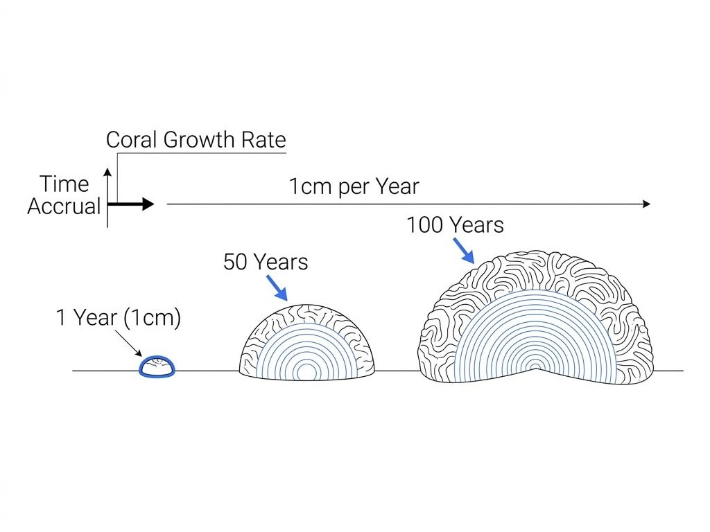
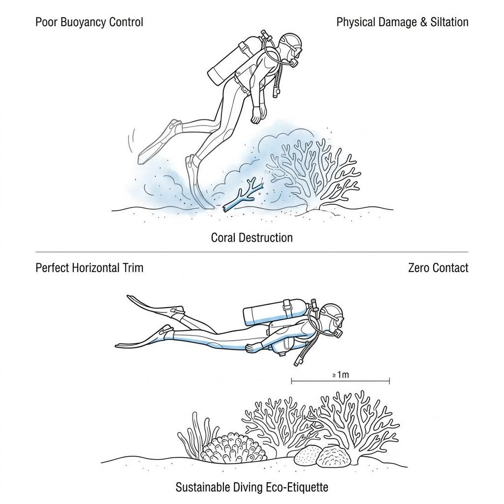

Ask any scuba diver to name their favorite underwater sight, and they will likely describe the vibrant, bustling expanse of a coral reef. Often referred to as the "rainforests of the sea," these thriving ecosystems provide shelter and sustenance to countless marine creatures, playing an indispensable role in maintaining the health of our oceans. Yet, surprisingly few divers appreciate just how fragile these stunning structures actually are. In reality, these ancient colonies are incredibly delicate organisms that can easily be destroyed by a single, careless human touch. In this article, we will explore the miraculous, slow-motion growth of corals and why mastering buoyancy control is the ultimate responsibility of every ethical diver.

### Just 1cm a Year: A Masterpiece Built Over Eons

To the untrained eye, coral may look like lifeless, sturdy rock. In reality, it is a colony of thousands of tiny, delicate animals called **polyps**. These microscopic creatures absorb calcium ions from seawater to build a hard calcium carbonate skeleton for protection. Over generations, these skeletons accumulate, forming the massive, complex reef structures we marvel at today.

The catch is that this construction process is unbelievably slow. While growth rates vary by species and environment, massive brain corals creep upward by a mere 0.5 to 1 centimeter per year. Even faster-growing branching corals, like staghorn, expand by only about 10 centimeters annually. That means a single coral colony the size of a person's embrace represents decades—or even centuries—of silent, patient accumulation by the ocean. It is a living monument of time.

### The Devastating Impact of a Single Fin Kick

Despite their stony appearance, coral reefs are covered in a thin, fragile layer of living tissue. When a diver loses buoyancy control and clips a branch with a fin, or rests a gloved hand on what they mistake for bare rock while taking a photo, it can act as a literal death sentence for the entire colony.

The damage extends far beyond the immediate physical breakage. Physical contact strips away the coral’s protective mucus layer, exposing it to marine bacteria and pathogens. This often triggers rapid tissue necrosis, which can wipe out the entire colony. Furthermore, when an unskilled kick kicks up sand and silt from the seabed, the sediment settles on the coral. This blocks sunlight from reaching the symbiotic microalgae (zooxanthellae) nestled inside the coral tissue. Deprived of their primary energy source from photosynthesis, the corals begin to starve and turn ghostly white—a process known as bleaching. A single second of carelessness can instantly obliterate centuries of natural growth.

### Buoyancy: The Ultimate Form of Environmental Etiquette

The most powerful tool we have as divers to protect these underwater treasures is perfect neutral buoyancy and horizontal trim. Without the ability to hover effortlessly—remaining absolutely motionless at a desired depth without twitching a finger or toe—any pledge to protect the marine environment is just empty rhetoric.

When cruising near reefs, always maintain a safety buffer of at least one meter above the coral and strictly maintain a horizontal trim. Sinking hips tilt your legs downward, causing you to strike and break coral behind or below you without even realizing it. In addition, swap the bicycle-like flutter kick for a proper frog kick. By directing the water flow directly behind you rather than downward, you prevent kicking up fine silt that can smother the delicate marine life below.

### Perfect Stillness in the Presence of Nature's Grandeur

Truly experienced, master divers leave absolutely no trace. They leave nothing in the ocean but bubbles, and take away nothing but memories of its wonders.

The next time you glide through a reef, take a moment to assess your buoyancy. Are you in a state of perfect, effortless equilibrium? Only when we respect these habitats—painstakingly built over centuries—and commit to protecting every single centimeter can we truly call ourselves welcome guests and guardians of the ocean.
