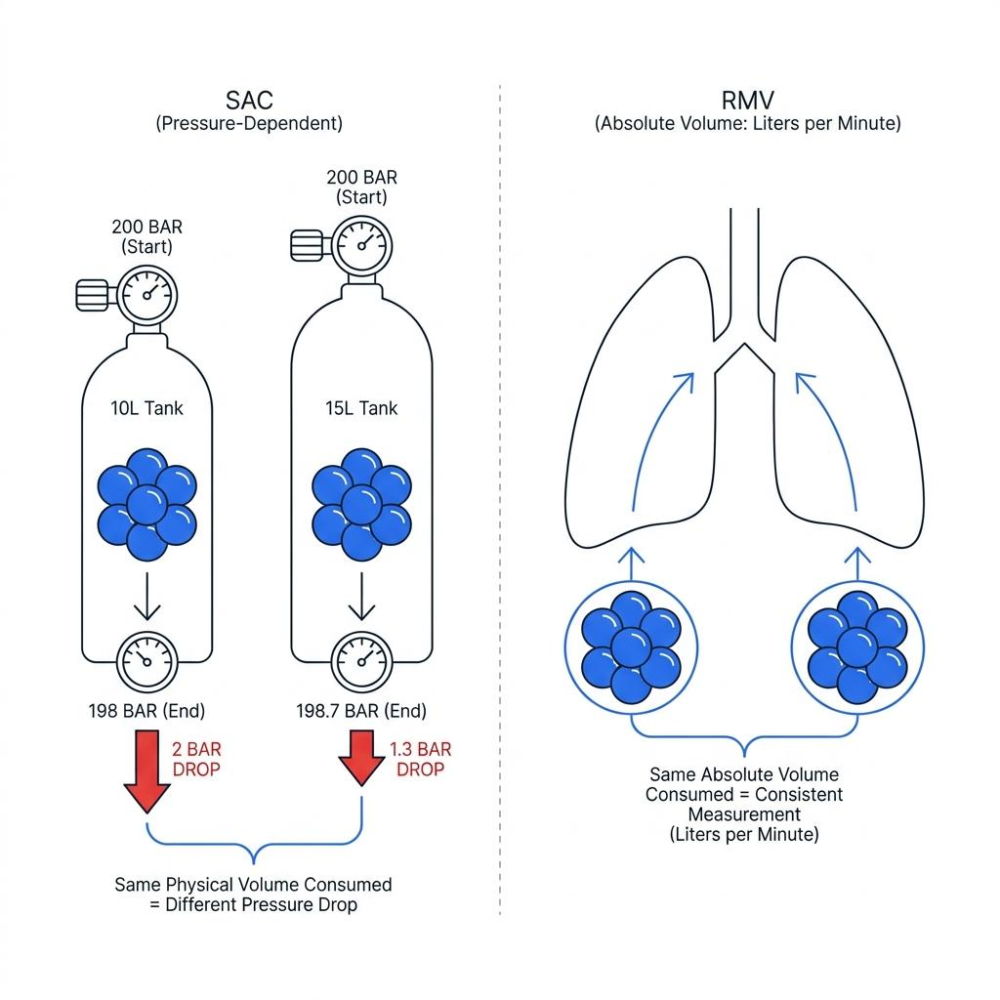
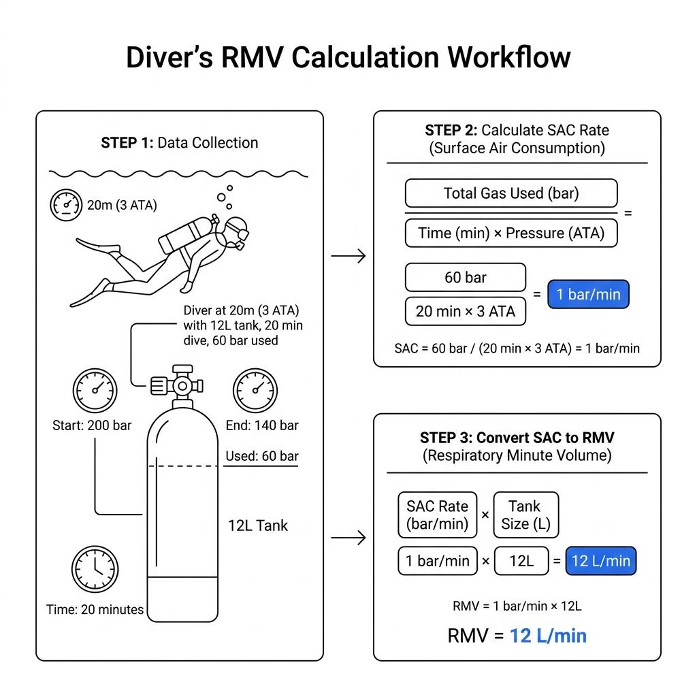

Upon completing a dive and returning to the surface, checking and comparing remaining gas pressures among buddies is a familiar ritual. Terms like "heavy breather" or "air saver" are often tossed around as subjective markers of a diver's skill, but these are abstract and highly variable concepts. The speed at which your pressure gauge needle drops depends entirely on the depth of the profile, your workload, and the volumetric size of the cylinder in use. To truly quantify your breathing rate and flawlessly integrate it into subsequent dive planning, you must master the core metrics of gas consumption: Surface Air Consumption (SAC) rate and Respiratory Minute Volume (RMV).

### Why You Must Quantify Your Breathing Rate

Most recreational divers manage their gas supply passively, turning back or initiating an ascent simply when the pressure gauge needle inches close to a generic 50-bar reserve. This is a remarkably hazardous strategy. If you choose to descend to 30 meters and your buddy encounters a catastrophic regulator failure, requiring you to donate your alternate air source and ascend together, you cannot rely on guesswork to know exactly how many liters of gas are required to safely complete the ascent and safety stops.

Quantifying your minute ventilation turns gas management into a highly predictable science. You can mathematically answer critical questions such as, "How many bars of gas must I possess at turn-around to execute a 45-minute profile at 20 meters?" or "What is my absolute Rock Bottom pressure required to ensure survival for two divers during an emergency ascent?" Moving from emotional gas tracking to data-driven management is the bedrock of advanced and technical diving safety.

### SAC vs. RMV: Tank Dependence vs. Tank Independence

The first metric encountered when analyzing gas tracking is the Surface Air Consumption rate. SAC represents the pressure drop per minute (in bar or psi) assuming the diver is at the surface (1 ATA). While it is easy to compute, SAC suffers from a critical limitation: it is entirely dependent on the specific volume of the cylinder used. A SAC rate calculated using an 11.5-liter aluminum cylinder becomes completely invalid if you switch to a 15-liter high-capacity steel tank or an 8-liter pony bottle. Because a larger internal volume experiences a smaller pressure drop for the exact same volume of gas exhaled, pressure-based tracking shifts with the hardware.

To remove this hardware dependency and isolate a diver's pure physiological breathing capacity, we look to Respiratory Minute Volume. RMV measures the actual volume of gas consumed per minute, expressed in volumetric units like liters per minute (L/min), independent of the tank size. Once you know your baseline RMV is 15 L/min, you can flawlessly back-calculate your exact gas endurance across any configuration, whether swimming with a single 10-liter tank or a high-capacity technical double setup.

### The Mathematics Behind Your RMV

Deriving your real-world consumption data requires a straightforward calculation. Track your pressure drop over a fixed time interval along a flat underwater topography, note the elapsed time, and factor in your average depth pressure. The equation to find your surface-equivalent pressure consumption rate (SAC) is as follows:

$$
SAC = \frac{\text{Gas Consumed (bar)}}{\text{Time (min)} \times \text{Average Depth Pressure (ATA)}}
$$

For example, suppose a diver breathes from a 12-liter cylinder at an average depth of 20 meters (3 ATA) for 20 minutes, noting a total pressure drop of 60 bar. Plugging these variables into the equation yields the following calculation:

$$
SAC = \frac{\text{60}}{20 \times 3} = 1\text{ bar/min}
$$

This establishes that the diver consumes 1 bar of pressure per minute at surface pressure within that specific cylinder configuration.

To convert this cylinder-dependent value into a universal volumetric baseline (RMV), simply multiply the SAC rate by the water volume capacity of the cylinder:

$$
RMV = SAC \times \text{Cylinder Volume (L)}
$$

Multiplying the diver's SAC rate of 1 bar/min by the 12-liter cylinder volume results in the following final calculation:

$$
RMV = 12\text{ L/min}
$$

The diver now possesses an absolute metric: they consume 12 liters of gas per minute. This baseline remains a reliable constant regardless of changes in cylinder selection. If this same diver experiences high-stress workloads or heavy currents, their RMV might spike above 20 L/min; conversely, hovering effortlessly in a perfect horizontal trim can lower it toward 10 L/min.

### The Psychological Liberation of Data

Many divers attempt to stretch their gas supply by intentionally skipping breaths or holding their breath underwater—a practice known as skip breathing. This is a direct pathway to hypercapnia (carbon dioxide buildup), which triggers severe headaches, elevated air thirst, and panic.

Once you uncover your precise RMV, the psychological need to restrict your breathing disappears. Because your gas requirements, turnaround parameters, and emergency reserves are calculated mathematically and integrated directly into your dive execution plan, you no longer need to worry about the pressure gauge needle. Viewing your gas consumption as a predictable physics calculation rather than a source of performance anxiety frees you to let go of the pressure gauge stress and truly enjoy the deep environment.
