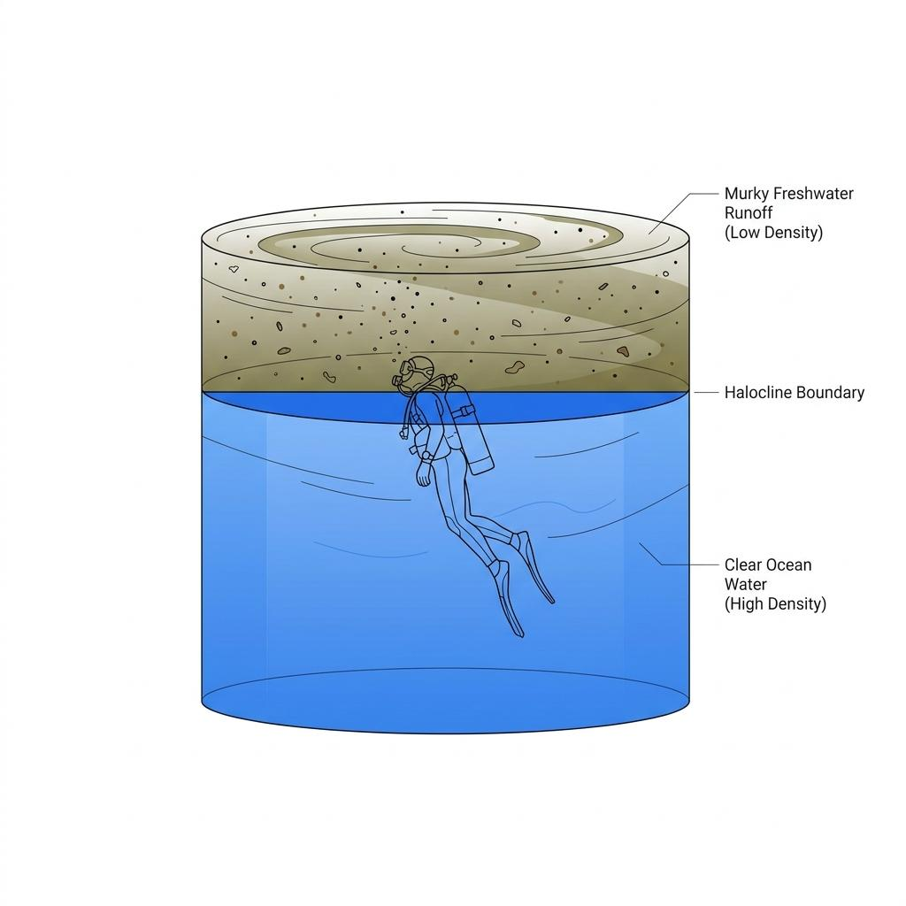
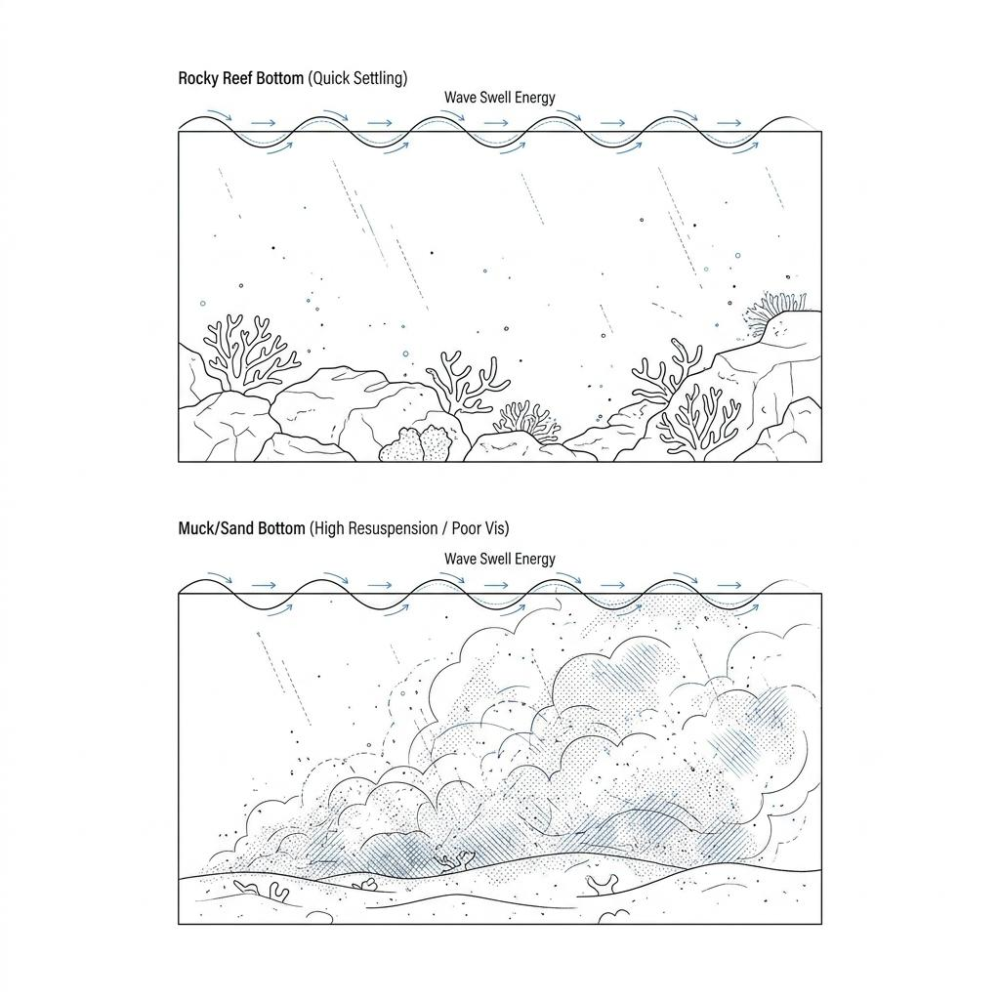

When boarding a dive boat, regardless of nationality, there is one question every diver asks first:

> "How's the visibility today?"

Clear, crystal-like visibility puts divers at ease and allows them to appreciate the vast underwater world. In contrast, murky visibility can disorient you and induce a strange sense of tension.

We often think of visibility as a matter of "luck" granted by the ocean on any given day. However, the clarity of the ocean is actually the product of strict cause and effect. Visibility is determined by the amount of suspended particles in the water. By understanding just a few environmental data points, we can predict the ocean's condition quite accurately.

### Plankton: The Microscopic Life That Paints the Ocean

The first factor to consider is plankton, the ocean's primary producers. When the water temperature rises and sunlight becomes abundant, phytoplankton multiply explosively, causing a phenomenon known as an **Algal Bloom**. During a bloom, the ocean's color shifts from a brilliant blue to a deep green, and visibility plummets. As phytoplankton increase, zooplankton gather to feed on them, turning the water into a thick soup full of suspended matter.

Therefore, during periods of rapid warming, or immediately after an "upwelling" current brings deep-sea nutrients to the surface, there is a very high probability of poor visibility—no matter how sunny the weather is. Conversely, this is exactly why winter diving offers overwhelmingly clear visibility; the cold water drastically reduces plankton activity.

### Unwelcome Guests from Land: Rainfall and Haloclines

If it rained heavily a few days ago, the ocean's visibility might be terrible even if the sky has completely cleared. Heavy rains wash muddy water and organic matter from the land into rivers, which then flow into the sea. At this point, an interesting physical phenomenon occurs. Freshwater from the land has a lower density than seawater, making it lighter. Because of this, the two types of water do not mix; instead, they form distinct layers near the surface.

This boundary layer is called a **Halocline**. Fine mud particles washed from the land become trapped in this layer, completely blocking visibility at the surface. If you dive on a day like this, you might experience a magical transition. Near the surface, the water is so murky you cannot see an inch ahead. But the moment you descend past 5 meters and punch through the halocline, the visibility suddenly opens up, becoming crystal clear. You can easily predict this condition by checking local rainfall data and knowing how close your dive site is to a river mouth.

### The Collaboration of Bottom Topography and Waves: Resuspension

The bottom topography is another critical variable that dictates visibility. At dive sites consisting of rocky reefs, waves kick up very few suspended particles from the bottom, allowing visibility to recover quickly. However, it is a different story for sites with fine sand or mud bottoms.

When strong winds or deep-ocean swells sweep across the seabed, fine sediments that had settled are stirred back into the water column. This is known as **Resuspension**. Especially in muddy terrains with fine particles, it can take several days for the suspended matter to settle back down even after the waves have stopped. If there was a strong swell yesterday and your dive site today has a sandy bottom, it is best for your mental health to lower your expectations for visibility.

### A Diver's Perspective on Reading the Environment

Checking today's tide tables is also essential. During a **Neap Tide**, where the tidal range is small, water movement stagnates, giving suspended particles time to settle. Conversely, during a **Spring Tide** with strong currents, the bottom gets churned up, making the water prone to murkiness.

Just because visibility is poor doesn't mean you should be disappointed. Murky visibility is strong evidence that the water is rich in nutrients, providing plenty of food for marine life. On days with poor visibility, you can simply change your strategy to macro diving, observing nudibranchs or small crustaceans on the bottom that you might normally overlook. Rather than blaming the environment, a truly experienced diver understands its underlying principles and adapts the purpose of their dive accordingly.
