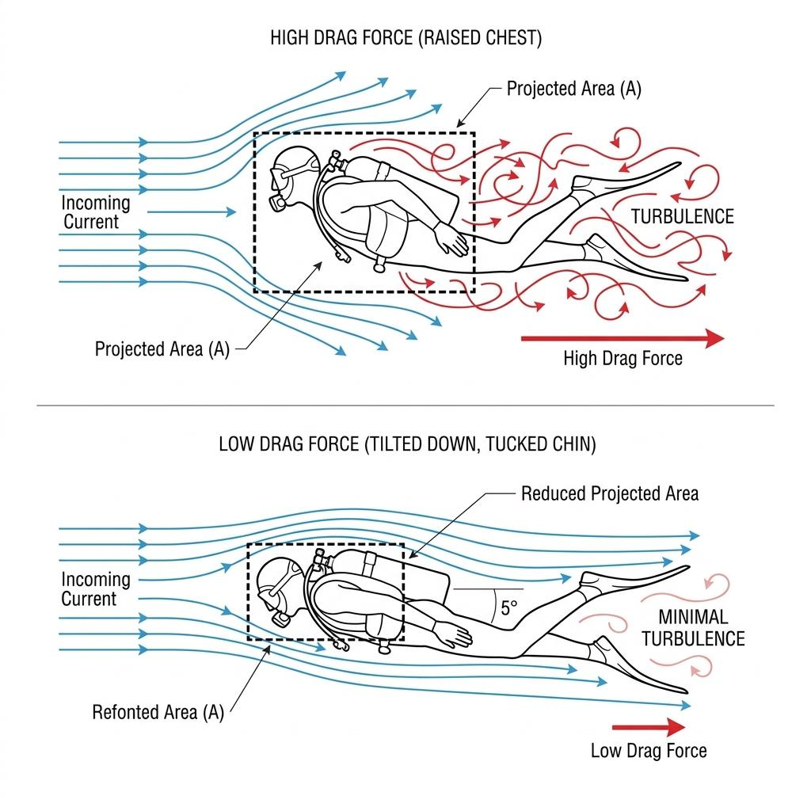
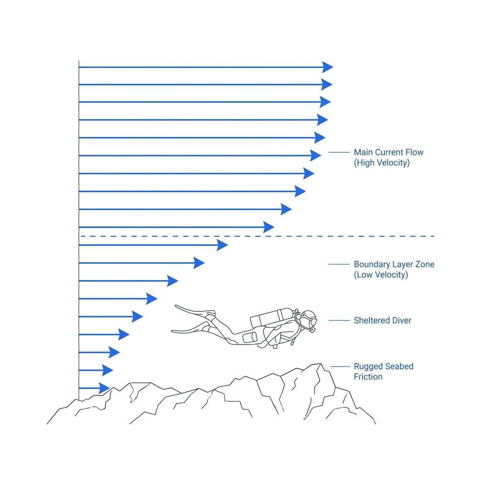

When directly confronting a strong current, most divers instinctively tense their muscles and begin executing powerful fin kicks. While their thighs burn and their breathing turns ragged, they often find themselves struggling just to hold their position, let alone move forward. The ocean is simply not an opponent that can be overcome by human muscular strength. Reckless kicking against a heavy flow serves only to exhaust your gas supply and accelerate a dangerous path toward panic.

The true secret to managing current underwater does not rely on strength, but rather on a technical flow that understands and utilizes fluid mechanics—specifically, hydrodynamics. We analyze the precise streamline control techniques required to minimize water resistance and slice through currents using minimal energy.

### Just 5 Degrees Changes the Flow: The Magic of Projected Area

The fluid resistance a diver encounters underwater, known as Drag Force ($F_d$), is dictated by a foundational physics equation:

$$
F_d = \frac{1}{2}\rho v^2 C_d A
$$

Within this formula, the most critical variable a diver can actively control in real-time is the projected area ($A$). The projected area represents the two-dimensional cross-section of the body that directly impacts the oncoming fluid stream.

Many divers, in an attempt to maintain a horizontal trim, excessively lift their chest or tilt their head back to look straight ahead. When moving directly into a current, however, this posture transforms the upper torso into a massive sail that traps incoming water. By adjusting your body pitch downward by just 5 degrees relative to the horizon, the dynamics shift completely. Tucking your chin toward your chest, directing your gaze slightly downward, and pulling your arms tight within the profile of your body dramatically reduces the exposed projected area ($A$). Without applying any additional physical force, you will feel the water slide smoothly over your gear rather than pushing against you.

### The Ocean's Blind Spot: Utilizing the Boundary Layer

Even within dive sites swept by raging currents, a perfect physical blind spot exists: the boundary layer, a zone extending just dozens of centimeters above the sea floor. Because water possesses viscosity, fluid flowing over a rough substrate like jagged volcanic rock or coarse sand experiences substantial friction. As a result, the current velocity drops sharply, approaching near-zero speeds the closer it gets to the seabed.

Inexperienced divers often ascend into open, mid-water columns when currents pick up, which inadvertently exposes them to the fastest and most punishing flow. In contrast, an intelligent diver immediately drops down to hug the topography the moment a current is detected. Navigating through the natural depressions of a reef, following underwater trenches, or tracking the eddy zones formed behind large boulders allows a diver to move forward effortlessly, completely insulated from the main flow. This technique turns the ocean's own friction into a protective shield.

### Ferry Gliding: Surfing Across the Current

Navigating currents does not always involve moving directly upstream. Frequently, a diver needs to traverse a crosscurrent to reach a specific landmark located to the left or right. Attempting to swim diagonally while taking the full force of a lateral current head-on often causes a diver to drift off-course, missing the target entirely.

To solve this, divers can employ a technique derived from kayaking and advanced technical diving known as ferry gliding. This method involves angling the body’s heading slightly into the oncoming current while allowing the water to sweep cleanly across the side profile. Similar to how an airplane wing generates lift, the kinetic energy of the moving water flows along the angled plane of the body, efficiently tracking the diver laterally. This enables smooth movement across the current line without demanding exhausting physical exertion.

### The Path That Appears Only When You Relax

Current diving is never a battle of raw power; it is a calculated game of chess where you constantly adjust your angle of attack relative to the moving fluid. The moment a diver tenses up out of instinctual fear, their streamlined profile shatters, causing their drag coefficient to skyrocket.

On your next encounter with a demanding current, pause your kicking and actively release the tension across your body. Tuck your chin to trim down your projected profile, drop low into the high-friction friction shield of the boundary layer, and focus on tuning your body pitch to align with the fluid vectors. By ceasing to fight the ocean and choosing instead to cooperate with its laws, you will find that navigating heavy currents can feel as natural and serene as a calm walk through the park.
