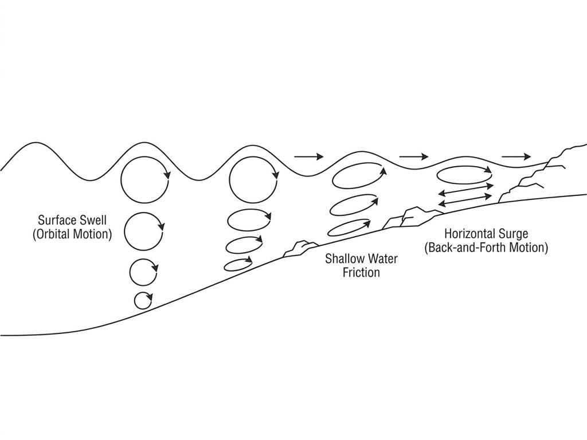
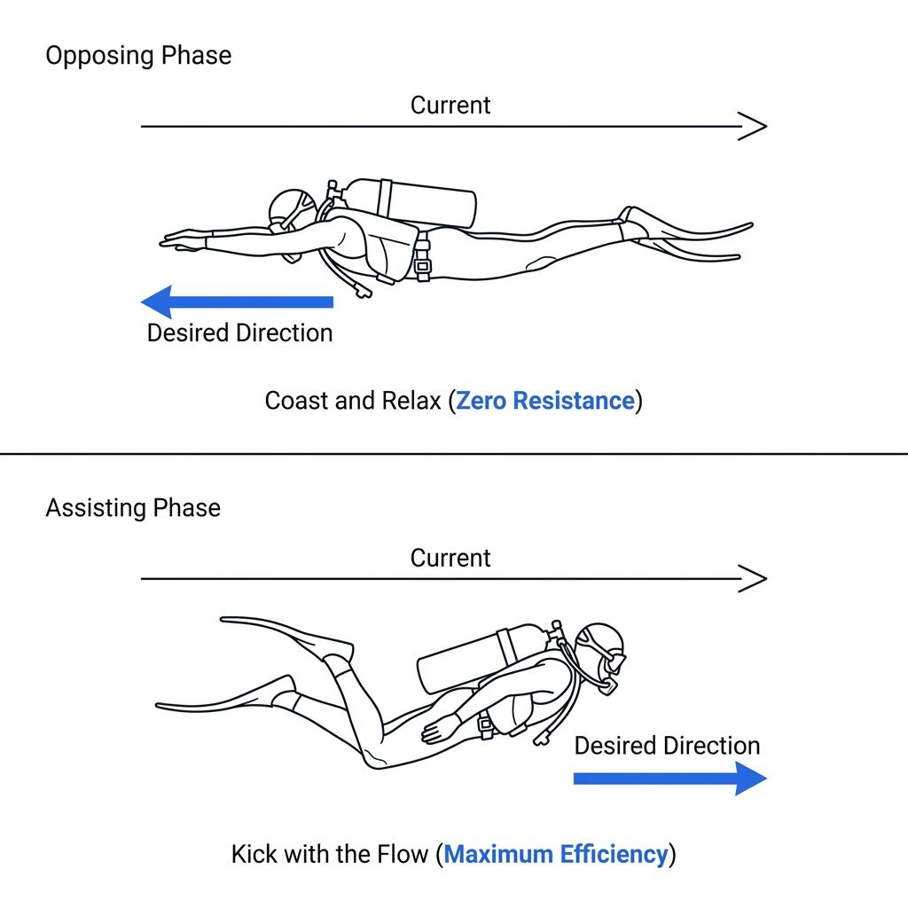

When the surface turns rough, many divers expect to find a peaceful sanctuary by descending deep into the water. While depth does offer protection from the breaking waves above, as you approach shallow coastal reefs or pinnacles, the ocean's immense energy returns in a different form. This manifests as surge and swell—the periodic, horizontal back-and-forth movement generated by surface waves. Understanding the fluid dynamics of this environment allows a diver to maintain composure and conserve energy without engaging in a futile test of strength against the ocean.

### From Surface Swell to Underwater Surge

The massive wave energy generated by distant winds that travels thousands of kilometers across the open ocean is known as swell. In deep water, this energy moves through the water column in a circular path known as orbital motion. Because of this, divers at depth will experience only a gentle, rhythmic vertical lift as the crests and troughs pass overhead, leaving their overall stability largely intact.

However, the dynamics shift dramatically when this energy hits shallow reefs or sloping coastal topographies. As the water depth decreases, the circular orbits of the moving fluid flatten due to friction against the sea floor, eventually compressing into a purely horizontal, bidirectional back-and-forth motion. This is surge. Unlike the surface wave that appears to travel in a single direction, underwater surge behaves like a pendulum, pushing a diver forward and then pulling them backward along a predictable, rhythmic cycle.

### The Inefficiency of Resistance: Avoiding the Tug-of-War

Inexperienced divers often feel an instinctual panic the moment the surge begins to displace them. To avoid drifting from their planned route or losing proximity to their buddy, they frequently tense up and kick furiously against the direction of the displacement. This is one of the most counterproductive responses possible underwater.

Attempting to overpower the kinetic energy of the ocean with human muscle is a losing battle. Executing hard fin kicks while the surge is actively pushing you backward results in zero net forward progress while expending a massive amount of energy. This unnecessary physical exertion causes rapid carbon dioxide accumulation in the bloodstream, which accelerates breathing rates and serves as a direct catalyst for psychological panic. The foundational rule for managing surge is to acknowledge the ocean's power and cease all direct resistance.

### The Rhythmic Window: Synchronizing with the Wave Period

The key to conserving gas and moving efficiently through a heavy surge lies in synchronizing your movements with the wave period. Surge operates on a predictable rhythm, shifting directions every few seconds. When the water vector pushes directly against your intended heading, you must stop all attempts to kick. Instead, focus entirely on relaxing your muscles, pulling your gear into a highly streamlined profile, and allowing the water to carry you momentarily—a tactical phase known as coasting.

As the opposing energy expends itself, the water column decelerates, pauses briefly, and then reverses direction, pushing forward along your intended heading. This precise moment is your window of opportunity to execute a single, clean frog kick. By layering your mechanical propulsion on top of the forward kinetic energy provided by the reversing surge, you double your forward efficiency with minimal effort. It is identical to the philosophy of surfing: riding the energy rather than fighting it.

### Expanding Peripheral Vision and Utilizing Eco-Anchoring

When you need to stop moving to hover or observe marine life within a high-surge zone, your positioning strategy must adapt. Rather than forcing your body to remain rigid, it is far more effective to relax your core and allow yourself to sway naturally back and forth with the cycle of the wave. Narrowing your focus to a single patch of substrate directly in front of your mask during this movement can induce spatial disorientation and motion sickness. Expanding your peripheral vision to include large, stationary geological structures provides a stable visual baseline that preserves orientation.

If you must anchor yourself firmly to capture stable camera footage or perform a task, you should never grab onto living coral matrices. Instead, locate a bare, sturdy rock surface devoid of marine growth and apply light stabilization using only your fingertips. By presenting a streamlined profile that lets the water wash past while maintaining minimal contact with a solid anchor point, you eliminate environmental damage. Accepting the ocean’s dynamic movement as a natural background variable transforms surge from a frustrating hazard into a rhythmic element of the dive.
