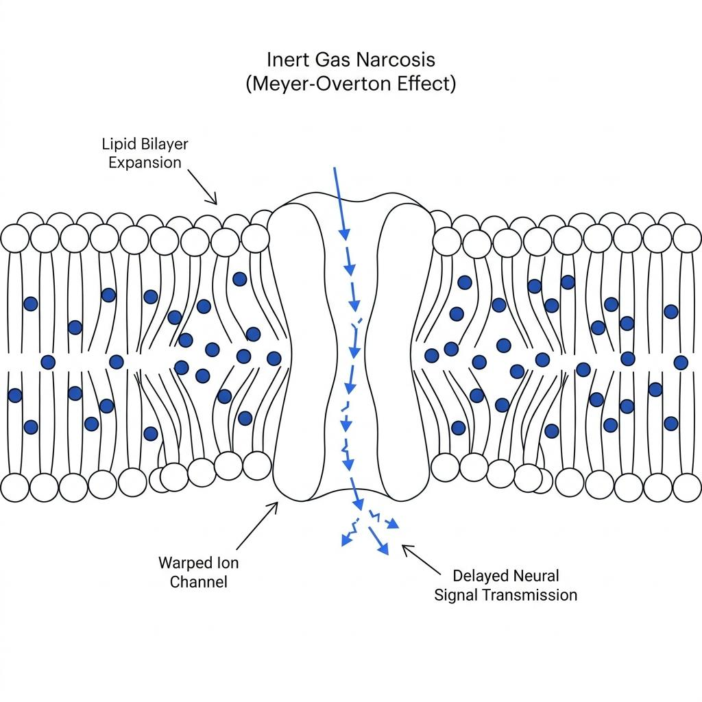
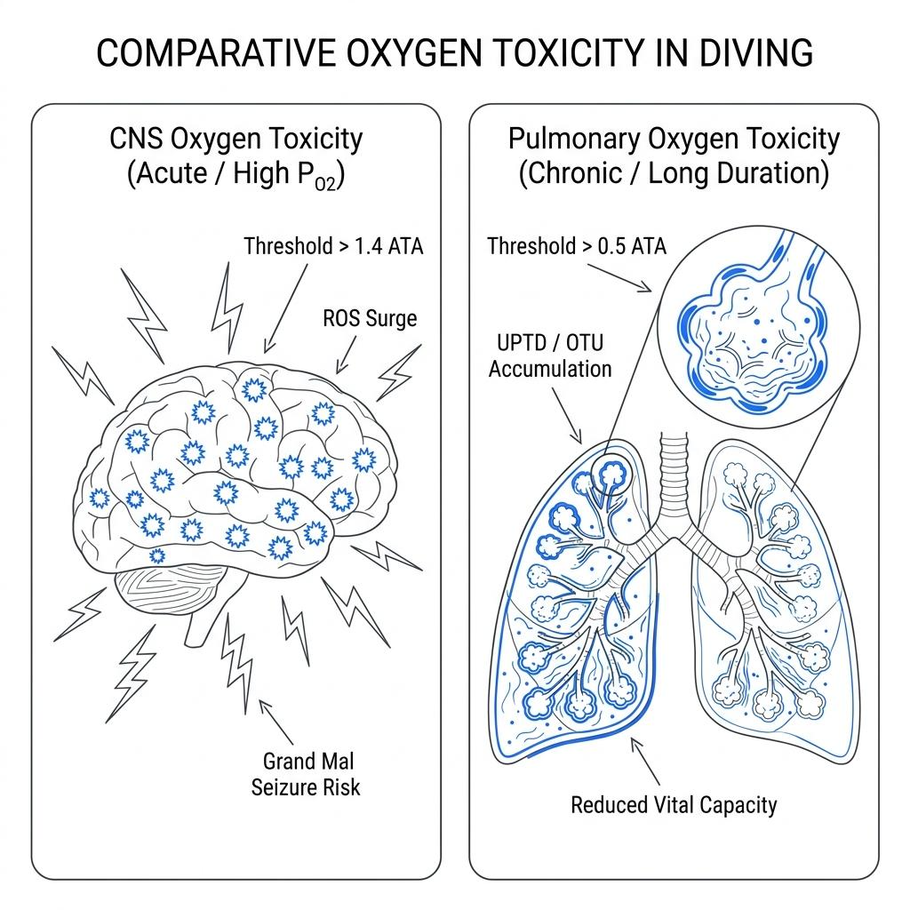

The air we breathe on land every single moment is the safest fuel for sustaining human life. At the atmospheric pressure of 1 ATA, the nitrogen and oxygen within the air exist in perfect equilibrium with the human body. However, the moment a diver descends into the deep sea, this peaceful air reveals an entirely different countenance. This shift occurs because Dalton's Law of Partial Pressures dictates that the density and pressure of the gas we breathe multiply exponentially as depth increases. We dissect the critical biological mechanisms of why air—the very gas that sustains life—transforms into an intoxicating alcohol that paralyzes the central nervous system or a systemic poison that destroys organs within the physics-governed deep.

### The Anesthetic of the Deep: Inert Gas Narcosis and Nitrogen Narcosis

When crossing past a depth of 30 meters, many divers experience unprovoked euphoria, delayed judgment, or mild spatial disorientation. Historically, this was simply labeled "Nitrogen Narcosis." However, reflecting the advancement of technical diving and contemporary hyperbaric medicine, global training agencies like PADI have updated their curricula to the more scientifically rigorous term, "Inert Gas Narcosis." This update accounts for the fact that other inert gases—including argon and neon, though excluding helium—also exert narcotic effects on the human nervous system under elevated pressures. In standard air diving, since nitrogen accounts for 79% of the total gas volume, it remains the primary culprit, leading both terms to be used interchangeably in the field.

The answer to why these gases produce symptoms identical to alcohol intoxication at depth resides within the Meyer-Overton lipid solubility hypothesis. Nitrogen is a lipophilic molecule, meaning it dissolves far better in oils and lipids than in water. As a diver descends and the partial pressure of nitrogen escalates, excess nitrogen molecules dissolved in the bloodstream are mechanically forced to infiltrate the lipid bilayer of the cell membranes encapsulating nerve cells (neurons). The nitrogen molecules wedged within the lipid membrane physically expand and structurally distort the membrane architecture.

This distortion warps the geometry of ion channels and neurotransmitter receptors responsible for propagating signals between neurons, noticeably slowing down the transit of electrical impulses traveling to and from the brain. Consequently, inert gas narcosis is not a chemical poisoning but a mechanical interference, identical to how medical anesthetics depress the central nervous system. This direct physical dampening explains why nitrogen acts exactly like alcohol under elevated pressures.

### The Dual Faces of Oxygen Toxicity: Central Nervous System (CNS) vs. Pulmonary

While nitrogen acts as a subtle alcohol clouding a diver's intellect, oxygen operates as an aggressive toxin that directly assaults cells and vital organs. Depending on the magnitude of the partial pressure and the duration of exposure, oxygen toxicity is fundamentally classified into two distinct pathologies: CNS Oxygen Toxicity and Pulmonary Oxygen Toxicity.

First, CNS Oxygen Toxicity is an acute reaction triggered by short-term exposure to high partial pressures of oxygen. On land, the body easily neutralizes the toxic reactive oxygen species (ROS), or free radicals, generated during normal oxygen metabolism using robust antioxidant enzyme networks like superoxide dismutase (SOD) and catalase. However, when the oxygen partial pressure surges past the established CNS convulsion limit of 1.4 ATA, the sheer volume of free radicals flooding across the alveolar membrane completely overwhelms the operational capacity of the body's antioxidant defenses. The unchecked free radicals rapidly oxidize the lipids within brain cell membranes and dismantle the pathways governed by the inhibitory neurotransmitter GABA. Stripped of these neurological dampening signals, the neurons within the brain fire synchronously in an uncontrolled electrical storm, manifesting as a grand mal seizure underwater.

Second, Pulmonary Oxygen Toxicity is a chronic reaction resulting from prolonged exposure to lower partial pressures of oxygen. It primarily affects technical divers undergoing lengthy decompression stops or repetitive divers executing multiple profiles over consecutive days. Breathing gas with an oxygen partial pressure exceeding 0.5 ATA for extended durations causes progressive oxidative damage to the alveolar epithelial cells. The inner lining of the alveoli becomes inflamed, leading to pulmonary edema, which manifests clinically as a burning chest sensation, persistent coughing, and a severe reduction in vital capacity. In hyperbaric medicine, this exposure is tracked using mathematical units known as UPTD (Unit Pulmonary Oxygen Toxicity Dose) or OTU (Oxygen Toxicity Unit) to strictly regulate the total daily volume of oxygen exposure.

### The Diver's Equation Controlling the Dynamics of Partial Pressure

To systematically manage these dual physiological hazards, a diver tracks a single, universal physical variable: gas partial pressure. The partial pressure of a specific component within a gas mixture is derived using the following calculation:

$$
\text{Gas Partial Pressure} = \text{Ambient Pressure (ATA)} \times \text{Fraction of the Gas in the Mixture}
$$

When breathing standard air at a depth of 30 meters (4 ATA), the partial pressure of nitrogen spikes as follows:

$$
4 \text{ ATA} \times 0.79 = 3.16 \text{ ATA}
$$

This physical pressure of nitrogen exceeding 3 atmospheres exerts mechanical compression on the neuronal membranes, inducing narcosis. Because the partial pressure of oxygen similarly follows a strict linear climb as depth increases and inflicts damage on the lungs over cumulative exposure, a diver must precisely pre-program their Maximum Operating Depth (MOD), Equivalent Narcotic Depth (END), and cumulative oxygen toxicity clocks (CNS% and OTU) into both their dive computers and execution logs.

### Embracing the Limits of Homo Divingcus

The deep ocean is an environment of intense pressure never meant for human biology. The transformation of breathing air into an intoxicating drink or a deadly toxin at depth is not a mystical hazard of the ocean, but the natural consequence of human biological vulnerability colliding with the laws of physics.

The hubris that one can mentally resist inert gas narcosis through sheer willpower or somehow sense the onset of oxygen toxicity is a lethal misconception that must be abandoned immediately. True safety belongs to the diver who approaches the environment with cold, analytical reason—reading the shifts in gas partial pressures and cumulative exposure times as raw data, and refusing to cross the physiological boundaries where human nerves and lungs can safely operate. Only within these calculated lines can we truly appreciate the majestic beauty of the deep.
