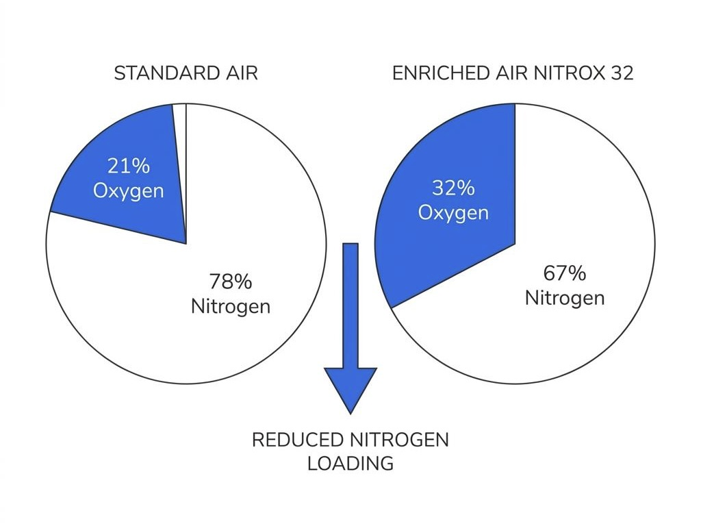
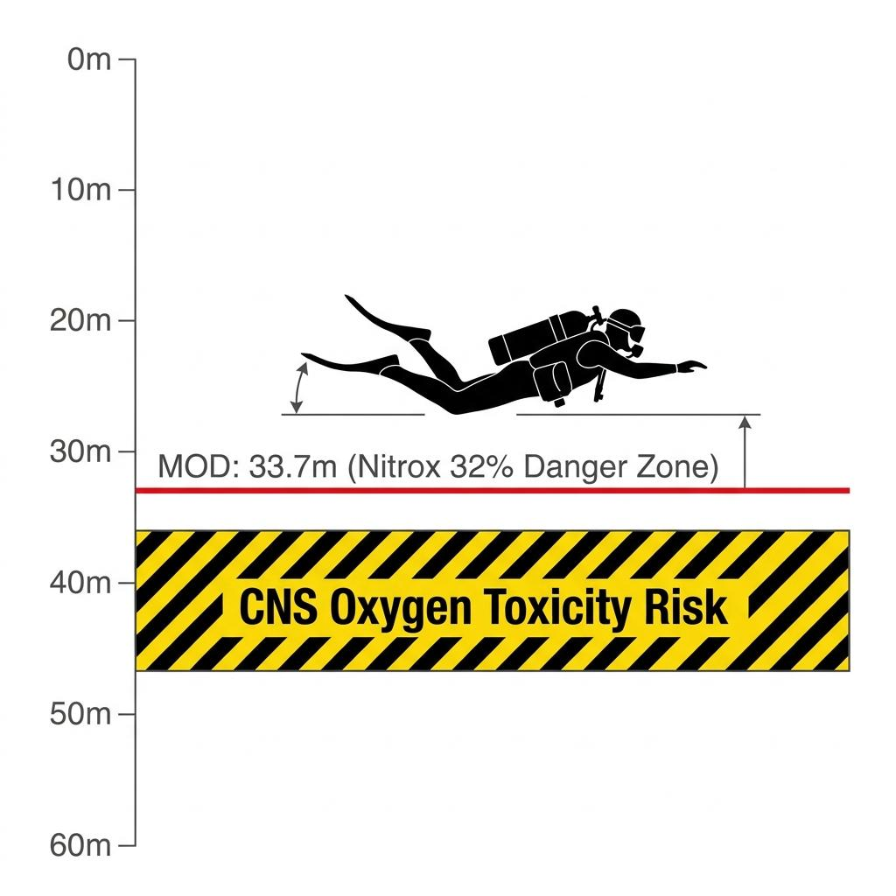

When boarding a recreational dive boat, it is easy to spot cylinders marked with distinct yellow and green bands. This is Enriched Air Nitrox, commonly referred to by divers simply as 'Nitrox.' Many divers mistake Nitrox for a magical gas that simply allows them to stay underwater longer.

However, increasing the proportion of oxygen in your breathing gas means accepting a strict physical and physiological trade-off. While you gain significant benefits, you also shoulder a potentially lethal risk. We dive into the true mechanism of Nitrox to understand this double-edged sword.

### Increasing Oxygen, Reducing Nitrogen

The standard air we breathe on land consists of approximately 21% oxygen, 78% nitrogen, and trace amounts of other gases. Nitrox refers to any gas mixture where the proportion of oxygen is intentionally increased above 22%. In recreational diving, mixtures with 32% or 36% oxygen are most commonly used as standard blends.

The core principle here is the deliberate reduction of nitrogen, the main culprit behind decompression sickness. Because the partial pressure of nitrogen in the breathing gas is lower, the absolute amount of nitrogen absorbed by your body tissues underwater drops significantly. As a result, the No-Decompression Limit (NDL) calculated by your dive computer extends drastically compared to when using standard air, offering a powerful decompression advantage.

### The Hidden Trap in the Deep: Oxygen Toxicity

The extended NDL gained by reducing nitrogen does not come for free. In return, divers must confront a much faster and more lethal risk: Central Nervous System (CNS) Oxygen Toxicity. Oxygen, the very source of life on land, transforms into a deadly toxin that can paralyze the central nervous system once underwater pressure rises and its partial pressure crosses a certain threshold.

In recreational diving, the generally accepted maximum limit for the partial pressure of oxygen (PO2) is 1.4ata. With standard air (21% oxygen), you would have to descend to 56 meters to hit this threshold, so it is rarely a concern during normal profiles. However, the moment you breathe Nitrox 32%, your Maximum Operating Depth (MOD) is instantly restricted to just 33.7 meters.

If a diver fails to recognize this depth limit and descends further, triggering oxygen toxicity, grand mal seizures and full-body convulsions can occur underwater without any warning signs. Seizures underwater directly lead to the regulator falling out of the mouth, resulting in rapid drowning before any rescue attempt can be made.

### Diving 'Safer,' Not Just 'Longer'

Many divers define the purpose of using Nitrox as "extending the remaining NDL to stay longer at 30 meters." However, this is like looking at only one side of a double-edged sword and holding the blade backward. Smart, safety-conscious divers view Nitrox as a protective shield for safer diving.

The most recommended way to utilize it is to keep your dive computer set to standard air (21%) while actually breathing from a Nitrox 32% cylinder. Your computer will restrict your NDL conservatively, calculating as if you are absorbing more nitrogen than you actually are. Meanwhile, your body absorbs far less nitrogen, lowering your risk of decompression sickness to nearly zero. Instead of pushing your NDL to the absolute limit, Nitrox should be viewed as a tool to reduce physical fatigue and minimize the post-dive impact of nitrogen accumulation.

### Respecting the Math and Honoring the Limits

Nitrox diving should never be done blindly by relying on a machine's default settings or an instructor's vague recommendation. Before entering the water, you must personally analyze the oxygen percentage of your cylinder using an oxygen analyzer, verify it down to the decimal point, calculate your Maximum Operating Depth (MOD), and clearly write it on the cylinder tank contents tag.

Technology is always a double-edged sword. Only when you mathematically recognize the threshold of oxygen toxicity hidden behind the sweet benefit of an extended NDL—and respect that boundary flawlessly—will Nitrox change from a dangerous hazard into a reliable partner that supports your underwater exploration with ultimate safety.
