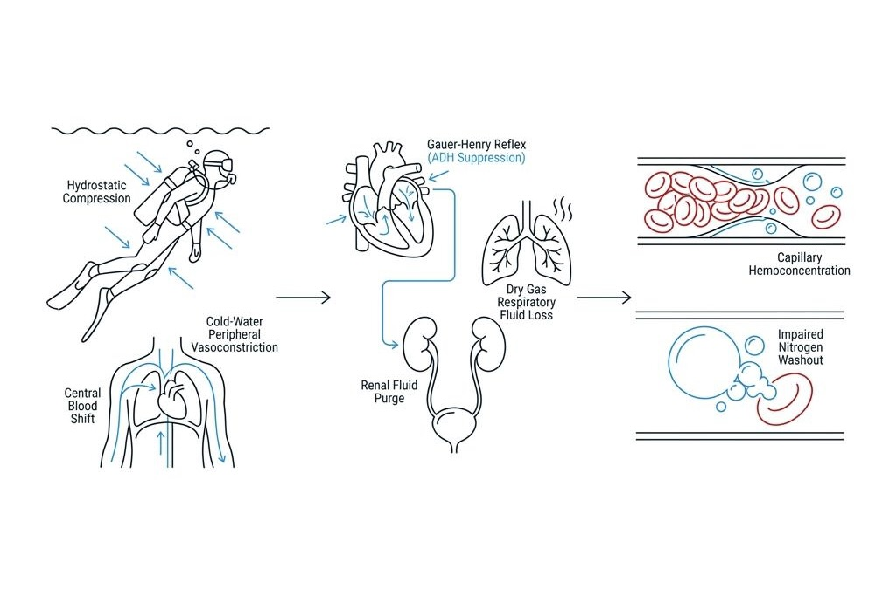

Every scuba diver has encountered the sudden, overwhelming urge to urinate within minutes of descending into the water. Even after emptying the bladder immediately before gearing up, diving into the ocean seems to trigger an instant internal reservoir refill, forcing divers into an uncomfortable moral dilemma inside their neoprene suits.

Many divers dismiss this reaction as bladder muscles contracting against cold water or as psychological nervousness. However, this response is neither an accident nor an emotional quirk. It represents a precise cardiovascular reflex deployed by the human body to manage external hydrostatic pressures and ambient fluid temperatures.

The underlying danger lies in what happens next: the rapid fluid dump driving this urinary urge strips the vascular system of vital water, plunging the body into acute dehydration. Understanding how silent dehydration progresses without a single drop of sweat reveals the biological chain linking immersion diuresis directly to decompression sickness.

### Fluid Redistribution Under Hydrostatic Pressure: The Gauer-Henry Reflex

When a diver descends below the surface, surrounding hydrostatic pressure exerts uniform mechanical compression across skin and peripheral tissues. Concurrently, because water conducts heat twenty-five times faster than air, peripheral blood vessels in the limbs constrict aggressively to insulate the core.

This peripheral vasoconstriction displaces roughly 500 to 700 mL of venous blood from the extremities, shifting it directly toward the thoracic cavity and heart. Termed central blood shift, this surge of displaced fluid inundates the cardiac chambers with an unnatural volume of blood.

The muscular walls of the cardiac atria stretch under this fluid loading. Mechanoreceptors lining the atrial chambers misinterpret this sudden central pooling as severe whole-body hypervolemia, assuming the vascular tree contains a dangerous excess of water. This neurochemical miscalculation initiates the Gauer-Henry reflex.

### Hormonal Misinterpretation: ADH Suppression and Rapid Filtration

Acting on distress signals from an overfilled heart, the posterior pituitary gland halts conservation protocols. It shuts down the release of Antidiuretic Hormone (ADH, or vasopressin), which normally commands the kidneys to reabsorb water back into circulation. Simultaneously, the heart secretes Atrial Natriuretic Peptide (ANP), an emergency chemical messenger demanding the immediate excretion of sodium and fluid.

Targeted by these conflicting signals, the renal system switches into overdrive, filtering vast quantities of plasma water directly into the bladder. Fluid volumes that would typically take hours to process on land are dumped into the urinary tract within thirty minutes of immersion.

The bladder fills not because the body is overhydrated, but because the central pooling of blood tricks endocrine sensors into disposing of critical fluids. The urge to pee is the visible symptom of a systemic fluid purge.

### Evaporative Depletion: The Respiratory Cost of Dry Gas

While immersion diuresis drains blood plasma internally, every breath through the regulator accelerates fluid loss from the thoracic cavity. Breathing gas compressed into scuba cylinders is routed through industrial desiccant filtration to safeguard cylinder walls from internal oxidation, leaving it with near-zero relative humidity.

As this bone-dry gas enters the pulmonary alveoli, mucous membranes lining the respiratory tract continuously surrender cellular water to humidify every inhalation to one hundred percent saturation. Over a typical forty-five-minute dive profile, this continuous evaporation strips hundreds of milliliters of water straight from the lungs.

Surrounded by ocean water and free from perspiration, divers rarely perceive this internal desiccation. Yet beneath the surface, the human engine operates with two drainage valves running wide open: accelerated renal filtration below and continuous respiratory evaporation above.

### Sluggish Blood and Decompression Sickness

As circulating fluid drains away, the liquid fraction of the blood contracts, driving up the relative concentration of red blood cells and plasma proteins. This hemoconcentration transforms low-resistance blood into a dense, viscous slurry, significantly elevating internal vascular friction.

According to fluid dynamic principles, elevated viscosity diminishes volumetric flow through microscopic capillary beds. During ascent and mandatory safety stops, optimal off-gassing depends entirely on rapid capillary perfusion carrying dissolved inert nitrogen from peripheral tissues back to the lungs. Sluggish microcirculation stalls this gas exchange, trapping supersaturated nitrogen in slow tissues.

Furthermore, thickened blood creates an ideal mechanical environment for microbubbles to coalesce, abrade endothelial linings, and activate platelets into micro-thrombi. Diving medical literature consistently identifies systemic dehydration as the primary silent risk factor transforming standard profiles into symptomatic bends.

### Strategic Pre- and Post-Dive Hydration

Restricting fluid intake before a dive to avoid urination underwater is one of the most dangerous misconceptions in diving. Waiting until thirst sets in indicates that significant hemoconcentration has already taken place; hydration must be maintained proactively well before gearing up.

Divers should consume roughly 500 mL of water mixed with electrolytes or balanced sports beverages across the two hours preceding a dive to maintain osmotic equilibrium. Diuretic beverages such as coffee, caffeinated teas, and energy drinks—as well as previous-night alcohol consumption—compound the intensity of immersion diuresis and must be avoided before entering the water.

Rehydrating with room-temperature water immediately upon stripping off gear is an indispensable component of the decompression schedule. Restoring plasma volume and lubricating microcirculation completes the dive safely, ensuring that silent fluid loss never compromises bubble elimination.
