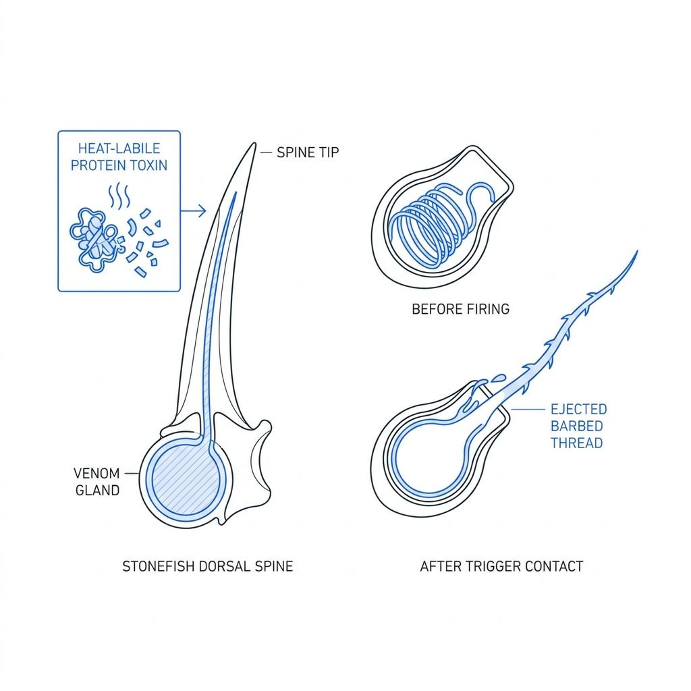
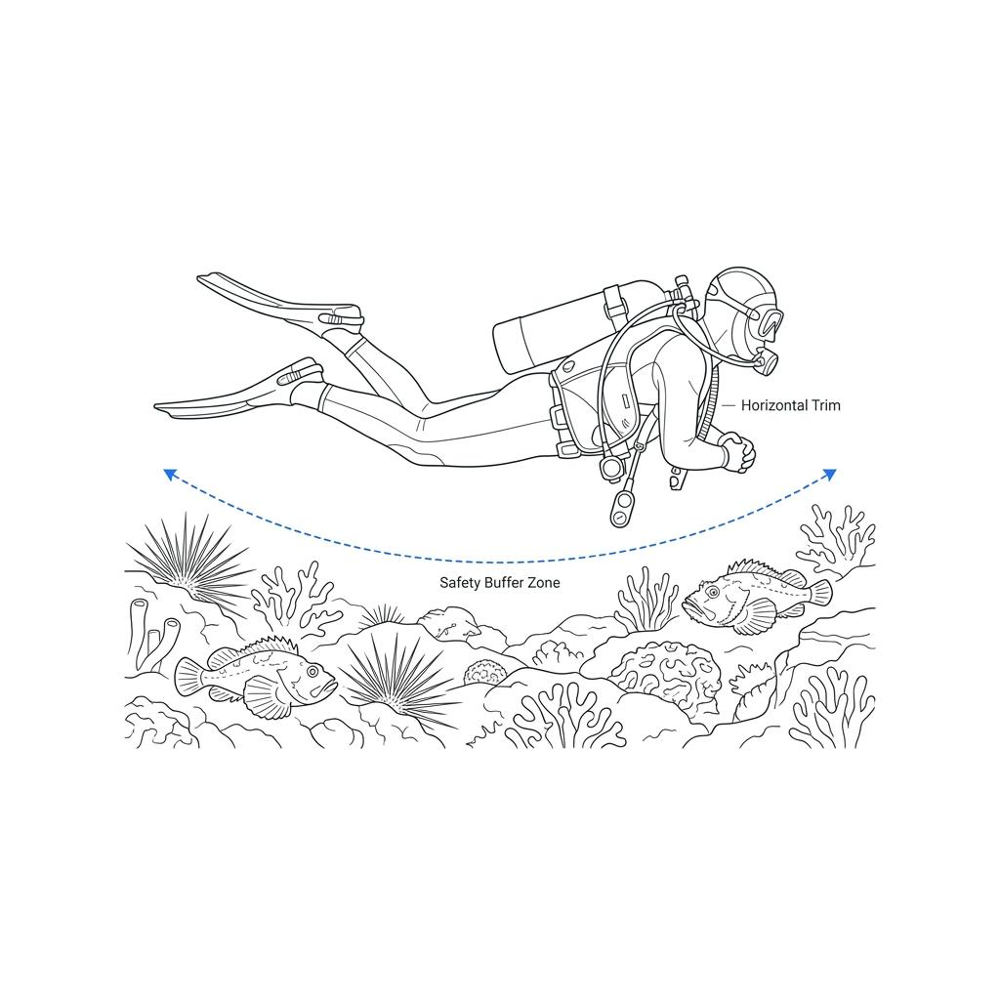

A persistent myth among divers entering the aquatic realm is the belief that marine creatures actively harbor aggressive intent toward humans. Dramatic portrayals of predatory sharks and venomous species in popular media often instill unwarranted anxiety in the diving community. However, a closer look at the venomous spines and translucent tentacles encountered while inspecting reef structures reveals a different reality: these organisms possess defensive mechanisms designed for survival, not offensive weapons built for hunting. Understanding the physical laws and evolutionary biology underlying these toxic systems dismantles baseless fear and promotes safer diving practices.

### Passive Defense Strategies: The Evolutionary Need for Venom

Observing a lionfish fluttering its ornate fins or a stonefish resting motionless against a rocky substrate highlights a shared ecological trait: limited swimming velocity and an inability to execute rapid escapes. To survive in open marine environments filled with agile predators, these slow-moving organisms evolved sophisticated survival mechanisms—either perfecting high-fidelity camouflage or deploying sharp spines capable of delivering immediate incapacitating pain.

Diver injuries involving stonefish, stingrays, or lionfish rarely stem from an animal initiating an attack. Instead, accidents occur when divers fail to detect a camouflaged organism and step on it, grab a handhold without looking, or crowd the creature's immediate space for photography. From the organism's perspective, an approaching diver represents a massive predator threatening imminent destruction, prompting a reflexive deployment of defensive armaments.

### Toxins Neutralized in Seconds: The Thermal Vulnerability of Venom Proteins

When a diver inadvertently contacts a venomous spine, high-potency protein compounds pass directly into dermal tissues, inducing severe localized pain and rapid edema. While these protein-based venoms effectively disrupt cellular membranes and trigger intense physiological distress, they share a critical biochemical vulnerability: extreme susceptibility to heat.

The primary first aid protocol for marine spine punctures involves immersing the affected extremity in non-scalding hot water, ideally maintained between 43℃ and 45℃, for at least 30 minutes. Exposing these complex protein chains to temperatures above 43℃ alters their molecular geometry through thermal denaturation. Once the tertiary structure collapses, the venom loses its ability to bind to target host receptors, rapidly mitigating pain and stopping tissue damage.

### The Osmotic Trap: Why Fresh Water Triggers Nematocysts

Managing encounters with cnidarians—such as jellyfish, hydroids, or fire corals—requires a completely different biochemical strategy than treating mechanical spine wounds. The surface of a cnidarian tentacle contains thousands of specialized cells called nematocysts, each housing a coiled, microscopic barbed thread held under high osmotic pressure.

Rinsing a sting site with fresh water or drinking water introduces a severe osmotic gradient. Water rapidly diffuses across the semi-permeable cell membrane into the higher-concentration interior of the nematocysts. This sudden influx of fluid increases intracellular pressure until unreleased nematocysts discharge simultaneously, injecting a much higher volume of venom into the skin.  Consequently, cnidarian stings must be rinsed exclusively with seawater to maintain osmotic equilibrium, or treated with a 5% acetic acid solution (vinegar) to chemically deactivate the firing mechanism before gently scraping away remaining tentacle fragments.

### Buoyancy and Trim: Technical Control as the Ultimate Vaccine

The most dependable safeguard against hazardous marine life encounters is precise physical control underwater. Divers experiencing buoyancy loss often reach out to steady themselves on reef walls or plant their fins on the seabed. These unmonitored contacts frequently result in painful collisions with hidden sea urchins, stonefish, or scorpionfish.

Developing a consistent horizontal trim position while maintaining a clear safety margin of 1 to 1.5 meters above the substrate prevents accidental contact. Keeping the eyes scanning downward and forward ensures early detection of camouflaged organisms along the swim path. Folding the arms and observing marine life solely through controlled buoyancy allows divers to navigate sensitive habitats without disrupting native species or risking injury.

### True Exploration Begins Beyond Ignorance

The ocean harbors no malicious organisms waiting to ambush human visitors. Marine environments contain only wild species defending their lives and divers who fail to interpret subtle biological signals.

By mastering the physical and chemical principles governing marine defense systems, divers transform abstract fear into actionable awareness. Combining precise diving technique with an understanding of species behavior allows divers to explore underwater ecosystems with genuine safety, ensuring sustainable interactions across every dive.
