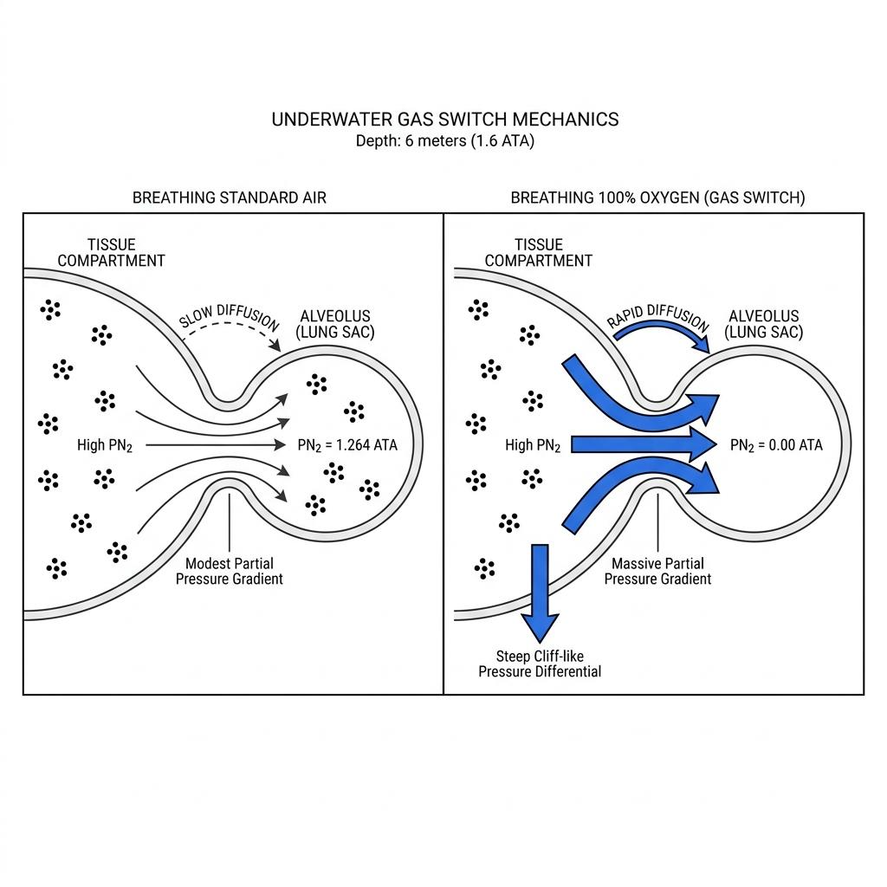

In the realm of technical diving, the surface is not merely a boundary marking the end of a dive. For a diver who has spent extended periods at great depths or inside overhead environments, the surface represents a massive wall of decompression that must be navigated through meticulous calculation and absolute control. While a standard recreational diver manages both the ascent and safety stops with a single cylinder worn on their back, technical divers equip themselves with additional gas cylinders along their sides. The "Accelerated Decompression" they perform by switching gases underwater is an advanced gas exchange technology that renders the journey to the surface both faster and safer.

### The Engine of Nitrogen Elimination: The Law of Partial Pressure Gradient

The core of decompression lies in safely eliminating inert gases—such as nitrogen or helium—dissolved within body tissues through respiration before they expand into microscopic bubbles that trigger decompression sickness. The physical driving force that dictates the speed at which gas migrates from tissues into the bloodstream, and subsequently from the blood through the alveoli to be exhaled, is the "Partial Pressure Gradient."

According to Dalton's Law of Partial Pressures, the total pressure of a gas mixture is equal to the sum of the partial pressures of its component gases, and the partial pressure of a specific gas is determined as follows:

$$
\text{Gas Partial Pressure} = \text{Ambient Pressure (ATA)} \times \text{Fraction of the Gas in the Mixture}
$$

At a fixed decompression stop depth where ambient pressure remains constant, a wider gradient between the nitrogen pressure within the body tissues and the partial pressure of nitrogen in the gas being breathed results in a exponentially faster diffusion of nitrogen out of the tissues. Conversely, if this partial pressure gradient is narrow, the elimination rate stagnates.

### Gas Switching: Forcing the Nitrogen Partial Pressure to Absolute Zero

Suppose a diver is performing a decompression stop at a depth of 6 meters (1.6 ATA) while breathing standard air (79% nitrogen). The partial pressure of nitrogen in the breathing gas at this depth is calculated as follows:

$$
1.6 \text{ ATA} \times 0.79 = 1.264 \text{ ATA}
$$

Because the partial pressure of nitrogen within the alveoli remains as high as 1.264 ATA, the pressure differential relative to the body tissues is small, causing nitrogen to diffuse at a slow pace. Consequently, the required decompression time lengthens.

This is where the magic of accelerated decompression comes into play. The moment the diver executes a gas switch to a cylinder containing 100% pure oxygen at the 6-meter stop, the fraction of nitrogen in the breathing gas instantly drops to 0%. Accordingly, the nitrogen partial pressure within the alveoli immediately shifts:

$$
1.6 \text{ ATA} \times 0.00 = 0.00 \text{ ATA}
$$

By driving the nitrogen partial pressure of the breathing gas to absolute zero, a massive pressure precipice—a steep gradient—is established between the nitrogen pressure in the body tissues and the lungs. Powered by this maximized gradient, the nitrogen trapped within the tissues gains incredible momentum, cascading out of the body through the bloodstream and lungs. Utilizing dedicated decompression gases like Nitrox 50% or 100% oxygen to slash absolute decompression time by up to half or more is the foundational mechanism of accelerated decompression.

### Opening the Biological Window: The Oxygen Window Effect

Another physiological mechanism by which high-oxygen breathing accelerates decompression is the "Oxygen Window" phenomenon. Our cells consume oxygen from arterial blood during metabolic processes and produce carbon dioxide as a byproduct. The critical factor here is that the metabolic consumption of oxygen causes a significant drop in gas pressure that is far greater than the subsequent pressure increase caused by carbon dioxide dissolving back into the blood.

Consequently, a physical void is created where the total gas pressure within venous blood and body tissues remains consistently lower than the surrounding ambient pressure. This pressure deficit is termed the "Oxygen Window." When a diver breathes a high concentration of oxygen during a decompression stop, the drop in venous gas pressure following cellular metabolism is maximized, throwing this biological window wide open. This open window draws inert gases out of the tissues and into the bloodstream at an accelerated rate, structurally suppressing the formation of bubbles.

### Precision Capturing Both Speed and Safety

Accelerated decompression is not a shortcut designed merely to exit the water quickly. It is a robust safety strategy that minimizes exposure to cold water temperatures and heavy currents, preventing diver exhaustion and hypothermia risks. Furthermore, by maximizing decompression efficiency, it shortens the duration that micro-bubbles reside within the body, offering a critical advantage in preventing decompression sickness.

Naturally, this highly efficient technique is only viable when backed by a diver's mathematical calculations and rigorous training to control the strict boundaries of oxygen toxicity. When you master the shifts in gas partial pressures across varying depths and maintain the precision required to switch gases seamlessly, accelerated decompression transforms into the ultimate tool to preserve life in demanding aquatic environments and elegantly clear the path to the surface.
