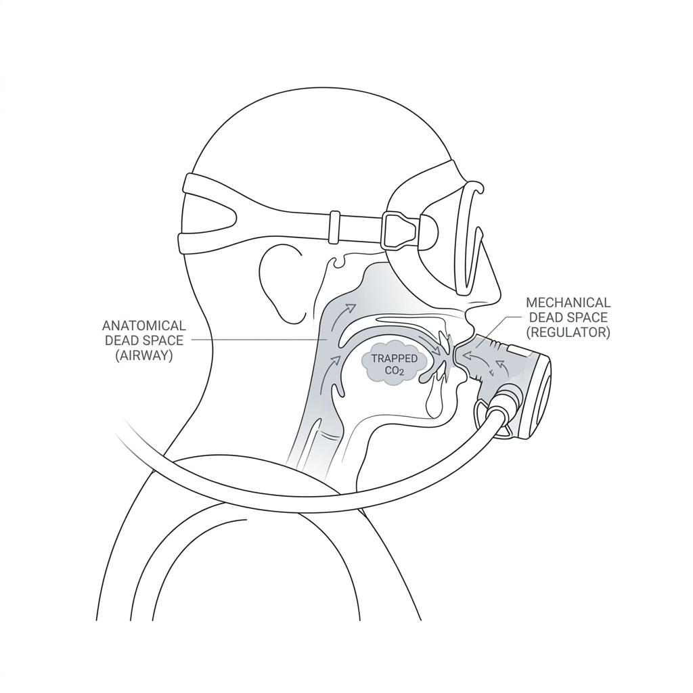
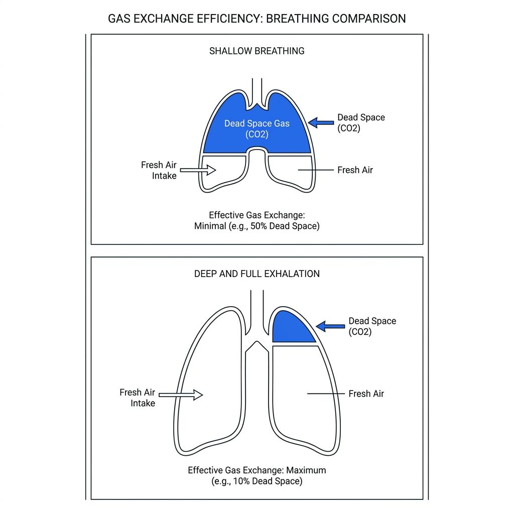

When you first learn to dive, one of the most common pieces of advice you hear is, "Breathe slowly and deeply." It is excellent advice for reducing air consumption and finding psychological calmness. However, when you actually try to control your breathing underwater following this advice, you might still feel a tightening in your chest or experience a mild headache after surfacing.

Why do you feel out of breath when you are clearly breathing slowly? This happens because we often focus solely on the "size" of our breath—our lung capacity—while overlooking the physical space where gas exchange efficiency drops. We call this space **Dead Space**.

### The Carbon Dioxide Trap: What is Dead Space?

On land, we naturally exchange gases by inhaling and exhaling fresh air through our nose and mouth. However, underwater, we must breathe through a mechanical device called a second-stage regulator, and this introduces structural limitations.

The pathway from your airway to your mouth, including the regulator's mouthpiece and internal chamber, is a discarded space where absolutely no oxygen and carbon dioxide exchange occurs. We refer to this as anatomical and mechanical **Dead Space**. When you exhale, the carbon dioxide-rich air from your lungs does not entirely escape into the water. Instead, a portion of it pools right inside this dead space.

Consequently, when you take your next breath, before you inhale the crisp, fresh air from your cylinder, you first draw this lingering carbon dioxide back into your lungs.

### The Terrifying Vicious Cycle of Shallow Breathing

What happens if a diver becomes tense or focuses too much on finning, causing their breathing to become even slightly shallow? When the absolute volume of inhaled air decreases, the proportion of fresh air entering the lungs drops sharply. Conversely, the proportion of carbon dioxide trapped in the dead space abnormally spikes. We call this state **Rebreathing**.

Our brain triggers a much stronger urge to breathe when blood carbon dioxide levels rise than when oxygen levels fall. To expel the accumulated carbon dioxide, your body instinctively commands your brain to make you breathe faster and harder. Because you feel out of breath, your breathing becomes shallow and rapid. This shallow breathing traps even more carbon dioxide, pushing you into a terrifying vicious cycle. This is exactly when you notice your pressure gauge needle dropping visibly fast.

### Focus on 'Exhaling', Not Inhaling

The method to break this vicious cycle and overcome dead space is surprisingly simple. You must abandon the obsession with taking big breaths in, and instead focus all your consciousness on exhaling. It is exactly like trying to fill a cup with clean water; you must first empty the murky water completely.

Before you inhale, gently contract your abdominal muscles. Try to exhale completely, feeling as though you are pushing every last bit of residual air from deep within your lungs and all the carbon dioxide inside the regulator out into the water. Once you cleanly empty this dead space, relax and open your chest. You don't need to force an inhalation; the fresh air from your cylinder will naturally rush in to fill the empty void.

### Breathing is About Emptying, Not Holding

Many divers unconsciously attempt **Skip Breathing**—forcing themselves to hold their breath to extend their dive time. However, this only accelerates carbon dioxide accumulation. It is a fast track to feeling short of breath and inducing headaches.

True breath control is not about holding your breath to save air. It is about maximizing gas exchange efficiency so your body feels completely comfortable. On your next dive, concentrate on the very end of your exhalation. Listen to the long, smooth sound of bubbles escaping your regulator. When you finally wash the carbon dioxide out of your body, you will experience a perfect sense of comfort underwater, just as you do on land.
