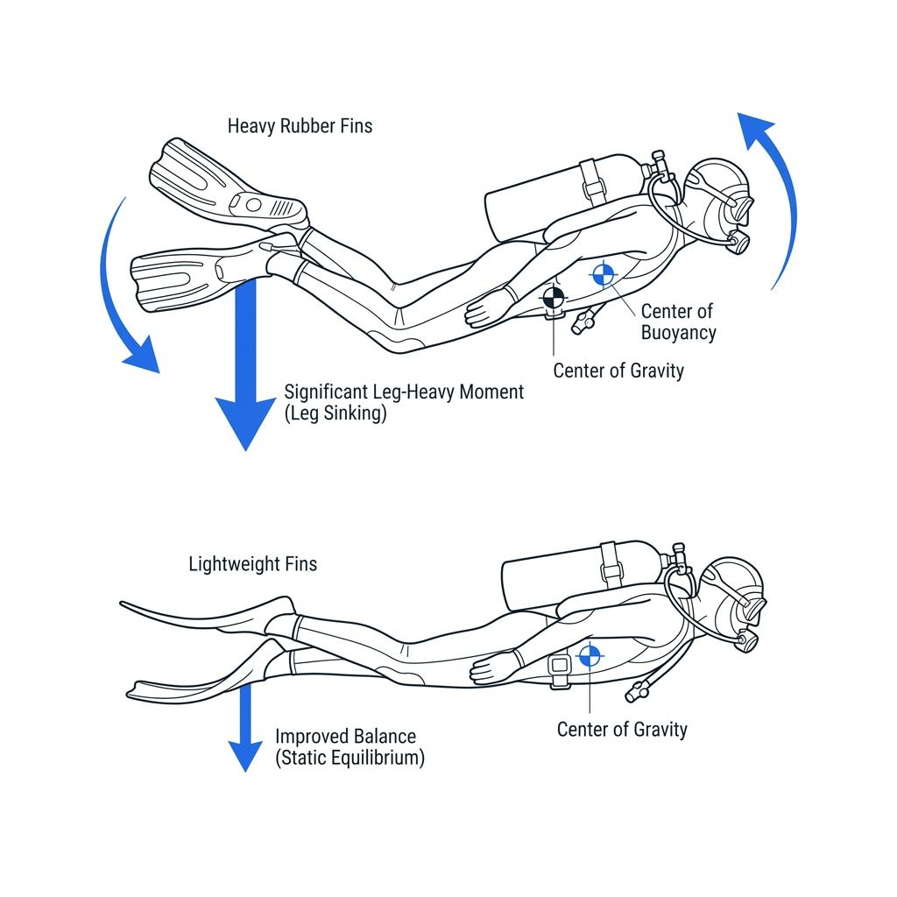

Have you ever finished a dive with a sore lower back or aching thighs? Most likely, you've been exhausting yourself by tensing your core and forcing your legs into a 90-degree angle to maintain that "perfect" horizontal position, or "Trim."

However, true trim isn't about muscular endurance. It should be a state of **Static Equilibrium**—where your equipment and body are so perfectly balanced that you remain horizontal even when completely relaxed. This is exactly why divers obsess over moving a 1kg weight by mere millimeters to find that perfect balance.

Today, we’re going beyond basic beginner advice like "look forward" or "straighten your back." We’ll dive deep into the actual physics of why your trim collapses and how to fix it at the source.

### Your Body is an Underwater Seesaw: Center of Gravity vs. Center of Buoyancy

Underwater, your body is governed by two opposing forces: buoyancy, which pulls you up, and gravity, which pulls you down.

Your **Center of Buoyancy (CB)** generally forms near your chest, where your air-filled lungs and BCD bladder are located. Conversely, your **Center of Gravity (CG)** is determined by your cylinder, lead weights, and your high-muscle-mass lower body, usually centering around your hips or navel.

If these two centers aren't vertically aligned, they create a **Moment**—a rotational force that tries to flip or tilt your body.

$$
M = F \cdot d
$$

Here, force **F** represents the weight or buoyancy of your gear, and distance **d** is the horizontal distance between the Center of Buoyancy (acting as the pivot point) and the Center of Gravity. When this distance **d** exists, the laws of physics will inevitably pull your legs down or lift your head up—no matter how hard you flex your back.

### The 5cm Cylinder Miracle

Leg-heaviness is one of the most common issues divers face. Many try to compensate by finning constantly to stay level, but this only increases air consumption without solving the root cause.

The simplest and most effective solution is adjusting your cylinder's position. The cylinder is the heaviest single piece of equipment you carry. If your legs keep sinking, try lowering the cylinder band on your BCD, effectively sliding the tank up toward your head. Shifting that center of gravity toward your upper body relieves the burden on your lower half and restores balance. Conversely, if you feel head-heavy, slide the cylinder down toward your hips.

Adjusting the band by just 5cm while setting up on land can drastically shorten the moment arm (**d**) underwater, leading to a dramatic improvement in your trim.

### It’s Not Your Fins' Fault

The weight of your fins also significantly impacts your trim. Heavy rubber fins (like Jet Fins) are negatively buoyant, while plastic or carbon fins are much lighter or even positively buoyant. For example, Mares Avanti Quattro + fins are slightly positively buoyant (nearly neutral) in the water.

When wearing a drysuit, air tends to migrate toward the feet, making the legs floaty. In this case, heavy rubber fins help anchor the lower body. However, wearing heavy fins with a thin wetsuit creates a strong rotational force that drags your legs down.

In these situations, there’s no need to waste energy fighting your legs or trying to counteract the weight with other gear. Simply switching to lighter fins is often the most intuitive and effective fix. Selecting the right fin weight for your exposure suit and environment is a critical part of mastering your trim.

### Stop Fighting the Water

If you’re forced to use kicks or core strength to stay horizontal, it’s probably not a lack of skill—it’s a configuration error.

Diving isn't a sport where you fight the water; it's one where you become a part of it. Before your next dive, check your physical balance: Is your cylinder at the right height? Are your weights distributed correctly? Is your fin weight appropriate? You might find yourself hovering in perfect trim without lifting a finger.
