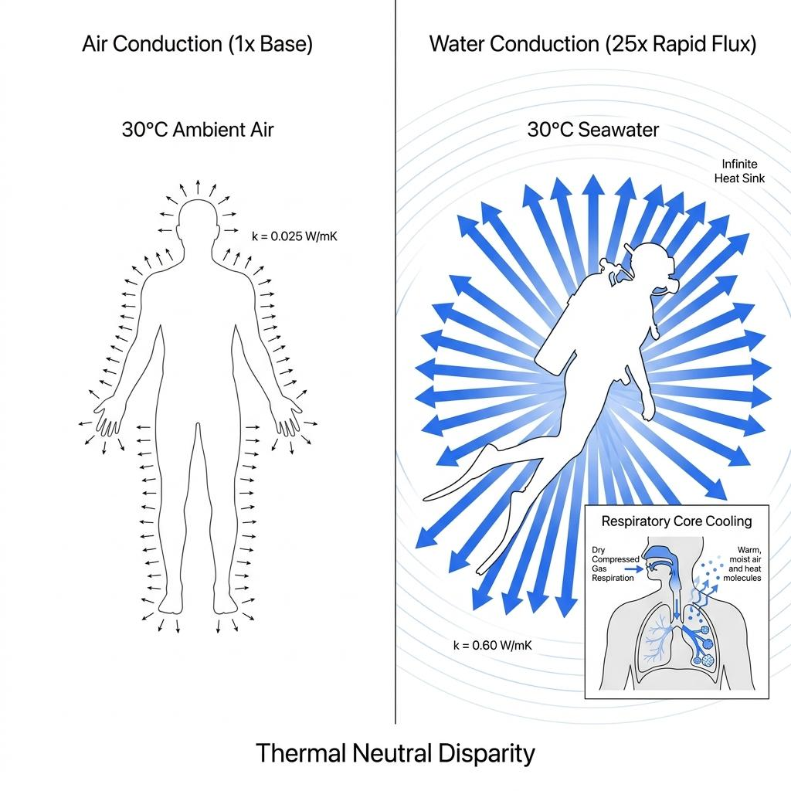

동남아시아나 열대 휴양지로 다이빙 여행을 떠난 다이버들이 흔히 겪는 기묘한 현상이 있습니다. 수온이 30도에 육박하는 따뜻한 바닷물에 들어서며 수영장 온수처럼 포근하다고 느꼈지만, 40분간의 다이빙을 마치고 안전 정지를 할 때쯤이면 자신도 모르게 턱을 덜덜 떨며 추위에 몸을 웅크리게 되는 경험입니다.

지상에서 기온이 30도라면 얇은 반소매 셔츠를 입고 가만히 있어도 땀이 흐르는 한여름 날씨입니다. 하지만 왜 동일한 온도의 바닷속에서는 뼈마디가 시려오는 한기를 느끼게 되는 것일까요. 이는 개인의 나약한 체력 때문이 아니라, 물이라는 유체가 가진 가혹한 물리적 열역학 법칙과 인체의 생리학적 방어 기제가 충돌하면서 발생하는 필연적인 결과입니다.

### 공기보다 25배 빠른 도둑: 물의 열전도율과 거대한 열용량

우리가 물속에서 추위를 느끼는 근본적인 이유는 물 분자가 열을 흡수하고 전달하는 능력이 공기와는 비교할 수 없을 정도로 압도적이기 때문입니다. 물리학적으로 물의 열전도율은 공기보다 약 25배 높습니다. 이는 동일한 표면적과 온도 차이에서 피부 표면의 열 에너지가 공기 중으로 빠져나가는 속도보다 바닷물로 빼앗기는 속도가 25배나 빠르다는 것을 의미합니다.

여기에 유체의 밀도와 비열이 만들어내는 체적 열용량의 격차까지 더해집니다. 물은 단위 부피당 공기보다 무려 3,000배 이상의 열량을 흡수할 수 있는 거대한 스펀지와 같습니다. 피부에 닿은 공기는 체온에 의해 쉽게 데워져 단열층 역할을 하지만, 바닷물은 피부에서 뿜어져 나오는 열을 순식간에 흡수한 뒤 끊임없이 주변으로 분산시켜 버립니다.

결국 다이버는 바다에 입수하는 순간, 자신의 체온으로 거대한 대양 전체를 데우려 하는 불가능한 열역학적 싸움을 시작하는 셈입니다. 30도의 수온 역시 차갑지 않게 느껴질 뿐, 인간의 중심 체온인 36.5도보다 현저히 낮기 때문에 체열은 쉴 새 없이 바다로 증발합니다.

### 35도의 역설: 왜 인간은 따뜻한 물에서도 식어가는가

인간이 옷을 입지 않고 가만히 누워있을 때 체온을 일정하게 유지할 수 있는 대기 온도를 열중립대(Thermal Neutral Zone)라고 부르며, 지상에서는 대략 24도에서 27도 사이에 형성됩니다. 이 온도 영역에서는 인체가 생명 활동을 유지하며 만들어내는 대사열과 외부로 방출되는 열량이 완벽한 평형을 이룹니다.

하지만 열 손실 속도가 극도로 빠른 수중 세계로 들어가면 이 열중립 온도가 무려 34.5도에서 35.5도 사이로 치솟게 됩니다. 즉, 섭씨 35도 이하의 물속에 들어간 인간은 생리학적으로 무조건 체온을 빼앗기며 서서히 냉각되는 경로를 밟게 됩니다.

성인 다이버가 휴식 상태에서 만들어내는 열 에너지는 백열전구 하나 수준인 80~100와트에 불과합니다. 반면 30도의 바닷물이 빼앗아가는 열량은 이를 아득히 초과합니다. 물속에서 팔다리를 활발하게 움직여 열을 내보려 해도, 움직임으로 인해 차가운 물의 대류 현상만 가속되어 오히려 열 손실 속도를 부채질할 뿐입니다.

### 호흡기로 빠져나가는 보이지 않는 열량: 건조한 기체의 폐포 냉각

다이버가 체온을 빼앗기는 통로는 피부 표면뿐만이 아닙니다. 수중에서 지속적으로 들이마시는 스쿠버 실린더 내부의 공기 역시 체내 중심부를 직접적으로 냉각시키는 숨은 주범입니다.

실린더 내부의 고압 기체는 1단계와 2단계 감압 밸브를 거쳐 급격히 팽창하면서 단열 팽창(줄-톰슨 효과)에 의해 온도가 급격히 떨어집니다. 게다가 컴프레서 필터를 거치며 습기가 제로에 가깝게 제거된 극도로 건조한 상태입니다. 이 차갑고 건조한 공기가 다이버의 폐포 속으로 들어오면, 폐 내부의 점막은 공기에 습기를 공급하고 온도를 체온 수준으로 끌어올리기 위해 막대한 양의 열과 수분을 증발시킵니다.

매 호흡마다 폐 내부에서 직접적으로 체열이 강탈당하기 때문에, 아무리 두꺼운 슈트를 챙겨 입더라도 다이빙 시간이 길어질수록 몸속 깊은 곳의 코어 온도는 서서히 떨어질 수밖에 없습니다.

### 추위가 다이버의 판단력을 앗아갈 때

수온에 의한 체온 저하는 단순히 불쾌한 추위에 그치지 않고 다이버의 안전에 치명적인 연쇄 작용을 일으킵니다. 중심 체온을 사수하기 위해 인체는 팔다리의 말초 혈관을 급격히 수축시키는 혈액 재분배를 감행합니다. 그 결과 손가락의 감각이 무뎌져 장비 조작이 둔해지고, 뇌로 가는 혈류 변화로 인해 위기 상황에서의 판단력이 눈에 띄게 저하됩니다.

더욱 치명적인 위험은 감압병(DCS)과의 상관관계입니다. 다이빙 후반부로 갈수록 말초 혈관이 좁아지면 근육과 관절 조직에 녹아있던 질소가 혈액을 타고 폐로 이동하여 배출되는 순환 속도가 급격히 떨어집니다. 몸이 차가워진 상태에서 안전 정지를 수행하면 체내 잔류 질소가 제때 방출되지 못하고 체내에 갇히게 되어 감압병 발병 위험이 비약적으로 증가합니다.

이러한 현상은 격렬한 떨림 없이 서서히 인지 능력을 마비시키며 찾아오기 때문에 이를 '침묵의 저체온증(Silent Hypothermia)'이라 부릅니다. 추위를 자각하지 못하더라도 다이빙 후 극심한 피로감을 느끼거나 관절이 뻐근하다면 이미 저체온의 덫에 걸렸던 증거입니다.

### 웻슈트의 단열 과학: 갇힌 물 한 겹이 만드는 기적

물이 체온을 뺏는 속도가 25배 빠르다면, 우리는 어떻게 차가운 바닷속에서 1시간 가까이 머물 수 있는 것일까요. 그 비밀은 웻슈트가 제공하는 네오프렌 내부의 독립 기포(Closed-cell Foam)와 피부 사이에 갇힌 얇은 수막에 있습니다.

웻슈트를 입고 입수하면 슈트 안쪽으로 소량의 바닷물이 유입됩니다. 이 유입된 물은 네오프렌에 의해 외부 바다와의 순환이 차단된 채 피부와 밀착됩니다. 다이버의 체온으로 이 얇은 수막을 한 번 데워두기만 하면, 갇혀있는 물은 새로운 차가운 물의 대류를 물리적으로 막아주며 매우 훌륭한 액체 단열재로 변모합니다.

결국 웻슈트의 보온력은 슈트의 두께뿐만 아니라, 몸에 얼마나 빈틈없이 밀착되어 차가운 물의 유출입을 막아주느냐에 따라 결정됩니다. 수온이 높다고 해서 슈트를 거르고 래시가드만 입거나 헐렁한 슈트를 착용하는 것은, 25배 빠른 속도로 체온을 강탈해 가는 바다의 물리 법칙 앞에 무방비로 자신을 노출하는 위험한 선택입니다.
