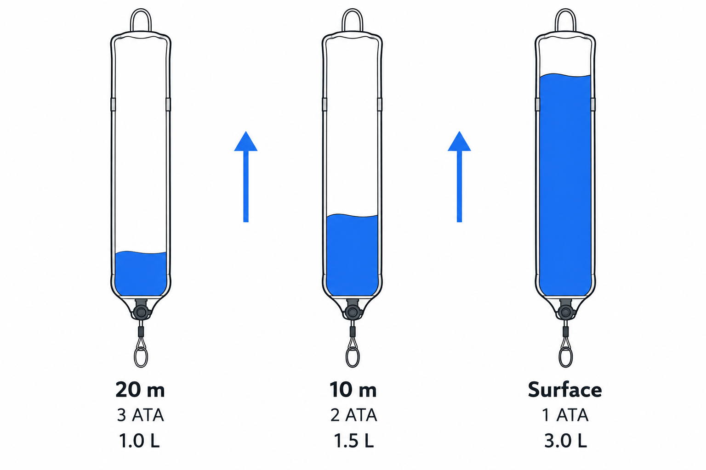
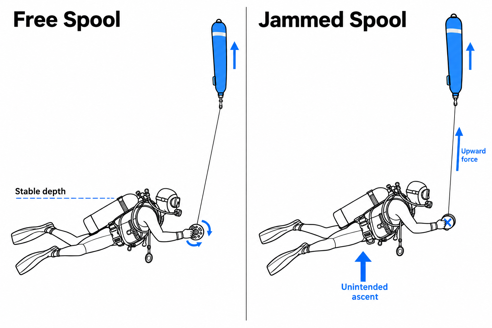

수심 5미터에서 안전 정지(Safety Stop)를 진행하던 중, 수면에 대기 중인 보트에 위치를 알리기 위해 SMB를 꺼냅니다. 한 손으로 릴을 잡고 다른 손으로 부이에 공기를 주입한 뒤 수면을 향해 놓아줍니다. 주황색 부이가 빠르게 떠오르고 손안의 릴이 회전하기 시작합니다. 그런데 부이가 올라가는 모습을 지켜보다 다이빙 컴퓨터를 확인하는 순간, 내 수심도 어느새 3미터로 얕아져 있습니다.

많은 다이버가 SMB 런칭을 단순히 '공기를 넣고 릴을 풀어주는 기술'로 생각합니다. 하지만 실제로는 기체의 압력과 부피 변화, 부력이 만들어내는 인양력(Lifting Force), 그리고 라인 장력(Line Tension)을 동시에 통제해야 하는 복합적인 물리학 실험에 가깝습니다. 부이는 빠르게 상승해야 하지만, 그 부이를 쏘아 올린 다이버는 정확히 같은 수심에 머물러야 한다는 역설적인 조건이 붙기 때문입니다.

수중에서 부이를 전개하는 장비는 엄밀히 말해 DSMB(Delayed Surface Marker Buoy)입니다. 일반적인 SMB가 수면에서 사용되거나 다이빙 내내 견인되는 것과 달리, DSMB는 수중에서 부풀려 수면으로 보내도록 설계됩니다. 그렇다면 어떻게 수면으로 솟구치는 부이와 연결된 상태에서도 내 몸의 중성부력을 무너뜨리지 않을 수 있을까요?

### 수심 10미터에서 넣은 공기는 수면에서 두 배가 된다

SMB 런칭의 핵심을 이해하려면 먼저 보일의 법칙(Boyle's Law)을 알아야 합니다. 온도가 일정하고 기체의 양이 변하지 않는다면, 기체의 부피는 주변 압력에 반비례합니다.

$$
P_1 V_1 = P_2 V_2
$$

수심 10미터의 주변 압력은 약 2 ATA이고, 수면에서는 1 ATA입니다. 따라서 수심 10미터에서 SMB에 1리터의 공기를 주입했다면, 이 공기는 수면에 도달할 때 약 2리터로 팽창합니다. 수심 20미터에서 넣은 1리터의 공기는 수면에서 약 3리터가 됩니다.

이는 부이의 내부 용적에 여유가 있고, 상승하는 동안 공기가 배출되지 않는다고 가정한 이론적인 값입니다. 실제 DSMB는 팽창 한계에 도달하면 과압 배출 밸브(OPV, Overpressure Valve)나 개방된 하단을 통해 여분의 기체를 배출합니다.

여기서 중요한 사실은 SMB를 수심에서 완전히 부풀릴 필요가 없다는 점입니다. 부이가 수면으로 올라가는 과정에서 주변 수압이 감소하고, 내부 기체는 자연스럽게 팽창하기 때문입니다. 다만 수심 5미터에서는 수면까지의 팽창률이 1.5배에 불과하므로, 지나치게 적은 공기를 넣으면 수면에서 부이가 충분히 서지 못할 수 있습니다.

결국 적절한 주입량은 고정된 한 호흡의 양이 아니라, **런칭 수심과 부이의 용적, 그리고 수면에서 필요한 부력에 따라 달라지는 값**입니다. 수심에 따른 공기 팽창률을 이해하면 불필요하게 많은 공기를 주입하지 않고도 부이를 효과적으로 전개할 수 있습니다.

### 릴이 잠기는 순간, SMB는 나를 끌어올리는 리프트가 된다

SMB에 주입한 공기는 단순히 부이의 모양을 만드는 역할만 하지 않습니다. 공기가 팽창해 더 많은 물을 밀어낼수록 부이가 받는 부력도 증가합니다.

이 현상을 설명하는 것이 아르키메데스의 원리(Archimedes' Principle)입니다. 물체가 받는 부력은 그 물체가 밀어낸 유체의 무게와 같습니다. 바닷물 1리터의 무게는 약 1kg이므로, 부이가 밀어낸 바닷물의 부피가 4리터라면 약 4kg중(kgf)의 부력이 발생합니다. 실제 인양력은 여기에서 부이 자체의 무게와 다른 저항을 고려해야 하지만, 작은 부이 하나에도 상당한 상승력이 만들어질 수 있다는 사실은 변하지 않습니다.

문제는 이 상승력이 릴의 라인을 통해 다이버에게 전달될 때 발생합니다.

정상적인 런칭에서는 부이가 상승하는 동안 릴에서 라인이 자연스럽게 풀려나갑니다. 그러나 라인이 손가락이나 장비에 엉키거나, 릴의 회전이 갑자기 잠기면 상황이 달라집니다. 부이가 만들어낸 상승력이 팽팽한 라인을 타고 다이버에게 그대로 전달되기 때문입니다.

이 순간 SMB는 수면 위치를 표시하는 신호 장비에서 다이버를 끌어올리는 인양 장치로 바뀝니다.

더 위험한 것은 상승이 시작된 이후입니다. 다이버가 의도하지 않게 얕은 수심으로 이동하면 BCD 내부에 있던 공기 역시 팽창하기 시작합니다. 적절한 배기가 이루어지지 않는다면 다이버 자신의 양성부력까지 커지면서 상승이 더욱 가속될 수 있습니다.

이것이 SMB 런칭에서 릴을 몸이나 BCD의 D링에 고정해서는 안 되는 이유입니다. **라인이 걸렸을 때 릴을 즉시 놓아줄 수 있어야 한다는 것**은 단순한 장비 사용 요령이 아니라, 부이의 상승력이 내 몸에 전달되는 연결 고리를 끊기 위한 핵심적인 안전 원칙입니다.

### 릴 컨트롤의 핵심은 빠르게 감는 것이 아니라 자유롭게 풀어주는 것이다

많은 다이버가 SMB 런칭에서 가장 어려워하는 부분은 릴 컨트롤(Reel Control)입니다. 공기가 주입된 부이를 놓는 순간 릴이 빠르게 회전하고, 가느다란 라인이 손가락 사이로 풀려나가기 시작하기 때문입니다.

여기서 직관적인 실수가 발생합니다. 릴이 너무 빠르게 돌아간다고 느껴 강하게 붙잡거나, 라인이 엉키는 것을 막기 위해 손으로 라인을 움켜쥐는 것입니다.

그러나 릴을 갑자기 멈추면 자유롭게 상승하던 부이와 다이버 사이에 강한 장력이 형성될 수 있습니다. 반대로 라인이 통제 없이 지나치게 빠르게 풀리면 느슨한 고리가 생겨 릴 내부에 걸리거나 다이버의 장비에 엉킬 수 있습니다.

따라서 릴 컨트롤의 핵심은 **라인을 강제로 붙잡는 것이 아니라, 부이의 상승을 방해하지 않으면서 불필요한 느슨함을 최소화하는 것**입니다.

런칭을 시작하기 전에는 먼저 중성부력을 안정시키고, 부이 위쪽에 다른 다이버나 선박, 장애물이 없는지 확인해야 합니다. 릴과 라인은 몸에서 충분히 떨어진 위치에 두고, 라인이 호흡기 호스나 손목, 장비 사이를 가로지르지 않도록 정리합니다. 사용하는 수심보다 충분히 긴 라인이 준비되어 있는지도 중요합니다.

부이에 적절한 양의 공기를 넣어 상승시키면 릴이나 핑거 스풀(Finger Spool)이 자유롭게 회전하도록 허용합니다. 필요한 경우 가벼운 저항으로 라인이 풀리는 속도를 조절하되, 급격하게 잠기지 않도록 해야 합니다. 부이가 수면에 도달한 뒤에는 남는 라인을 정리하고 적절한 장력을 유지해 부이가 수면에 서 있도록 합니다.

이 과정에서 무엇보다 중요한 것은 릴을 절대적인 고정점으로 생각하지 않는 태도입니다. 라인이 걸리거나 갑작스러운 인양력이 발생한다면 장비를 회수하려고 버티기보다, 릴을 즉시 놓아줄 수 있어야 합니다. 이를 위해 라인을 손이나 손목에 감지 않고, 커팅 도구(Cutting Device)에도 접근할 수 있어야 합니다.

숙련된 다이버는 릴을 끝까지 놓치지 않는 사람이 아닙니다. 어느 순간 릴을 놓아야 하는지 정확히 판단할 수 있는 사람입니다.

### 두 손은 바쁘지만, 내 수심은 움직이지 않아야 한다

SMB 런칭을 어렵게 만드는 마지막 요소는 중성부력(Neutral Buoyancy)입니다.

평소 다이빙에서는 시선과 호흡, BCD의 공기량, 핀킥을 조절하며 비교적 자연스럽게 수심을 유지합니다. 하지만 SMB를 꺼내는 순간부터 이 균형을 유지하는 데 사용하던 주의력이 다른 곳으로 분산됩니다.

한 손은 릴을 제어하고, 다른 손은 부이를 펼쳐 공기를 주입해야 합니다. 동시에 부이의 상승 경로를 확인하고 라인에 걸림이 없는지 살펴야 합니다. 여기에 다이빙 컴퓨터의 수심까지 확인해야 하므로 짧은 순간에 여러 작업이 겹칩니다.

이러한 작업 부하(Task Loading)는 기존에 안정적이던 부력 조절까지 무너뜨릴 수 있습니다.

특히 부이에 공기를 주입하는 동안 호흡 주기가 달라지거나, 장비를 조작하느라 자세가 무너지면 의도하지 않은 수심 변화가 발생하기 쉽습니다. 이때 수심을 유지하려고 핀킥으로 억지로 아래로 내려가거나, 폐에 공기를 가득 채운 채 호흡을 멈추는 것은 해결책이 아닙니다.

중성부력은 런칭을 시작하기 전에 이미 확보되어 있어야 합니다. 적절하게 조절된 BCD와 안정적인 호흡을 바탕으로 수평 트림을 유지하고, 장비를 다루는 도중에도 다이빙 컴퓨터와 버디를 통해 내 수심을 계속 확인해야 합니다. 필요하다면 소규모의 부력 조정을 하되, 라인에서 전달되는 상승력을 BCD나 핀킥으로 억지로 상쇄하려 해서는 안 됩니다.

SMB가 정상적으로 분리되어 상승하는 동안에는 부이와 다이버가 서로 다른 운동을 합니다. 부이는 양성부력에 의해 수면을 향하지만, 다이버는 자신의 중성부력을 이용해 원래 수심에 머무릅니다. 이 두 움직임을 독립적으로 관리하는 것이 런칭 기술의 본질입니다.

결국 정확한 SMB 런칭은 손기술 하나만으로 완성되지 않습니다. 부력 조절과 트림, 호흡, 장비 조작이 이미 익숙한 동작으로 자리 잡고 있어야 비로소 가능한 복합적인 수중 기술입니다.

### 부이를 띄우는 기술이 아니라, 나를 멈추는 기술

SMB 런칭의 성공 여부는 부이가 얼마나 빠르게 수면에 도달했는지로 결정되지 않습니다. 부이가 올라가는 동안 내 수심과 자세가 얼마나 안정적으로 유지되었는지가 훨씬 중요합니다.

보일의 법칙은 부이가 상승할수록 공기가 어떻게 팽창하는지 알려주고, 아르키메데스의 원리는 그 공기가 얼마나 큰 부력을 만들어내는지 설명합니다. 릴 컨트롤은 이 힘이 다이버에게 위험하게 전달되지 않도록 관리하는 기술이며, 중성부력은 모든 과정에서 내 몸을 안정적으로 유지하는 기반입니다.

다음 다이빙에서는 통제된 환경에서 버디와 강사의 감독 아래 SMB 런칭을 연습하며, 부이가 수면으로 올라가는 순간에도 내 다이빙 컴퓨터의 수심이 얼마나 일정하게 유지되는지 확인해 보세요.

**가장 정확한 SMB 런칭은 부이만 상승하고, 다이버는 계획된 수심에 그대로 머무르는 것입니다.**
