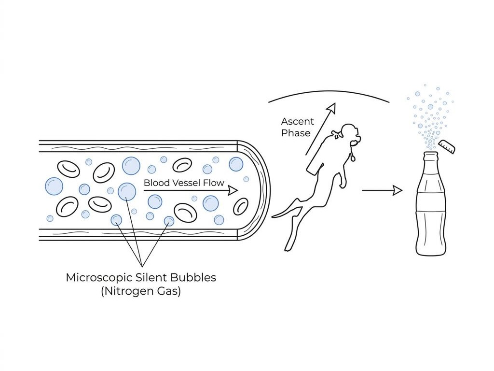
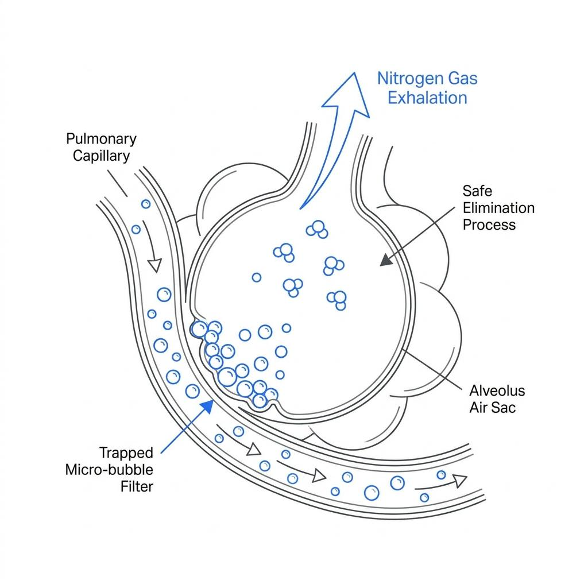

다이빙을 마치고 배 위나 해변으로 돌아오면 다이어리에 수면 휴식 시간(Surface Interval)을 기록합니다. 많은 다이버가 이 시간을 단순히 '다음 다이빙을 위해 피로를 푸는 시간'이나 '체내 질소를 대충 빼내는 시간' 정도로 생각하곤 합니다.

하지만 수면 휴식의 진짜 목적은 눈에 보이지 않는 더 치명적인 존재를 제어하는 데 있습니다. 바로 감압병의 방화쇠가 되는 '고요 기포(Silent Bubbles)'입니다. 우리가 수면에서 보내는 시간이 어떻게 혈관 내부를 깨끗하게 청소하는 과학적인 과정으로 이어지는지 파헤쳐 봅니다.

### 용해된 가스가 눈에 보이는 기포가 되기까지

물속에서 압력이 높아지면 우리가 호흡한 질소는 보일의 법칙과 헨리의 법칙에 따라 혈액과 신체 조직 속으로 녹아 들어갑니다. 이 단계의 질소는 액체 속에 완벽히 녹아 있는 형태이기 때문에 아무런 문제를 일으키지 않습니다. 탄산음료 뚜껑을 열기 전, 병 안의 음료가 투명하고 평온해 보이는 것과 같은 이치입니다.

진짜 변화는 우리가 상승할 때 시작됩니다. 수면으로 올라올수록 주변 압력이 낮아지면서 조직 속에 녹아 있던 질소가 다시 기체 상태로 빠져나오기 시작합니다. 이때 탄산음료 뚜껑을 열었을 때 기포가 뽀글뽀글 올라오는 것처럼, 다이버의 혈액과 조직 내에서도 미세한 질소 기포들이 형성됩니다. 이 기포들이 바로 감압병 증상을 겉으로 드러내지 않으면서 체내를 돌아다니는 '고요 기포'입니다.

### 증상이 없다고 안전한 것은 아니다

놀랍게도 현대 의학의 도플러 초음파 검사에 따르면, 안전 정지를 완벽히 지키고 감압 규정을 준수하며 상승한 정상적인 다이버의 혈관에서도 수많은 미세 기포가 발견됩니다. 다만 이 기포들의 크기가 매우 작고 양이 적어 혈관을 막지 않기 때문에, 다이버가 통증이나 마비 같은 감압병(DCS) 증상을 느끼지 못할 뿐입니다. 그래서 '고요(Silent)'이라는 이름이 붙었습니다.

하지만 증상이 없다고 해서 이 기포들이 무해한 것은 아닙니다. 체내에 고요 기포가 많이 남아있는 상태에서 충분한 수면 휴식 없이 곧바로 반복 다이빙(Repetitive Dive)을 진행하면 끔찍한 결과가 초래될 수 있습니다. 두 번째 다이빙에서 하강하고 다시 상승할 때, 새로 생성된 질소 가스가 기존에 남아있던 미세 기포들과 결합하면서 기포의 크기가 눈덩이처럼 커지기 때문입니다. 거대해진 기포는 결국 모세혈관을 막아 조직을 괴사시키고 극심한 감압병 통증을 유발하게 됩니다.

### 수면 휴식: 폐라는 천연 필터로 기포를 청소하는 시간

수면 휴식 시간은 우리 몸의 천연 필터인 '폐'를 가동하여 혈관 내 미세 기포들을 밖으로 밀어내는 능동적인 청소 시간입니다.

혈액을 타고 흐르는 고요 기포들은 결국 온몸을 돌다가 폐의 모세혈관에 도달하게 됩니다. 폐포를 둘러싼 얇은 막은 수중에서 생긴 미세한 기포들을 걸러내는 필터 역할을 합니다. 폐포에 걸러진 질소 기포들은 우리가 숨을 내뱉을 때마다 조금씩 분해되어 호흡을 통해 몸 밖으로 안전하게 배출됩니다.

이 청소 과정에는 절대적인 '시간'이 필요합니다. 기포가 폐포 벽을 통과해 확산되고 배출되는 속도는 물리적으로 정해져 있기 때문입니다. 다이빙 컴퓨터가 수면 휴식 시간을 초 단위로 카운트하는 것은 바로 내 혈관 속 기포 청소기가 얼마나 돌아갔는지를 계산하고 있는 것입니다.

### 완벽한 청소를 위한 다이버의 행동 요령

체내의 고요 기포를 더 효율적으로 청소하기 위해서는 수면 휴식 시간을 영리하게 보내야 합니다. 가장 중요한 것은 '수분 섭취'와 '체온 유지'입니다. 다이빙 후 탈수가 오거나 몸이 차가워지면 혈액 순환 속도가 느려져, 혈관 속 기포들이 폐로 이동하여 배출되는 효율이 급격히 떨어집니다. 따뜻한 물을 충분히 마시고 체온을 보호하는 것 자체가 혈관 청소기의 성능을 높이는 행위입니다.

수면 휴식은 다이빙 사이의 공백기가 아니라, 이미 시작된 감압 과정의 연장선입니다. 다음 다이빙을 준비하며 수면에 머무는 동안, 나의 폐가 혈관 구석구석을 돌며 고요 기포들을 열심히 청소하고 있다는 사실을 기억하시기 바랍니다. 충분한 시간을 두고 몸을 완전히 비워낼 때, 다음 다이빙 역시 가장 안전하고 평온한 탐험이 될 것입니다.
