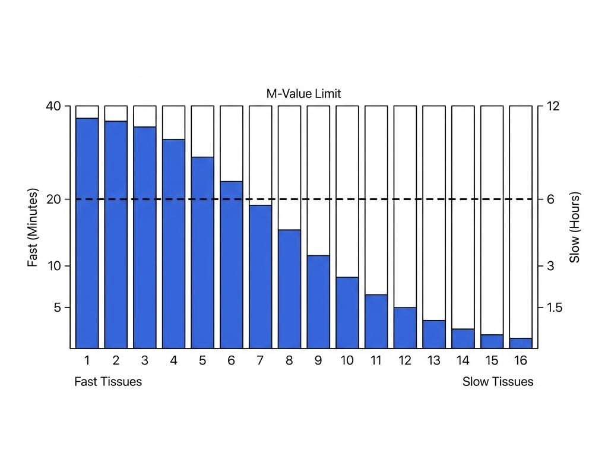
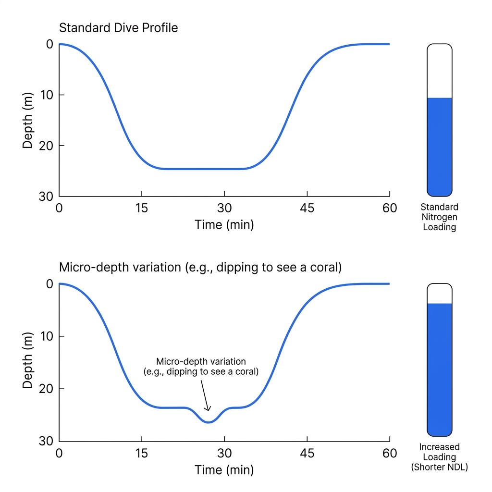

다이빙 컴퓨터는 우리 손목 위에서 실시간으로 안전한 다이빙 시간을 계산해 주는 아주 똑똑한 기계입니다. 하지만 같은 시간, 같은 수심에서 나란히 다이빙 중인 버디와 나의 무감압 한계 시간(NDL)이 수 분씩 차이 나는 것을 본 적이 있으실 겁니다. 기계적인 오류일까요? 아니면 모델의 차이일까요?

답은 다이빙 컴퓨터 내부에 탑재된 '알고리즘'에 있습니다. 컴퓨터는 우리 몸을 수십 개의 논리적 조각으로 나누어 초 단위로 연산을 수행하고 있습니다. 이 글에서는 현대 다이빙 컴퓨터 알고리즘의 표준이라 불리는 뷜만(Bühlmann) 모델을 통해 그 수학적 비밀을 파헤쳐 봅니다.

### 내 몸을 16개로 쪼개는 가상 조직 모델

다이빙 컴퓨터는 우리의 실제 혈액형이나 체지방률, 근육량을 알지 못합니다. 대신 알베르트 뷜만 박사가 고안한 수학적 모델(ZHL-16)을 사용하여 우리의 인체를 16개의 가상 조직(Compartment)으로 나누어 시뮬레이션합니다.

이 16개의 조직은 혈액이나 뇌처럼 혈류량이 많아 기체 교환이 빠른 **빠른 조직** (Fast Tissue)부터, 뼈나 연골처럼 기체 교환이 아주 느리게 일어나는 **느린 조직** (Slow Tissue)까지 다양하게 구성되어 있습니다. 우리가 물속으로 하강하는 순간부터, 컴퓨터는 이 16개의 가상 조직이 각각 얼마나 많은 질소를 흡수하고 있는지를 동시에 병렬로 계산하기 시작합니다.

### 반감기(Half-Time)와 질소 포화의 속도차

각각의 가상 조직은 질소를 흡수하고 배출하는 고유의 속도를 가지고 있으며, 이를 **반감기** (Half-Time)라는 개념으로 설명합니다. 반감기란 주변 압력과 조직 내 압력 차이의 절반을 채우는 데 걸리는 시간을 의미합니다.

예를 들어 5분짜리 빠른 조직은 수심이 깊어지면 순식간에 질소를 빨아들이지만, 반대로 상승할 때는 그만큼 빠르게 질소를 배출해 냅니다. 반면 120분 이상의 느린 조직은 깊은 수심에 잠깐 머무는 정도로는 질소를 거의 흡수하지 않지만, 반복 다이빙을 지속하면 서서히 질소가 누적되어 수면 휴식 시간 동안에도 쉽게 빠져나가지 않는 특징을 보입니다. 컴퓨터의 화면에 표시되는 단 하나의 NDL 숫자는, 사실 백그라운드에서 치열하게 돌아가고 있는 16개 조직의 질소 포화도 경주 결과인 셈입니다.

### 생존의 마지노선, M-Value

그렇다면 이 NDL은 정확히 어떻게 결정되는 것일까요? 뷜만 모델의 각 가상 조직에는 **M-Value** (최대 허용 과포화도)라는 절대적인 한계치가 설정되어 있습니다. 이는 해당 조직이 감압병을 유발하는 미세 기포를 형성하지 않고 견딜 수 있는 질소 압력의 최대 한계선입니다.

우리가 다이빙을 진행함에 따라 16개의 조직 중 어느 하나라도 자신의 M-Value에 도달하기까지 남은 시간이 바로 다이빙 컴퓨터 화면에 깜빡이는 NDL입니다. 일반적으로 수심 30미터 이상의 대심도에서는 질소를 급격히 흡수하는 빠른 조직이 NDL을 깎아내리고, 얕은 수심에서 길게 다이빙할 때는 서서히 질소가 쌓인 중간 조직이나 느린 조직이 NDL을 결정하는 **주도 조직** (Leading Tissue)이 됩니다.

### 버디와 나의 NDL이 다른 결정적 이유

이제 버디와 나의 NDL이 다른 이유를 수학적으로 설명할 수 있습니다. 가장 큰 이유는 두 컴퓨터가 채택한 알고리즘과 **보수성** (Conservatism) 설정의 차이입니다. 뷜만 알고리즘을 쓰는 컴퓨터와 RGBM 알고리즘을 쓰는 컴퓨터는 M-Value를 계산하고 기포의 성장을 예측하는 수학적 전제가 완전히 다릅니다. 또한, 같은 뷜만 모델이라도 **그라디언트 팩터** (Gradient Factor)라는 보수성 세팅을 어떻게 조절했느냐에 따라 컴퓨터가 NDL을 잘라내는 기준선이 확연히 달라집니다.

심지어 완전히 동일한 컴퓨터에 동일한 세팅을 했더라도 NDL은 다를 수 있습니다. 다이빙은 완벽한 2인 3각 경기가 아닙니다. 버디가 바닥의 산호를 보기 위해 나보다 1미터 아래로 30초 동안 내려갔다 왔다면, 버디의 가장 빠른 1번 가상 조직은 이미 나보다 더 많은 압력을 받아 질소를 흡수했을 것입니다. 컴퓨터의 초정밀 압력 센서는 이 미세한 수심 변화와 시간의 누적을 초 단위로 계산하여 버디의 NDL을 나보다 1~2분 먼저 깎아내리게 됩니다.

### 기계의 지시를 넘어선 이해

다이빙 컴퓨터는 마법의 기계가 아니라, 실시간으로 수집되는 압력 데이터를 수학적 모델에 대입하여 끊임없이 정답을 도출해 내는 정밀한 계산기입니다. 화면에 뜬 NDL 숫자 뒤에 숨겨진 16개 조직의 상태와 알고리즘의 원리를 이해하는 순간, 우리는 단순히 기계의 알람에 의존하는 수동적인 다이버를 넘어, 자신의 다이빙 프로파일을 주도적으로 통제하고 설계하는 한 차원 높은 시야를 갖추게 될 것입니다.
