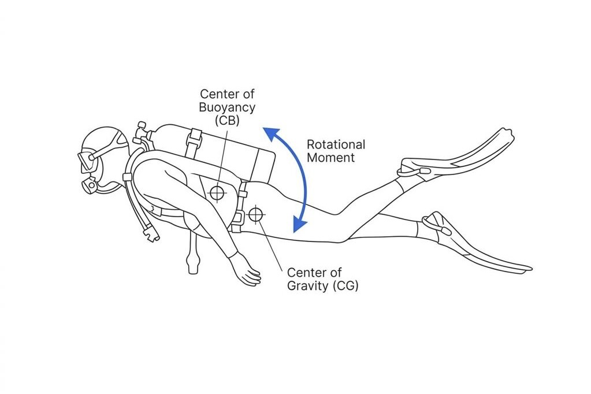

다이빙을 마치고 출수할 때, 허리나 허박지가 뻐근했던 경험이 있으신가요? 수중에서 멋진 수평 자세, 즉 '트림(Trim)'을 유지하기 위해 코어에 잔뜩 힘을 주고 다리를 90도로 꺾어 올리느라 에너지를 소모했기 때문일 확률이 높습니다.

하지만 진정한 트림은 근육으로 버티는 자세가 아닙니다. 장비와 신체의 밸런스가 맞아떨어져, 온몸에 힘을 빼도 자연스럽게 수평이 유지되는 **정적 평형** (Static Equilibrium) 상태여야 합니다. 웨이트 1kg의 위치를 밀리미터 단위로 조정하는 것도 바로 이 평형을 찾기 위함입니다.

오늘은 초보자 가이드에서 흔히 말하는 "시선은 앞을 보고 허리를 펴세요" 같은 조언을 넘어, 트림이 무너지는 물리적인 원인과 그 해결책을 파헤쳐 봅니다.

### 내 몸은 수중의 시소: 무게중심과 부력중심

수중에서 우리 몸은 두 가지 상반된 힘의 지배를 받습니다. 우리를 띄우려는 부력과, 가라앉히려는 중력입니다.

**부력중심** (Center of Buoyancy)은 공기가 가득 찬 폐와 BCD의 공기집이 위치한 가슴 부근에 형성되어 우리 몸을 위로 당깁니다. 반면 **무게중심** (Center of Gravity)은 실린더, 웨이트 납, 그리고 근육량이 많은 하체에 의해 결정되며 보통 골반이나 배꼽 주변에 형성되어 우리 몸을 아래로 끌어내립니다.

이 두 중심점이 수직선상에 나란히 있지 않고 앞뒤로 어긋나 있다면, 몸을 회전시키려는 힘인 **모멘트** (Moment)가 발생합니다.

$$
M = F \cdot d
$$

여기서 힘 **F**는 장비의 무게나 부력이고, 거리 **d**는 부력중심을 축(Pivot Point)으로 했을 때 무게중심까지의 거리입니다. 이 거리 **d**가 발생하면, 당신이 아무리 허리에 힘을 주고 버텨도 물리 법칙에 의해 다리가 가라앉거나 머리가 들리는 회전 운동이 일어날 수밖에 없습니다.

### 실린더 높이 5cm가 만드는 기적

가장 흔하게 발생하는 문제 중 하나는 하체 가라앉음입니다. 이를 해결하기 위해 핀킥을 차며 몸을 띄우려 하지만, 이는 공기 소모량만 늘릴 뿐 근본적인 해결책이 아닙니다.

가장 쉽고 확실한 해결책은 실린더의 위치를 조절하는 것입니다. 실린더는 다이버가 착용하는 장비 중 가장 무거운 단일 장비입니다. 다리가 자꾸 가라앉는다면 BCD에 체결하는 실린더 밴드의 위치를 조금 낮춰, 실린더 전체를 내 머리 쪽으로 조금씩 올려보세요. 무게중심이 상체 쪽으로 이동하면서 하체의 부담이 줄어들고 수평이 맞게 됩니다. 반대로 머리가 자꾸 무겁게 쏠린다면 실린더를 약간 아래쪽으로 엉덩이에 가깝게 내려 무게중심을 하체 쪽으로 보내면 됩니다.

물 밖에서 장비를 세팅할 때 밴드 위치를 단 5cm만 조정해도, 수중에서 모멘트 거리가 줄어들어 극적인 트림의 변화를 체감할 수 있습니다.

### 당신의 핀은 죄가 없습니다

핀의 무게도 트림에 지대한 영향을 미칩니다. 제트핀 계열의 고무 핀은 음성 부력을 띠며 상당히 무거운 반면, 플라스틱이나 카본 소재의 핀은 가볍거나 양성 부력을 띱니다. 마레스 아반티 콰트로 플러스(Mares Avanti Quattro +)는 물속에서 약간의 양성 부력(거의 중성에 가까운)을 가지고 있지요.

드라이슈트를 입을 때는 발쪽으로 공기가 몰려 다리가 뜨기 쉽기 때문에, 무거운 고무 핀을 신어 무게중심을 잡아 주는 것이 유리할 때가 많습니다. 하지만 얇은 웻슈트를 입고 무거운 핀을 신는다면 핀의 무게 때문에 다리가 가라앉는 강한 회전력이 발생합니다.

이럴 때는 억지로 다리를 들어 올리려 하거나 다른 장비 세팅으로 무게를 억지 상쇄하려 할 필요가 없습니다. 웻슈트를 입을 때는 단순히 가벼운 소재의 핀을 착용하는 것만으로도 아주 훌륭하고 직관적인 해결책이 됩니다. 자신이 착용하는 슈트와 환경에 맞는 핀의 무게를 선택하는 것부터가 트림 세팅의 중요한 과정입니다.

### 물과 싸우지 않는 다이빙의 시작

물 속에서 발차기나 허리 힘으로 억지로 수평을 만들고 있다면, 그것은 나의 다이빙 실력이 부족해서가 아니라 세팅이 잘못되었기 때문일 가능성이 큽니다.

다이빙은 물과 싸우는 스포츠가 아니라 물에 동화되는 스포츠입니다. 다음 다이빙에서는 물에 뛰어들기 전, 나의 실린더 높이와 웨이트의 배치, 그리고 핀의 무게가 물리적인 평형을 이루고 있는지 먼저 점검해보면 어떨까요? 수중에서 손가락 하나 까딱하지 않고도 완벽하게 멈춰 있는 당신을 발견하게 될 것입니다.
