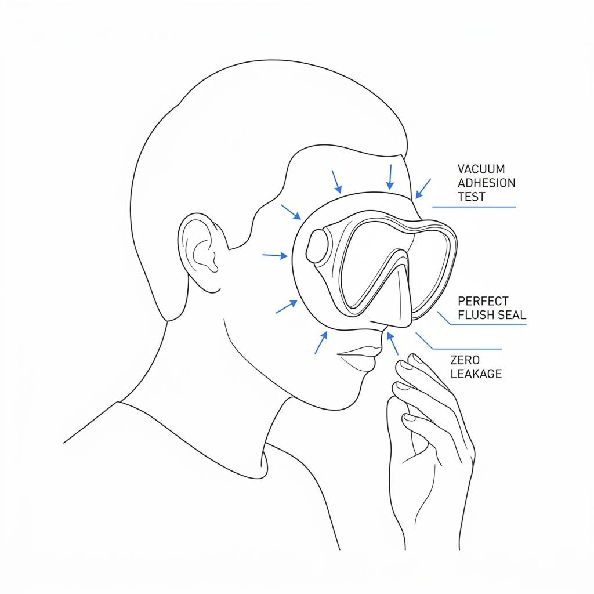

수중 세계를 마주하는 가장 첫 번째 창문인 다이빙 마스크는 다이버의 시야와 심리적 안정에 직결되는 장비입니다. 물속에서 마스크 내부로 끊임없이 물이 스며들거나 코 포켓이 짓눌려 통증이 발생하면, 아무리 아름다운 풍경 앞에서도 다이빙은 고통으로 변하게 됩니다. 많은 다이버가 유명 브랜드의 인기 모델이나 화려한 색상만을 보고 장비를 선택하지만, 마스크를 고르는 최우선 기준은 철저하게 자신의 '얼굴형'이어야 합니다.

### 동양인과 서양인의 두상 차이라는 물리적 벽

시중에 판매되는 글로벌 다이빙 브랜드의 상당수는 유럽이나 미국에 기반을 두고 있습니다. 이로 인해 대다수의 기본 마스크 프레임은 서양인의 골격 특성인 좁고 앞뒤로 긴 두상, 높은 콧대, 그리고 깊은 눈방울 구조에 맞춰 설계됩니다.

반면 전형적인 동양인의 얼굴형은 상대적으로 좌우 대칭면이 넓고 평평하며, 콧대가 시작되는 비근점(Nasion)이 낮고 광대뼈가 조금 더 돌출된 형태를 띱니다. 이러한 해부학적 차이를 간과한 채 서양인 핏으로 제작된 유명 마스크를 착용하면 구조적인 유격이 발생할 수밖에 없습니다. 특히 콧대 옆쪽의 빈 공간이나 돌출된 광대뼈 주변의 스커트(Silicone Skirt)가 들뜨면서 핀킥을 차거나 미소를 지을 때마다 물이 새어 들어오는 고질적인 문제의 원인이 됩니다. 최근 일부 브랜드에서 '아시안 핏(Asian Fit)' 모델을 별도로 출시하는 이유도 바로 이 압력 경계면의 물리적 차이 때문입니다.

### 마스크 선택의 절대 명제: 무조건 써봐야 안다

마스크의 성능을 결정짓는 것은 실리콘의 두께나 유리의 투명도가 아니라, 내 얼굴 윤곽과 마스크 스커트 라인이 완벽한 '진공 상태'를 형성하느냐입니다. 따라서 타인의 추천이나 온라인상의 리뷰는 참고 자료일 뿐, 직접 착용해 보고 검증하는 과정이 반드시 선행되어야 합니다.

오프라인 숍에서 자신에게 맞는 마스크를 찾아내는 가장 확실한 검증법은 스트랩을 쓰지 않는 '흡착 테스트'입니다. 마스크 스트랩을 머리 뒤로 넘기지 않은 채, 마스크 프레임만 얼굴 위에 가볍게 얹습니다. 그 상태로 머리카락이 스커트 안쪽으로 들어가지 않도록 정리한 뒤, 코로 숨을 가볍게 들이마시고 멈춥니다. 만약 마스크가 내 얼굴형과 완벽하게 일치한다면, 손을 떼고 고개를 아래로 숙이거나 가볍게 흔들어도 마스크가 얼굴에 진공 흡착되어 떨어지지 않고 그대로 붙어 있어야 합니다. 숨을 들이마시는 동안 특정 부위에서 바람 빠지는 소리가 들리거나 압력이 유지되지 않는다면, 그 마스크는 물속에서 반드시 물이 샐 마스크이므로 미련 없이 제외해야 합니다.

### 최고의 장비는 존재를 잊게 만드는 것

장비의 네임밸류나 유행하는 디자인이 수중에서의 편안함을 보장해 주지 않습니다. 아무리 비싸고 고급스러운 마스크라도 내 광대를 누르고 코를 압박한다면 그것은 실패한 장비입니다. 반대로 이름 없는 저렴한 마스크라도 내 얼굴에 얹었을 때 완벽한 밀착감을 준다면 그것이 나에게는 수백만 원짜리 커스텀 장비보다 훌륭한 최고의 마스크입니다.

물속에서 내가 마스크를 쓰고 있다는 사실조차 잊어버릴 만큼 완벽한 핏을 찾는 것, 그것이 바로 마스크 선택의 최종 목적지입니다. 다음 다이빙을 위한 장비를 고민하고 있다면 브랜드를 향한 시선을 거두고, 오직 내 얼굴의 곡선과 마스크가 이루는 정밀한 밀착감에만 집중해 보시기 바랍니다.
