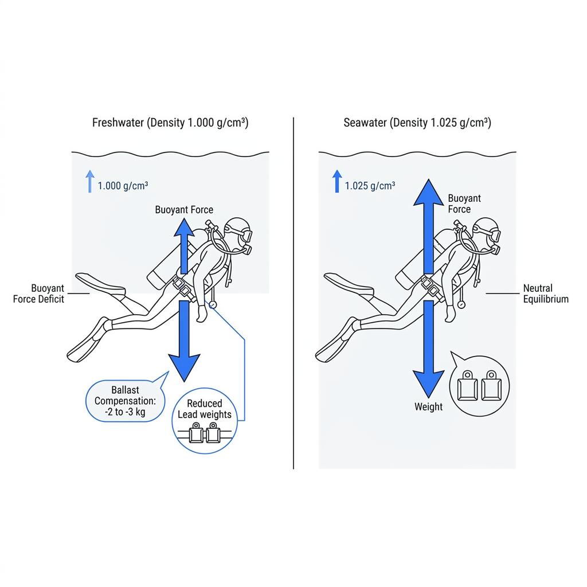

대부분의 다이버는 개방수역 교육을 바다에서 시작하기 때문에 물속 환경의 기준을 자연스럽게 해수에 맞추곤 합니다. 짭조름한 바닷물, 규칙적인 조류, 수평선 너머로 펼쳐지는 산호초가 다이빙의 전부라고 생각하기 쉽습니다.

하지만 멕시코의 신비로운 세노테, 고요한 산정호수, 거대한 강바닥을 탐험하는 민물 다이빙의 문을 여는 순간 전혀 예상치 못한 물리적 변화를 겪게 됩니다. 바다에서 사용하던 익숙한 웨이트를 그대로 차고 입수했다가 엘리베이터가 추락하듯 바닥으로 곤두박질치거나, 얼음물처럼 날카로운 수온약층을 마주하며 당황하는 일이 대표적입니다. 바다와는 전혀 다른 물리 법칙과 독특한 매력을 지닌 담수 다이빙의 메커니즘을 파헤쳐 봅니다.

### 아르키메데스의 법칙: 소금 3%가 결정하는 웨이트의 비밀

민물 다이빙을 시작할 때 가장 먼저 조정해야 하는 요소는 바로 착용하는 납 웨이트의 무게입니다. 바닷물에는 평균 3.5%의 염분이 녹아 있어 담수보다 밀도가 약 2.5%에서 3%가량 높습니다. 이 미세해 보이는 밀도 차이가 다이버의 몸 전체와 공기통, 슈트의 부피와 결합하면 거대한 부력의 격차를 만들어냅니다.

신체와 장비를 합쳐 100리터의 부피를 가진 다이버를 기준으로 계산해 보면, 바다에서는 102.5kg의 부력을 받지만 민물에서는 100kg의 부력밖에 받지 못합니다. 바다에서 완벽한 중성 부력을 맞췄던 다이버가 민물에 그대로 입수하면 순식간에 2.5kg짜리 덤벨을 몸에 묶고 들어간 것과 같은 강한 음성 부력 상태가 됩니다.

따라서 담수 다이빙 전에는 반드시 부력 체크를 다시 진행하여 평소 바다에서 차던 웨이트에서 약 2kg에서 3kg(전체 체중의 약 2~3%)을 덜어내야 합니다. 웨이트 조절 없이 입수할 경우 수면에서 부력 확보가 어려워지고, 바닥으로 급하강하여 침전물을 강타하거나 귀 통증을 겪는 위험에 노출될 수 있습니다.

### 극단적인 시야와 침전물의 역설: 크리스털 워터와 앙금 트랩

담수 환경, 특히 지하수가 석회암층을 통과하며 천연 필터링된 세노테나 청정 산정호수는 바다에서는 상상하기 힘든 극단적인 투명도를 자랑합니다. 부유물이 거의 없어 수십 미터 밖의 버디가 마치 공중에 떠 있는 것처럼 선명하게 보이는 압도적인 시각적 해방감을 선사합니다.

하지만 이러한 경이로운 시야 이면에는 치명적인 침전물의 함정이 숨어 있습니다. 파도와 조류가 끊임없이 바닥을 씻어내는 바다와 달리, 흐름이 없는 호수나 동굴 바닥에는 수천 년간 침전된 미세 분진과 유기물이 두껍게 쌓여 있습니다. 이 분진은 밀가루보다 입자가 곱기 때문에 단 한 번의 잘못된 핀킥이나 손짓만으로도 폭풍처럼 피어오릅니다.

한번 피어오른 담수의 미세 앙금은 조류가 없어 몇 시간 동안 가라앉지 않고 제자리에 머물며, 순식간에 한 치 앞도 보이지 않는 암흑 상태를 만듭니다. 완벽한 수평 트림과 앙금을 일으키지 않는 프로그 킥 제어 능력이 담수 다이빙에서 필수적으로 요구되는 이유가 바로 여기에 있습니다.

### 칼로 자른 듯한 수온약층과 고도 다이빙의 변수

바다에서는 조류와 파도에 의해 수온이 비교적 완만하게 변하지만, 닫힌 담수 환경에서는 마치 물속에 보이지 않는 유리판을 깔아둔 것처럼 급격한 수온약층(Thermocline)이 형성됩니다. 수심 5미터까지는 따뜻한 온수였다가도, 특정 경계선을 10cm만 지나치는 순간 수온이 10도 이상 곤두박질치는 서늘한 냉수층을 만나게 됩니다.

특히 담수는 섭씨 4도에서 물리적 밀도가 가장 높아지기 때문에, 깊은 호수 바닥에는 계절과 관계없이 4도에 가까운 극저온 암흑층이 고정되어 있습니다. 표면 수온이 따뜻하다고 해서 얇은 웻슈트만 입고 들어갔다가는 깊은 수심에서 저체온증에 직면할 수 있으므로 보온 대책을 철저히 수립해야 합니다.

또한 내륙의 호수는 해수면보다 높은 고지대에 위치한 경우가 많습니다. 해발 300미터 이상의 고도 다이빙에서는 수면 대기압이 1기압보다 낮기 때문에 체내 질소 배출 속도가 달라집니다. 다이브 컴퓨터를 고도 모드로 전환하고 특수한 고도 감압 테이블을 적용하지 않으면 바다보다 훨씬 얕은 수심에서도 감압병 위험이 급증합니다.

### 타임캡슐을 여는 즐거움과 담수 다이빙의 가치

바다 다이빙이 화려한 열대어와 산호초를 감상하는 생태계 중심의 여정이라면, 담수 다이빙은 지구의 지질학적 역사와 완벽하게 보존된 유적을 탐험하는 고고학적 탐사에 가깝습니다.

염분이 없는 담수 환경에서는 철이나 나무를 부식시키는 화학 반응이 매우 느리게 일어납니다. 바다에서는 수십 년 만에 녹슬어 무너지는 난파선이나 비행기가 담수 호수 속에서는 100년이 넘는 세월 동안 건조 당시의 원형을 그대로 유지한 채 다이버를 맞이합니다. 바닷속과는 완전히 다른 기이한 수중 동굴 지형과 수중 침식 암석들은 오직 민물에서만 경험할 수 있는 독보적인 비경입니다.

담수의 물리적 특성을 정확히 이해하고 장비 세팅과 부력 기술을 환경에 맞게 전환할 때, 다이버는 짠물 너머에 숨겨진 지구의 또 다른 푸른 세상을 안전하고 완벽하게 경험할 수 있습니다.