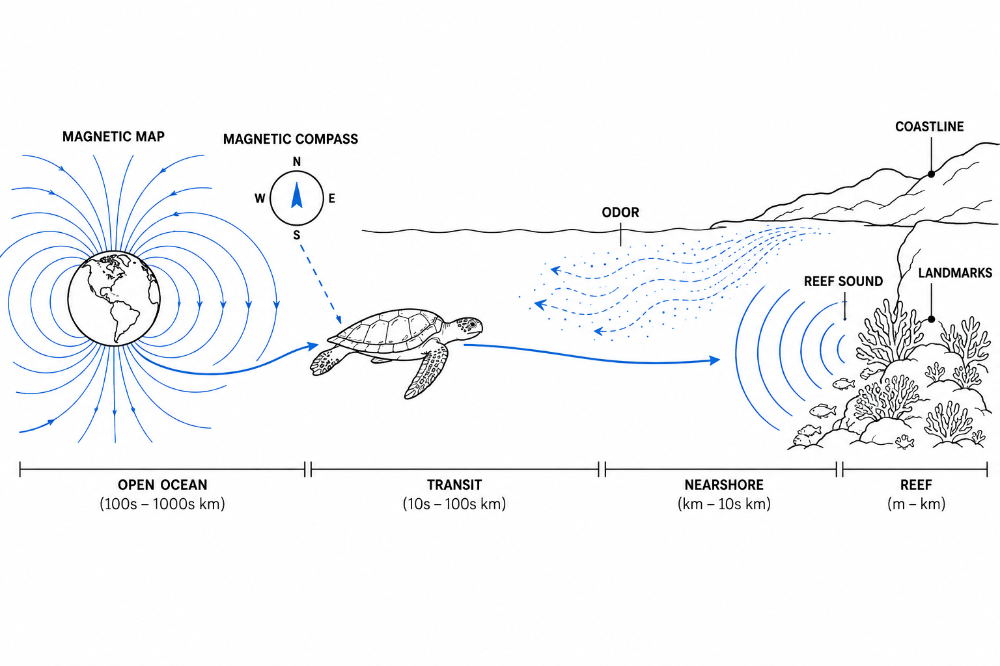
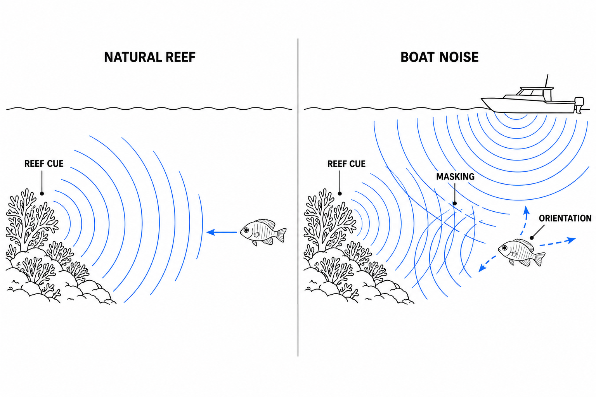

다이빙을 하다 보면 가끔 이상한 생각이 듭니다. 우리는 시야가 조금만 나빠져도 입수 지점을 놓치고, 특징 없는 모래밭 위에서는 몇 분 만에 방향 감각을 잃어버립니다. 나침반이 없다면 방금 지나온 산호초가 어느 방향이었는지조차 헷갈릴 때가 있습니다.

그런데 바다거북은 수백에서 수천 킬로미터를 이동한 뒤 특정 해역으로 돌아오고, 연어는 먼 바다에서 자신이 태어난 하천을 찾아갑니다. 어떤 암초어의 유생은 며칠에서 몇 주 동안 외해를 떠돌다가 다시 산호초에 정착합니다. 인간에게는 아무런 표지판도 없는 푸른 공간이지만, 이들에게 바다는 생각보다 훨씬 많은 정보로 가득 차 있습니다.

그렇다면 이 놀라운 항법 시스템은 완벽할까요? 그렇지는 않습니다. 수중 생물도 길을 잘못 찾을 수 있습니다. 다만 우리가 길을 잃는 방식과 조금 다를 뿐입니다. 문제는 대개 생물의 머릿속에 있는 지도가 사라지는 것이 아니라, 그 지도를 구성하던 환경 신호가 달라지는 순간 시작됩니다.

### 바다에는 '지도'와 '나침반'이 따로 있다

동물 항법 연구에서는 목적지를 찾아가는 과정을 흔히 지도(Map)와 나침반(Compass)의 두 단계로 나눕니다.

지도는 "나는 지금 목적지의 어느 쪽에 있는가?"를 알려주는 시스템입니다. 반면 나침반은 "그렇다면 어느 방향으로 움직여야 하는가?"를 결정하는 시스템입니다.

우리에게 GPS 화면과 나침반 바늘이 별개의 기능인 것과 비슷합니다. 아무리 북쪽이 어디인지 알아도 현재 위치를 모르면 집으로 돌아갈 수 없고, 현재 위치를 정확히 알아도 방향을 유지할 방법이 없다면 목적지에 도달할 수 없습니다.

바다거북의 자기 감각(Magnetoreception)은 이 구분을 매우 흥미롭게 보여줍니다. 붉은바다거북(Loggerhead Turtle)을 대상으로 한 연구에서는 서로 다른 지역의 지구 자기장 패턴을 학습할 수 있다는 사실이 확인됐습니다. 더 흥미로운 것은 위치 정보를 판단하는 '자기 지도'와 이동 방향을 유지하는 '자기 나침반'이 적어도 기능적으로 서로 다른 감각 메커니즘을 사용할 가능성이 있다는 점입니다.

바다거북의 머릿속에 우리가 보는 것과 같은 세계지도가 들어 있는 것은 아닙니다. 대신 지구 자기장의 세기(Intensity), 경사각(Inclination)처럼 장소에 따라 조금씩 달라지는 물리적 특성을 읽어 위치 정보를 얻는 것입니다.

바다는 텅 빈 공간처럼 보이지만, 자기장의 관점에서는 거대한 좌표계인 셈입니다.

### 자기장은 대양의 좌표, 냄새와 소리는 마지막 주소다

한 가지 감각만으로 모든 항법을 해결하는 생물은 거의 없습니다. 먼 거리에서는 넓게 퍼져 있고 안정적인 신호가 유리하지만, 목적지 바로 앞에서는 훨씬 세밀한 정보가 필요하기 때문입니다.

상어에서도 비슷한 현상이 관찰됩니다. 보닛헤드상어(Bonnethead Shark)를 실제로 다른 장소로 옮기지 않고 주변 자기장만 수백 킬로미터 떨어진 지역의 값으로 바꾸자, 상어는 자신의 서식지 방향으로 몸을 정렬하는 반응을 보였습니다. 실제 위치는 그대로인데 자기장만 바꿨는데도 행동이 달라졌다는 것은, 자기장이 단순히 북쪽을 알려주는 나침반을 넘어 위치 정보까지 제공할 수 있다는 강력한 증거입니다.

연어는 또 다른 전략을 사용합니다. 먼 바다에서는 자기장 같은 대규모 정보를 사용할 가능성이 있지만, 고향 하천에 가까워지면 어린 시절 각인(Imprinting)한 냄새가 중요한 역할을 합니다. 마치 내비게이션으로 도시까지 찾아온 뒤 마지막 골목에서는 익숙한 건물과 간판을 보고 집을 찾는 것과 비슷합니다.

산호초의 작은 유생들에게는 소리 역시 중요한 정보가 될 수 있습니다. 건강한 리프는 조용한 공간이 아닙니다. 물고기의 발성, 새우의 딱딱거리는 소리, 파도와 생물 활동이 만들어내는 복잡한 사운드스케이프(Soundscape)가 존재합니다. 일부 정착 단계의 어류 유생은 이런 리프 소리에 방향성 반응을 보이며, 서식지를 선택하는 단서로 사용할 수 있습니다.

즉 바다에는 하나의 지도가 있는 것이 아닙니다.

대양에서는 자기장이 좌표를 제공하고, 연안에서는 냄새와 소리가 목적지를 좁혀주며, 가까운 거리에서는 산호의 형태와 빛, 수류 같은 국소적인 단서가 마지막 위치를 확인합니다. 여러 센서가 서로의 오차를 보정하는 항공기의 항법 시스템과 비슷합니다.

### 길을 잃는 순간: 생물이 아니라 신호가 바뀔 때

이 구조를 이해하면 수중 생물이 언제 길을 잘못 찾을 수 있는지도 보입니다.

가장 단순한 경우는 신호가 가려지는 것(Masking)입니다.

정착 단계의 일부 산호초 물고기 유생은 자연적인 리프 소리가 들릴 때 산호초 쪽으로 향하는 경향을 보입니다. 그런데 같은 리프 소리에 모터보트 소음을 섞으면 그 방향성이 약해지거나 반대 방향으로 움직이는 개체가 증가합니다. 야외 실험에서도 보트 소음이 함께 재생된 패치 리프에는 자연적인 리프 소리만 재생한 곳보다 적은 유생이 정착했습니다.

생물의 귀가 고장 난 것이 아닙니다. 필요한 신호가 더 큰 신호 속에 묻힌 것입니다.

항법에서 더 까다로운 상황은 틀린 정보가 들어오는 것입니다.

건강한 산호초와 훼손된 산호초는 모양만 다른 것이 아닙니다. 그곳에서 발생하는 소리와 화학 물질의 조합도 달라집니다. 산호 유생을 대상으로 한 실험에서는 자연적인 보호 리프의 사운드스케이프가 적절한 정착 기질을 선택하는 행동을 강화한 반면, 보트 소음은 이런 선호 행동을 방해했습니다.

동물이 수백만 년 동안 "이 신호가 들리면 좋은 서식지가 있다"는 관계에 적응해 왔다면, 환경이 급격하게 바뀌었을 때 오래된 항법 규칙이 더 이상 올바른 결과를 만들지 않을 수 있습니다.

그 순간 생물은 잘못 판단한 것이 아니라, 과거에는 정확했던 정보를 지금도 정확하다고 가정한 것에 가깝습니다.

### 조류에 밀려난 것과 길을 잃은 것은 다르다

여기서 한 가지를 구분할 필요가 있습니다.

어떤 물고기가 평소 이동 경로에서 벗어나 있다고 해서 반드시 길을 잃은 것은 아닙니다.

바다는 움직이는 유체입니다. 작은 유생이나 플랑크톤 생물은 자신의 수영 속도보다 강한 조류에 의해 수십 또는 수백 킬로미터 이동할 수 있습니다. 태풍이나 해류 변화처럼 외부 힘에 의해 원래 경로에서 밀려나는 것은 항법 오류와는 다른 문제입니다.

중요한 것은 그 이후입니다.

자신이 예상한 위치와 실제 감각 정보 사이에 차이가 생겼을 때 이를 감지하고 경로를 수정할 수 있다면, 일시적으로 코스를 벗어난 것은 길을 잃은 것이 아닙니다. 항공기가 측풍에 밀리면서도 계속 침로를 수정하는 것과 같습니다.

실제로 일부 해양 생물의 항법 시스템은 이런 변위를 보정할 수 있을 정도로 정교합니다. 반대로 사용할 수 있는 위치 정보가 충분하지 않거나 감각 단서가 서로 충돌하면 수정 능력도 떨어집니다.

또한 모든 'Straying', 즉 원래 장소가 아닌 곳으로 이동하는 행동이 실패인 것도 아닙니다. 특정 장소로 돌아오는 경향과 일부 개체가 새로운 장소로 퍼져나가는 현상은 동시에 존재할 수 있습니다. 개체에게는 잘못된 목적지처럼 보여도, 종 전체의 관점에서는 새로운 서식지를 개척하고 개체군을 연결하는 분산(Dispersal)이 될 수 있습니다.

자연에서 길은 항상 하나만 존재하지 않습니다.

### 산호초는 지형이 아니라 정보의 풍경이다

그래서 다이버가 바라보는 산호초는 단순한 돌과 산호의 집합이 아닙니다.

우리 눈에는 같은 수중 지형이라도 물고기에게는 특정 주파수의 소리가 들리는 장소이고, 유생에게는 특정 화학 물질이 흘러나오는 장소이며, 장거리 이동을 하는 동물에게는 지구 자기장의 좌표 위에 놓인 한 점입니다.

이 관점에서 보면 서식지를 보호한다는 말의 의미도 달라집니다.

산호의 형태를 그대로 남겨두는 것만으로는 충분하지 않을 수 있습니다. 보트 소음으로 자연적인 사운드스케이프가 가려지고, 수질 변화로 화학적 신호가 바뀌고, 생물 군집이 무너지면서 원래 존재하던 감각 정보가 사라진다면 그 장소는 물리적으로 남아 있어도 생물에게는 더 이상 같은 장소가 아닐 수 있습니다.

수중 생물도 길을 잘못 찾을 수 있습니다.

하지만 그것은 단순히 방향 감각이 부족해서가 아닙니다. 그들이 사용하는 지도는 바닷속 어디엔가 그려져 있는 것이 아니라 자기장과 냄새, 소리와 빛, 물의 흐름 속에서 매 순간 만들어지기 때문입니다.

우리가 다이빙하며 지나가는 바다는 빈 공간이 아닙니다. 보이지 않는 좌표와 신호가 겹쳐진 거대한 정보의 풍경입니다.

그리고 그 풍경이 바뀌면, 가장 뛰어난 항해자에게도 익숙했던 바다가 낯선 장소가 될 수 있습니다.
