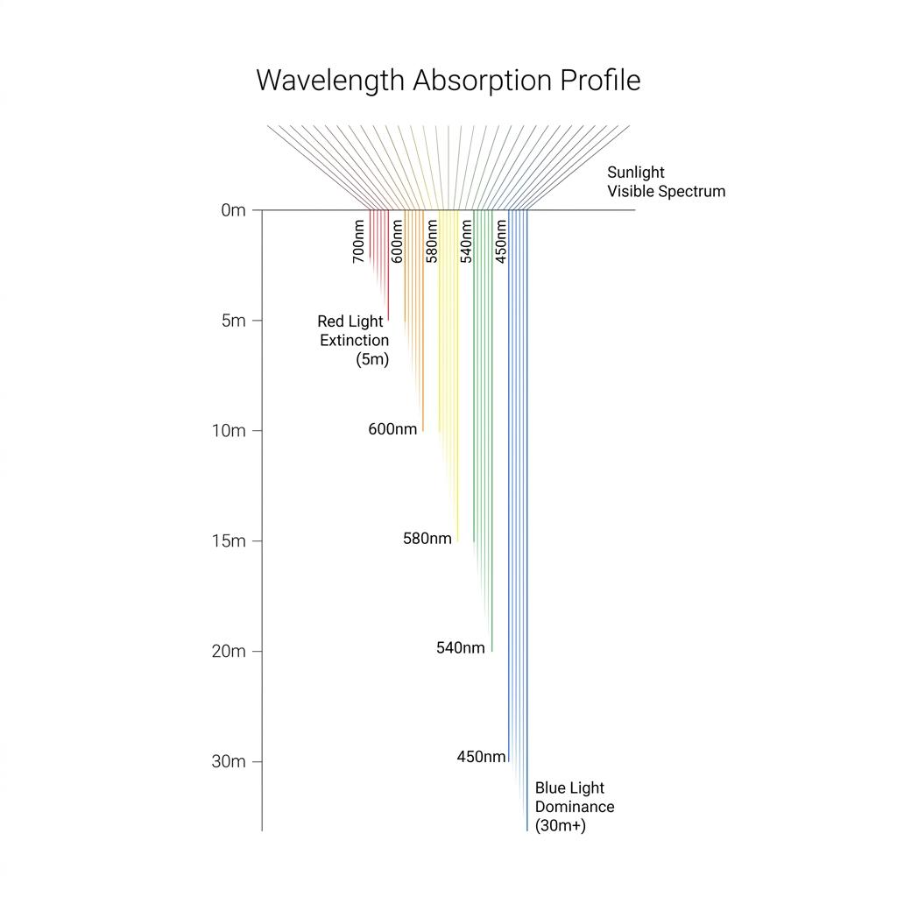
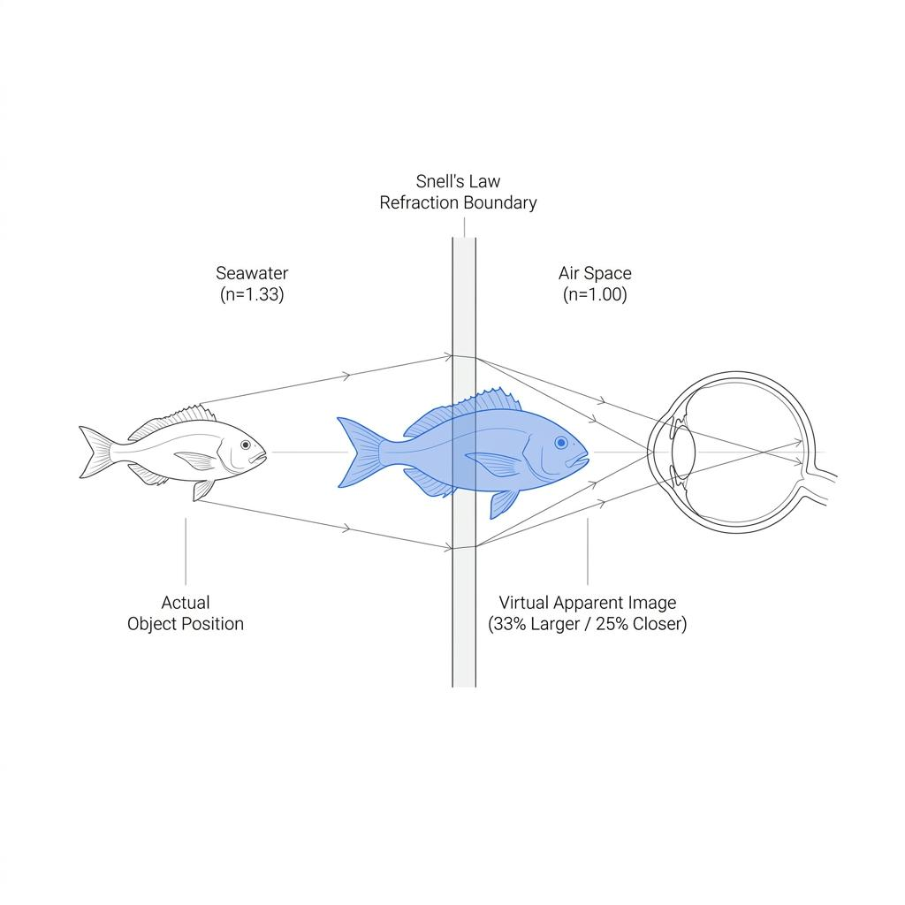

수중 카메라나 스마트폰 하우징을 들고 바닷속으로 들어간 다이버들이 흔히 겪는 허탈한 경험이 있습니다. 눈으로는 분명히 화려하게 보였던 연산호와 열대어가 촬영한 결과물 속에서는 칙칙한 푸른빛이나 검푸른 단색으로 덮여버리는 현상입니다. 스트로브(외장 플래시)나 비디오 라이트를 비추는 순간 거짓말처럼 숨겨진 붉은색과 노란색이 튀어나오는 모습을 보며 다이버들은 놀라움을 금치 못합니다. 우리가 물속에서 마주하는 푸른 수중 세계는 사실 바다라는 거대한 액체 필터가 만들어낸 '거짓된 색'일 수 있습니다. 빛의 흡수와 굴절이라는 물리학적 메커니즘을 통해 그 이유를 파헤쳐 봅니다.

### 파장의 법칙: 붉은색부터 시작되는 시각의 소멸

태양빛은 파장이 각기 다른 가시광선 스펙트럼의 집합체입니다. 무지개색으로 익숙한 가시광선 중 파장이 가장 긴 붉은색 계열(약 650~700nm)은 에너지가 낮은 반면, 파장이 짧은 보라색과 푸른색 계열(약 400~480nm)은 높은 에너지를 지닙니다.빛이 수면을 뚫고 물속으로 진입하는 순간, 바닷물 분자와 그 안에 떠도는 미세 부유물들은 파장이 길고 에너지가 낮은 빛부터 차례대로 흡수하기 시작합니다.

\- **수심 5미터:** 가장 긴 파장을 가진 붉은색 빛이 90% 이상 흡수되어 사라집니다. 수심 5미터 아래에서는 혈액조차 붉은색이 아닌 검붉은색이나 어두운 녹색으로 보이기 시작합니다.\
\- **수심 10미터:** 주황색 파장이 붕괴하며 사라집니다.\
\- **수심 15~20미터:** 노란색과 초록색 영역의 파장마저 차례로 흡수됩니다.\
\- **수심 30미터 이상:** 오직 가장 짧고 에너지가 강한 푸른색 파장만이 잔존하여 퍼져나갑니다.

결국 스트로브나 인공 조명 없이 수심 20미터에서 우리가 보는 피사체는, 이미 붉은색과 주황색 파장이 유실된 채 남겨진 잔여 빛 반사물일 뿐입니다. 수중 사진이 칙칙한 파란색으로 나오는 것은 카메라의 성능 부족이 아니라, 피사체에 도달하여 반사될 붉은색 빛 자체가 수중 세계에 존재하지 않기 때문입니다.

### 왕복 거리의 함정: 3미터 수심에서도 붉은색이 사라지는 이유

많은 다이버가 "수심 3미터에서는 붉은색이 잘 보일 것"이라고 오해합니다. 하지만 수중 광학에서 고려해야 할 가장 결정적인 변수는 수심 단독 수치가 아니라, 빛이 이동하는 '총 왕복 거리(Total Path Length)'입니다.

태양빛은 수면에서 수심 3미터에 있는 피사체까지 3미터를 내려갑니다. 그리고 그 피사체에 부딪혀 반사된 빛이 다이버의 눈이나 카메라 렌즈까지 다가오는 데 또다시 3미터를 이동합니다. 즉, 빛이 바닷속을 통과한 총거리는 수심의 두 배인 6미터가 됩니다. 피사체와의 거리가 멀어질수록 빛이 바닷물이라는 매질을 통과해야 하는 거리가 곱절로 늘어나므로, 얕은 수심이라도 카메라와 피사체 간의 거리가 벌어지면 붉은색은 시야에서 순식간에 탈색되어 버립니다. 수중 사진가들이 피사체에 바짝 다가가서 촬영하는 밀착 촬영(Macro / Wide Close-Up)을 강조하는 이유가 바로 이 왕복 거리를 줄이기 위함입니다.

### 굴절의 마법: 물체는 33% 더 크고 25% 더 가깝게 보인다

색의 소멸과 더불어 다이버의 시각을 교란하는 또 다른 광학적 현상은 빛의 굴절입니다. 빛은 통과하는 매질의 밀도에 따라 속도가 변하는데, 바닷물의 굴절률(약 1.33)은 공기(약 1.00)보다 훨씬 높습니다.

수중에서 빛이 '바닷물'을 지나 마스크의 '유리'를 거쳐 마스크 내부의 '공기층'으로 들어올 때, 매질의 밀도 차이로 인해 빛의 진행 방향이 꺾이게 됩니다. 스넬의 법칙(Snell's Law)에 따라 발생하는 이 굴절 현상으로 인해, 다이버의 뇌는 피사체가 실제보다 더 가깝고 크게 위치해 있다고 착각하게 됩니다.

$$
\text{확대율} = \frac{\text{물 속의 굴절률 (1.33)}}{\text{공기 중의 굴절률 (1.00)}} \approx 1.33
$$

이 1.33의 비율로 인해 수중에서 피사체는 실제 크기보다 약 33% 더 크게 보이며, 실제 거리보다 약 25% 더 가깝게 느껴집니다. 물속에서 손을 뻗어 바위를 잡으려 할 때 생각보다 멀리 있음을 느끼거나, 물 밖으로 가지고 나온 소라나 성게가 물속에서 보았던 것보다 훨씬 작아 보여 실망하는 이유가 바로 이 33%의 굴절 착시 때문입니다.

### 숨겨진 스펙트럼을 깨우는 다이버의 시선

우리가 스쿠버 다이빙을 하며 보는 투명하고 아름다운 푸른 바다는, 어찌 보면 태양 빛의 절반 이상이 상실된 기형적인 시각 세계일 수 있습니다. 하지만 이 물리학적 한계를 이해하는 순간, 다이버는 바다를 바라보는 새로운 눈을 얻게 됩니다.

수중 촬영 시 피사체와의 거리를 극단적으로 줄이고, 랜턴이나 스트로브를 비추어 수십 미터 아래 폐허 속에 갇혀 있던 원색의 스펙트럼을 다시 깨워내는 작업은 단순한 사진 촬영을 넘어 바다의 참모습을 복원하는 과학적인 탐구입니다. 빛의 파장과 굴절이라는 자연의 공식을 이해할 때, 우리는 눈앞의 착시에 속지 않고 심해의 진정한 풍경을 온전히 감상할 수 있을 것입니다.
