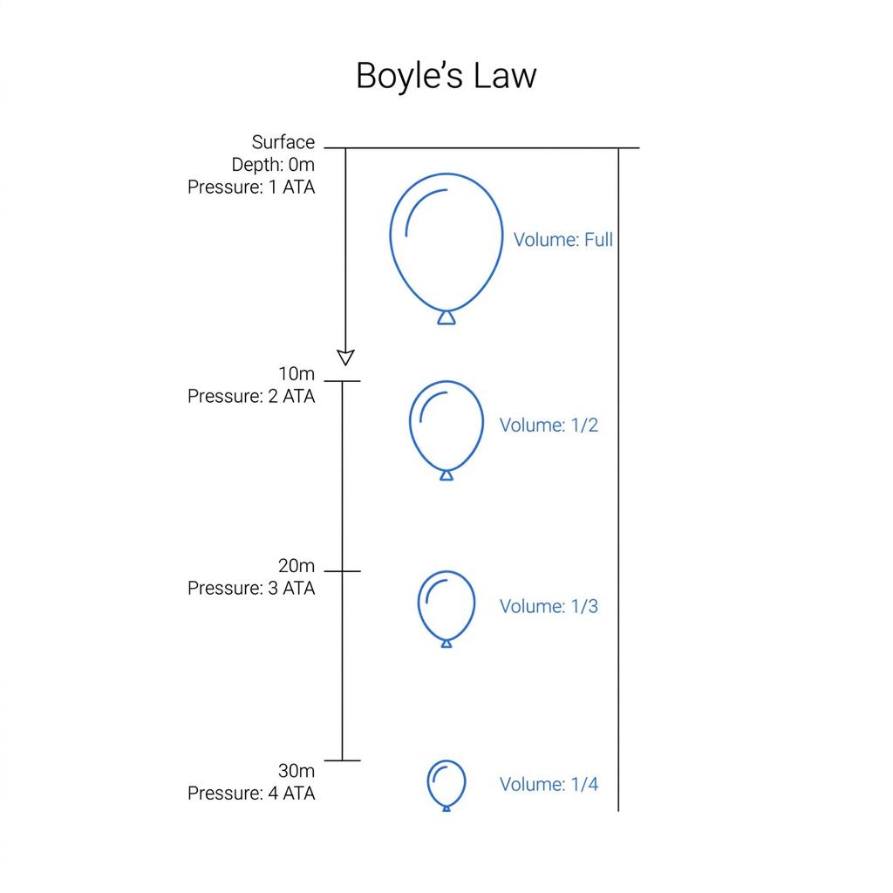
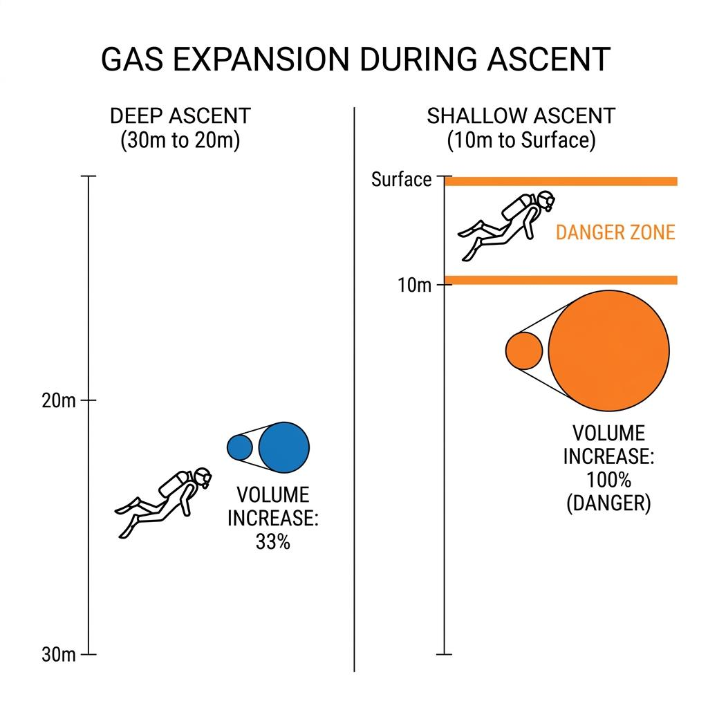

다이빙을 하다 보면 누구나 한 번쯤 깊은 수심에 대한 막연한 두려움을 갖게 됩니다. 수심 30미터, 40미터 아래의 짙은 푸른색은 심리적인 압박감을 주기에 충분하지요. 반대로 수심 5미터 내외의 얕은 바다는 언제든 물 밖으로 고개를 내밀 수 있다는 생각에 우리에게 크나큰 안도감을 줍니다.

하지만 물리학의 관점에서 보면 이 직관은 완전히 틀렸습니다. 질소 마취나 감압병 같은 생리학적 리스크를 제외하고, 다이버의 폐에 직접적인 물리적 손상을 입히는 '기체 팽창'의 위험도만 놓고 본다면 바다에서 가장 위험한 구간은 심해가 아니라 바로 수면 아래 10미터 구간입니다. 보일의 법칙을 통해 얕은 물이 숨기고 있는 무서운 역설을 파헤쳐 봅니다.

### 압력과 부피의 시소게임, 보일의 법칙

수중 세계를 지배하는 가장 강력하고 단순한 원리는 **보일의 법칙** (Boyle's Law)입니다. 온도가 일정할 때 기체의 부피(V)는 압력(P)에 반비례한다는 이 법칙은 다음과 같은 간단한 수식으로 표현됩니다.

$$
P \cdot V = k
$$

우리가 일상생활을 하는 수면의 압력은 1기압(1 ATA)입니다. 물속으로 10미터 내려갈 때마다 수압이 1기압씩 더해지므로, 수심 10미터에서는 2기압, 20미터에서는 3기압, 30미터에서는 4기압이 됩니다. 압력이 2배, 3배, 4배로 커지면, 우리 폐 속이나 BCD에 들어있는 공기의 부피는 역으로 1/2, 1/3, 1/4로 쪼그라들게 됩니다. 여기까지는 오픈워터 교육에서 모두가 배우는 기초적인 내용입니다.

### 심해의 상승 vs 얕은 물의 상승

진짜 중요한 문제는 우리가 수면으로 '상승'할 때 발생합니다. 수심 30미터(4기압)에서 수심 20미터(3기압)로 10미터를 상승한다고 가정해 봅시다. 폐 속의 공기 부피는 1/4에서 1/3로 커집니다. 수치상으로는 부피가 약 33% 팽창하는 셈입니다. 우리가 평상시 호흡을 통해 충분히 감당하고 뱉어낼 수 있는 부드러운 팽창입니다.

이번에는 똑같이 10미터를 상승하되, 수심 10미터(2기압)에서 수면(1기압)으로 올라와 보겠습니다. 이때 폐 속의 공기 부피는 1/2에서 1로 커집니다. 무려 100%의 팽창, 즉 공기의 부피가 정확히 두 배로 폭발적으로 늘어나는 것입니다. 똑같은 10미터 거리를 이동했지만, 심해에서는 33% 팽창하던 공기가 얕은 물에서는 100% 팽창합니다. 이것이 바로 심해의 역설입니다.

### 수심 5미터, 마의 구간을 대하는 우리의 자세

만약 초보 다이버가 다이빙을 마치고 수심 5미터에서 안전 정지를 하다가, 잔압이 부족하거나 부력 조절에 실패하여 당황한 나머지 숨을 참고 수면으로 급상승하면 어떻게 될까요? 불과 5미터의 상승만으로도 폐 속의 공기는 1.5배 가까이 급격히 팽창합니다. 풍선처럼 부풀어 오른 공기가 빠져나갈 길을 찾지 못하면, 결국 폐포를 찢고 혈관으로 들어가 치명적인 **동맥기체색전증** (AGE)을 유발하게 됩니다.

가장 안전해 보이는 수면 직전의 얕은 물이 다이빙 사고 통계에서 가장 치명적인 구간으로 꼽히는 물리적인 이유가 바로 여기에 있습니다.

우리가 상승 속도를 분당 9미터 이하로 엄격하게 통제해야 하는 이유, 그리고 수심 5미터에서의 3분 안전 정지가 단순히 몸속의 질소를 빼내는 것을 넘어 폭발적인 압력 변화에 몸을 적응시키는 필수적인 완충 과정이라는 것을 이해하셨을 겁니다. 다음번 다이빙에서는 얕은 수심에 도달했을 때 긴장을 풀기보다는, 가장 드라마틱한 물리적 변화가 일어나고 있는 공간임을 인지하고 마지막 한숨까지 길고 부드럽게 내쉬어 보시기 바랍니다.
