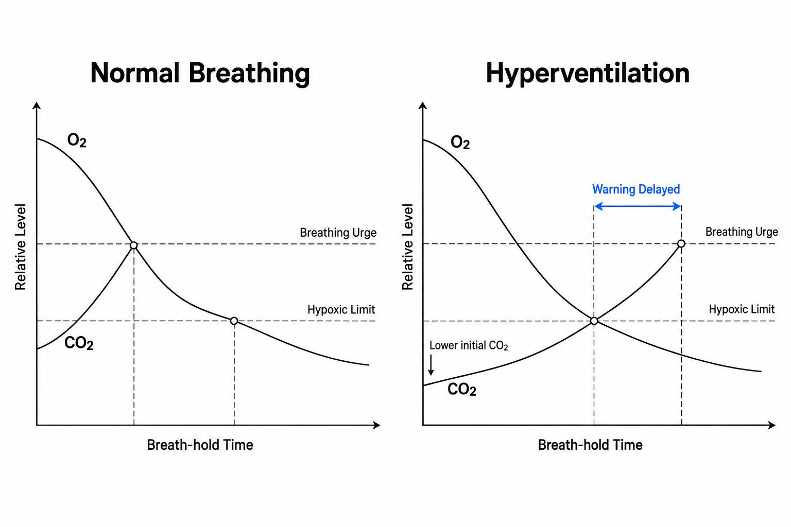
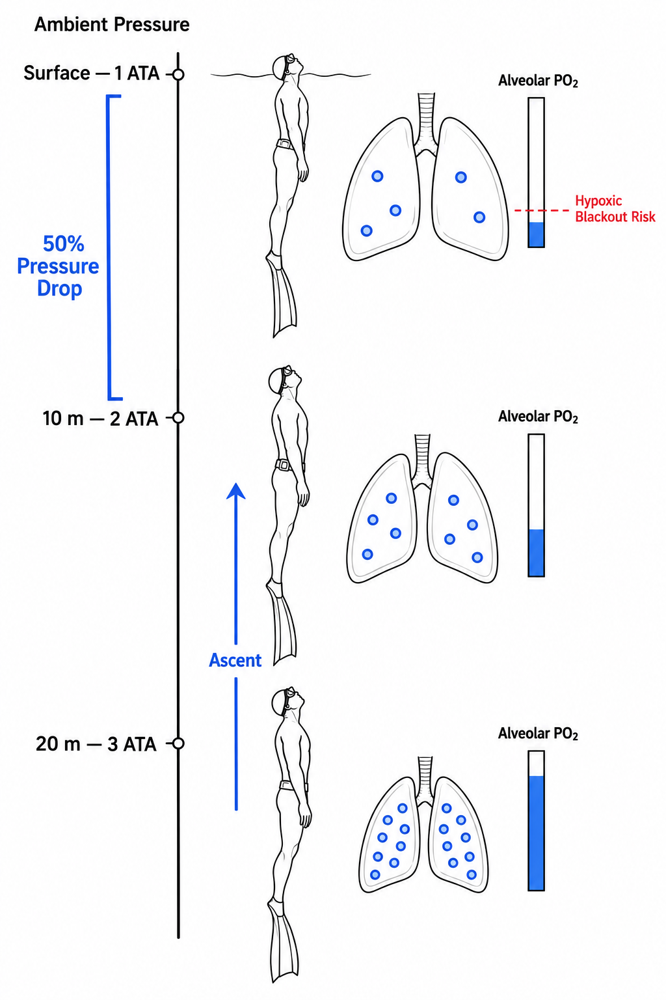

프리다이빙에서 가장 위험한 순간은 가장 깊은 곳일 것처럼 느껴집니다. 수심이 깊을수록 압력은 높고, 수면까지 돌아가야 할 거리도 길기 때문입니다. 그런데 실제 저산소성 의식소실(Blackout)은 역설적으로 수면이 눈앞에 보이는 마지막 몇 미터, 혹은 이미 수면에 도착한 직후에 발생할 수 있습니다.

다이버는 상승하면서 오히려 안도합니다. 햇빛은 밝아지고 수면은 가까워지며, 이제 몇 번만 더 핀을 차면 숨을 쉴 수 있습니다. 그런데 바로 이 순간 폐 속에서 사용할 수 있는 산소의 부분압(Partial Pressure)은 급격히 떨어지고 있습니다. 몸속에 남아 있는 산소의 양뿐 아니라, 그 산소를 뇌가 실제로 사용할 수 있게 만드는 '압력' 자체가 무너지고 있기 때문입니다.

우리가 흔히 얕은물 기절증(Shallow-water Blackout)이라고 부르는 현상을 이해하려면 두 가지를 따로 봐야 합니다. 하나는 이산화탄소가 만드는 호흡 경고 신호, 다른 하나는 상승하면서 떨어지는 산소 분압입니다. 이 두 메커니즘이 겹치는 순간, 다이버는 숨이 아주 급하지 않다고 느끼면서도 의식을 유지할 산소는 이미 바닥난 상태에 도달할 수 있습니다.

### 숨이 차다는 느낌은 산소 게이지가 아니다

숨을 오래 참으면 우리는 어느 순간 견디기 힘든 호흡 충동(Urge to Breathe)를 느낍니다. 흔히 이것을 "산소가 부족하다는 신호"라고 생각하지만, 실제로 이 감각을 강하게 만드는 주인공은 산소보다 이산화탄소(CO₂)입니다.

무호흡이 시작되면 몸은 계속 산소를 소비하면서 이산화탄소를 만들어냅니다. 혈액 속 CO₂의 부분압이 상승하면 뇌와 혈관 주변의 화학수용체가 이를 감지하고 호흡 중추를 자극합니다. 횡격막이 불수의적으로 수축하기 시작하고, 몸은 점점 강하게 "이제 숨을 쉬어라"라는 명령을 보냅니다.

문제는 산소와 이산화탄소가 같은 속도로 하나의 경고등을 움직이는 것이 아니라는 점입니다.

산소 농도는 계속 떨어지고 있어도 CO₂가 아직 충분히 쌓이지 않았다면, 강한 호흡 욕구를 느끼지 않을 수 있습니다. 다시 말해 숨이 아직 참을 만하다는 감각은 뇌에 충분한 산소가 남았다는 보증서가 아닙니다.

이 차이를 가장 위험하게 확대하는 행동이 바로 입수 전 과호흡(Hyperventilation)입니다.

### 과호흡은 산소를 채우는 기술이 아니라 경고등을 늦추는 기술이다

프리다이빙 전 여러 번 크고 빠르게 숨을 쉬면 몸에 산소가 가득 충전되는 것처럼 느껴집니다. 하지만 정상적인 대기 상태에서 혈액의 헤모글로빈은 이미 산소로 상당히 포화되어 있기 때문에, 과호흡을 한다고 해서 몸 전체의 산소 저장량이 극적으로 늘어나지는 않습니다.

대신 크게 변하는 것은 CO₂입니다.

과호흡은 폐를 통해 이산화탄소를 평소보다 많이 배출하여 동맥혈 CO₂ 분압을 낮춥니다. 무호흡을 시작한 뒤에도 CO₂가 다시 호흡 자극 수준까지 올라오려면 더 오랜 시간이 필요해집니다. 다이버 입장에서는 이전보다 숨을 훨씬 오래 참을 수 있게 된 것처럼 느껴집니다.

하지만 그동안 대사는 멈추지 않습니다.

심장도 뛰고, 뇌도 에너지를 소비하며, 핀을 찰 때마다 근육은 산소를 태웁니다. CO₂ 경고 신호만 뒤로 밀렸을 뿐 산소 소비 속도가 사라진 것은 아닙니다.

결국 충분한 호흡 욕구가 찾아오기 전에 산소가 의식을 유지하기 어려운 수준까지 떨어질 수 있습니다.

심한 저탄산혈증(Hypocapnia)은 뇌혈관을 수축시켜 뇌혈류를 감소시키는 방향으로도 작용할 수 있습니다. 과호흡이 위험한 이유는 단순히 "숨을 오래 참게 해주기 때문"이 아니라, 몸이 가진 자연스러운 시간 제한 장치를 교란하기 때문입니다.

### 깊은 곳에서는 버티던 산소가 왜 수면 앞에서 무너질까

여기서 수압이라는 두 번째 메커니즘이 개입합니다.

기체의 부분압은 기본적으로 전체 압력과 해당 기체의 비율에 의해 결정됩니다.

[
P\_{O_2} \propto P\_{\text{ambient}} \times F\_{O_2}
]

프리다이버가 하강하면 주변 압력이 증가하고 폐 속 기체도 압축됩니다. 따라서 산소가 대사로 계속 소비되고 있음에도 깊은 곳에서는 높은 주변압 때문에 폐포 산소분압(Alveolar PO₂)이 일시적으로 충분히 높게 유지될 수 있습니다.

말하자면 깊은 수심의 높은 압력이 이미 줄어들고 있는 산소 잔고를 억지로 '압축해서' 사용할 수 있게 붙잡아 두는 셈입니다.

그러나 상승을 시작하면 상황은 반대로 움직입니다.

주변 압력이 감소하면서 폐가 다시 팽창하고, 폐 속 기체의 부분압도 함께 내려갑니다. 특히 마지막 10미터에서 변화가 가장 극적입니다.

수심 30미터의 주변압은 약 4 ATA이고 20미터에서는 약 3 ATA입니다. 10미터를 올라와도 압력 감소는 약 25%입니다.

하지만 수심 10미터에서는 약 2 ATA이고 수면에서는 1 ATA입니다.

똑같이 10미터를 상승했지만 이번에는 전체 압력이 절반으로 떨어집니다.

이미 긴 무호흡으로 산소가 상당 부분 소비된 상태에서 이 압력까지 절반으로 줄어들면, 폐포 산소분압 역시 급격히 하강합니다. 경우에 따라서는 폐포와 혈액 사이의 산소 분압 관계가 바뀌면서 혈액에서 폐 쪽으로 산소가 이동하는 현상까지 나타날 수 있습니다.

그래서 가장 깊은 곳에서 의식이 멀쩡했던 다이버가 수면을 몇 미터 남겨두고 갑자기 운동 조절 능력을 잃거나 의식을 잃을 수 있습니다.

'얕은 물'이 위험한 것이 아닙니다.

얕은 구간에서 일어나는 압력 변화의 비율이 가장 크기 때문에 위험한 것입니다.

### 수면에 도착했다고 다이빙이 끝난 것도 아니다

프리다이버가 수면을 뚫고 올라와 첫 호흡을 하는 순간 모든 위험이 즉시 사라진다고 생각하기 쉽습니다. 하지만 새로 들이마신 산소가 폐에서 혈액으로 이동하고, 산소가 풍부해진 혈액이 뇌에 도달하기까지는 짧지만 실제 시간이 필요합니다.

따라서 극심한 저산소 상태로 수면에 도착했다면 첫 호흡을 한 직후에도 의식소실이나 운동 조절 상실(Loss of Motor Control)이 나타날 수 있습니다.

이것이 프리다이빙에서 버디가 단순히 다이버가 수면에 닿는 것만 확인하고 시선을 돌려서는 안 되는 이유입니다. 상승 마지막 구간과 수면 직후의 회복 과정까지 직접 관찰해야 합니다.

그리고 얕은물 기절증에서 가장 위험한 것은 의식소실 그 자체보다 그다음입니다.

육지에서 잠깐 실신했다면 넘어지는 것으로 끝날 수 있지만, 물속에서 의식을 잃으면 기도가 물에 잠깁니다. 몇 초짜리 저산소성 실신이 곧바로 익수와 익사 위험으로 연결되는 이유입니다.

### 스쿠버에서의 '숨 참기'와는 완전히 다른 위험이다

스쿠버 다이버라면 여기서 한 가지를 명확히 구분해야 합니다.

얕은물 기절증은 기본적으로 한 번 들이마신 공기로 잠수하는 무호흡 다이빙(Breath-hold Diving)에서 산소가 소모되며 발생하는 저산소 문제입니다.

반면 스쿠버 다이버는 수심에 맞는 주변압의 기체를 호흡기에서 계속 공급받습니다. 스쿠버 상태에서 호흡을 멈춘 채 상승하는 행동의 대표적인 위험은 얕은물 기절증이 아니라 폐 과팽창 손상(Pulmonary Barotrauma)과 동맥가스색전증(Arterial Gas Embolism)입니다. 상승하면서 폐 속 압축기체가 팽창하기 때문입니다.

두 현상 모두 마지막 얕은 수심에서 압력 변화가 크게 작용하지만, 사고의 메커니즘은 완전히 다릅니다.

프리다이빙에서는 산소분압이 너무 낮아지는 것이 문제이고, 스쿠버에서 숨을 참은 채 상승할 때는 폐 속 기체가 지나치게 팽창하는 것이 문제입니다.

결국 얕은물 기절증이 가르쳐 주는 가장 중요한 사실은 단순합니다.

"우리의 감각은 산소 측정기가 아닙니다."

숨이 아직 견딜 만하다는 느낌도, 수면이 바로 위에 보인다는 안도감도, 뇌에 충분한 산소가 남아 있다는 증거가 될 수 없습니다. 입수 전 의도적인 과호흡을 피하고, 무호흡 다이빙은 훈련된 버디의 직접적인 감시 아래 수행하며, 상승 마지막 구간과 수면 직후까지 하나의 다이빙으로 바라봐야 하는 이유가 여기에 있습니다.

다이빙에서 진짜 위험한 순간은 항상 가장 깊거나 가장 극적인 곳에 숨어 있는 것은 아닙니다. 때로는 수면까지 남은 마지막 몇 미터가, 전체 다이빙에서 가장 정밀하게 관리해야 할 구간입니다.
