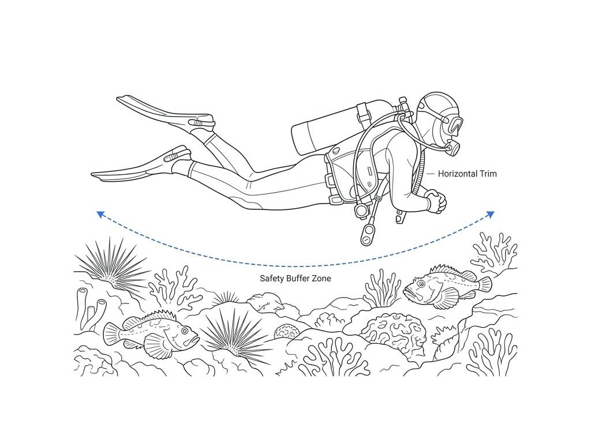

수중 세계로 들어선 다이버들이 자주 품는 거창한 오해 중 하나는 바다 생물들이 인간을 위협하거나 공격할 기회를 노리고 있다는 생각입니다. 영화나 매체 속에서 각색된 식인 상어나 독성 생물들의 자극적인 모습은 다이버들에게 불필요한 공포를 심어주곤 합니다. 하지만 수중 촬영을 하거나 바위를 유심히 관찰할 때 마주치는 독가시와 투명한 촉수들은 우리를 사냥하기 위한 무기가 아닙니다. 바다라는 거대한 야생 속에서 힘없고 느린 생물들이 포식자로부터 스스로를 지키기 위해 만들어낸 처절한 방어막일 뿐입니다. 우리가 무심코 지나치는 수중 생물의 독성 시스템과 그 뒤에 숨겨진 물리적 법칙을 파헤쳐 봅니다.

### 수동적 방어의 진화: 왜 그들은 독을 품었는가

바닷속에서 화려한 지느러미를 날리며 천천히 헤엄치는 쏠배감펭이나, 바위와 똑같은 형상으로 바닥에 납작 엎드려 있는 스톤피쉬를 보면 한 가지 공통점을 발견할 수 있습니다. 바로 유영 속도가 매우 느리거나 능동적인 도망이 불가능한 생태적 한계를 지녔다는 점입니다. 광활한 바다에서 빠른 포식자의 표적이 되기 쉬운 이들은 자신의 몸을 완벽하게 위장하거나, 몸에 찔리는 순간 강력한 통증을 유발하는 독가시를 배치하는 방향으로 진화했습니다.

다이버가 스톤피쉬를 밟거나 쏠배감펭의 지느러미에 찔리는 사고의 대부분은 생물이 다이버를 향해 덤벼들어서 발생하는 것이 아닙니다. 다이버가 생물을 인지하지 못한 채 발을 디디거나, 바위를 잡거나, 촬영을 위해 생태 영역을 너무 가까이 침범했을 때 발생합니다. 생물의 입장에서는 자신보다 수십 배나 큰 거대 다이버라는 포식자가 자신을 압사시키려 한다고 판단하여 반사적으로 가시를 세운 것에 불과합니다.

### 0.1초 만에 분사되는 독소: 열에 무너지는 단백질의 비밀

만약의 사태로 쏠배감펭, 성게, 쏠종개의 독가시를 미처 발견하지 못하고 피부가 관통당했다면, 극심한 통증과 함께 조직 부종이 시작됩니다. 이들이 가시를 통해 피부 속으로 주입하는 독소의 주성분은 고분자 단백질 화합물입니다. 단백질 기반 독소는 생명체의 세포를 파괴하고 신경계를 자극하여 인체에 치명적인 통증을 일으키지만, 물리학적으로 매우 결정적인 약점을 하나 가지고 있습니다. 바로 열에 지극히 취약한 열라빌성(Heat-labile) 물질이라는 점입니다.

독가시에 찔렸을 때 가장 신속하고 유효한 응급처치는 환부를 사람이 참을 수 있는 가장 뜨거운 온수(약 43~45℃)에 30분 이상 담그는 것입니다. 약 43℃ 이상의 열이 전달되면 꼬여있던 단백질 독의 복합 구조가 물리적으로 풀리면서 단백질 변성이 일어납니다. 구조가 깨진 독소는 생체 조직에 결합하는 능력을 잃고 불활성화되며, 거짓말처럼 통증이 씻은 듯이 줄어들게 됩니다.

### 촉수에 숨겨진 삼투압의 함정: 담수를 대는 순간 터지는 자포

해파리나 히드라, 말산호 같은 자포동물과의 접촉은 독가시 찔림과는 완전히 다른 화학적 접근이 필요합니다. 자포동물의 촉수 표면에는 미세한 스프링 형태의 투창을 품은 자포(Nematocyst) 세포가 수없이 붙어 있습니다. 다이버의 피부가 촉수에 스치는 순간 일부 자포가 터지며 독을 주입하지만, 피부에는 여전히 터지지 않은 수많은 자포가 붙어 있게 됩니다.

이때 통증을 줄이겠다고 일반 생수나 수돗물 같은 담수로 환부를 세척하는 것은 매우 위험한 행동입니다. 담수가 닿는 순간, 자포 내부와 외부 간의 삼투압 균형이 급격히 깨지면서 세포 내부로 물이 밀려 들어옵니다. 그 결과 수압을 견디지 못한 미발사 자포들이 일제히 폭발하며 피부 속으로 수십 배 더 많은 독소를 쏟아내게 됩니다. 따라서 자포동물에 닿았을 때는 삼투압 변화가 없는 바닷물로 세척하거나, 5% 아세트산(식초)을 뿌려 자포 세포막의 발사 기전 자체를 불활성화시킨 후 카드로 남아있는 촉수를 살살 긁어내야 합니다.

### 부력과 트림: 바다 생물과 나를 지키는 기술적 백신

위험한 해양 생물과의 불필요한 충돌을 막는 가장 완벽한 백신은 다이버의 우수한 수중 제어력입니다. 시야가 흐리거나 수심을 유지하기 힘들 때 부력 조절에 실패하면, 다이버는 본능적으로 손을 뻗어 바위를 잡거나 바닥에 발을 디디게 됩니다. 바로 이 순간 위장해 있던 스톤피쉬나 바위 틈의 성게, 쏠종개 무리와 물리적 접촉이 발생합니다.

수평 자세인 완벽한 트림 자세를 유지하고 바닥에서 최소 1~1.5미터의 안전거리를 확보한 채 유영하는 습관을 들여야 합니다. 눈은 항상 전방과 하방을 넓게 살피며 자신이 진행할 경로에 어떤 생물이 위장해 있는지 사전에 확인해야 합니다. 수중 생태계를 관찰할 때 손을 완전히 접고 오직 눈으로만 감상하는 정밀한 부력 통제야말로 생명체에게 위협을 주지 않고 자신을 안전하게 보호하는 유일한 기술입니다.

### 무지를 넘어서는 순간 시작되는 진정한 탐험

바다에는 인간을 사냥하기 위해 매복해 있는 악의적인 생물은 존재하지 않습니다. 오직 자신의 터전에서 생명을 지키기 위해 방어 기제를 작동시키는 생물과, 그들의 생태와 행동 방식을 이해하지 못한 채 무모하게 다가간 다이버가 있을 뿐입니다.

독성 생물들의 물리적, 화학적 메커니즘을 이해하고 그들의 경계 신호를 읽어낼 때 다이버는 수중 환경에 대한 막연한 공포에서 벗어나게 됩니다. 올바른 지식과 정밀한 수중 기술을 바탕으로 바다 생물들의 영역을 존중하며 한 걸음 물러설 줄 아는 시선을 가질 때, 우리는 바닷속 사계절이 펼쳐내는 진정한 아름다움을 비로소 안전하게 누릴 수 있을 것입니다.
