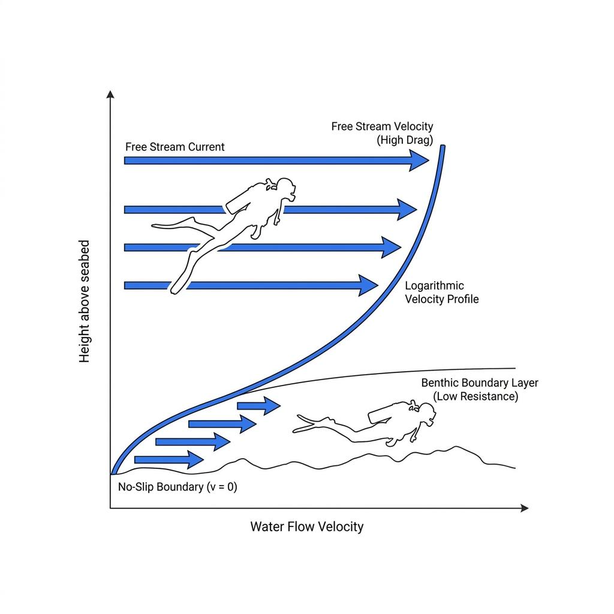

다이빙 중 마주치는 강력한 맞조류는 모든 다이버에게 공포와 피로의 대상입니다. 핀을 부러질 듯 격렬하게 차보아도 풍경은 제자리에 멈춰 있고, 거친 호흡 탓에 수중 잔압계의 바늘은 곤두박질치며 다리에는 쥐가 올라오기 시작합니다. 그런데 바로 옆을 보면 노련한 가이드나 고수 다이버가 힘 하나 들이지 않고 우아하게 앞으로 나아가는 기이한 광경을 목격하게 됩니다.

동일한 바다에서 같은 조류를 마주하고 있으면서도 결과가 극단적으로 갈리는 이유는 폐활량이나 하체 근력의 차이가 아닙니다. 이는 유체가 고체 표면과 만날 때 발생하는 물리 법칙을 이해하고, 거친 조류가 만들어내는 흐름의 그늘을 영리하게 이용할 줄 아는 수중 행동학의 차이에서 비롯됩니다.

### 달의 인력과 벤투리 효과가 빚어내는 수중 급류

바다의 조류는 기본적으로 지구와 달, 태양이 상호 작용하는 중력에 의해 하루 두 번 밀물과 썰물이 오가며 발생하는 거대한 수괴의 수평 이동입니다. 조수간만의 차가 가장 극대화되는 사리 물때에는 눈으로 보기에도 위협적인 대규모 바닷물이 좁은 바다를 향해 쏟아져 들어옵니다.

광활한 대양을 흐르던 완만한 물 흐름이 급격히 빨라지는 순간은 수중 지형의 병목 구간을 만날 때입니다. 유체역학의 연속 방정식에 따르면 유체가 통과하는 단면적이 좁아질수록 흐름의 속도는 단면적에 반비례하여 급격히 가속됩니다. 평탄했던 해저면에 불쑥 솟아오른 피나클의 양 측면이나 좁은 수중 협곡을 지날 때 물살이 총알처럼 빨라지는 이유가 바로 이 벤투리 효과 때문입니다.

이러한 지형 가속 원리를 모르는 다이버는 개활지에서 마주친 거센 흐름을 온몸으로 받아내며 탈진의 늪으로 빠져들게 됩니다. 조류 다이빙의 첫걸음은 물때를 확인하는 것을 넘어, 자신이 유영할 수중 지형이 흐름을 어떻게 왜곡하고 압축하는지 머릿속으로 입체적인 유선도를 그리는 것에서 출발합니다.

### 바닥에 붙으면 조류가 사라지는 물리학: 해저 경계층

물속에서 아무리 강한 맞조류가 불어 닥쳐도, 바닥 표면과 맞닿아 있는 유체 분자는 거친 암초와의 마찰력으로 인해 움직임을 멈추게 됩니다. 이 점착 조건으로 인해 바닥으로부터 수십 센티미터 높이까지는 유속이 급격하게 감속되는 완충 지대가 형성되는데, 이를 물리학에서는 해저 경계층이라고 부릅니다.

수심 15미터의 자유 유영 공간에서 시속 3노트로 사납게 몰아치는 급류라 할지라도, 울퉁불퉁한 바위 바닥에서 불과 20센티미터 위로 내려앉으면 유속은 0.5노트 이하로 뚝 떨어집니다. 바닥에서 불과 1미터만 높게 떠서 헤엄쳐도 거대한 항력을 정면으로 맞받아치게 되지만, 바닥에 바짝 엎드린 다이버는 흐름의 물리적 저항을 거의 받지 않는 기적을 경험하게 됩니다.

따라서 맞조류를 뚫고 이동해야 할 때 취해야 할 가장 과학적인 대처는 수직으로 서서 발을 구르는 것이 아니라, 수평 트림을 유지한 채 암초 바닥에 최대한 밀착하는 것입니다. 바닥면이 제공하는 이 얇은 마찰의 틈새야말로 인간이 거대한 해류의 에너지를 회피할 수 있는 유일한 물리적 피난처입니다.

### 암초 뒤에 숨은 흐름의 사각지대: 와류와 정체 구역

강물이 커다란 바위를 만나면 바위 뒤편에 물살이 멈추거나 오히려 반대 방향으로 잔잔하게 도는 소용돌이가 생기듯, 바닷속 피나클이나 거대한 산호 둔덕 뒤편에도 동일한 유체 분리 현상이 발생합니다.

조류가 장애물을 강타하고 넘어가면서 암초의 배후면에는 강한 압력 강하와 함께 흐름이 정체되는 후류 구역이 형성됩니다. 이 사각지대에서는 전방으로 향하는 거센 흐름이 완전히 차단될 뿐만 아니라, 경우에 따라 역방향으로 완만하게 도는 와류를 타고 힘들이지 않고 앞으로 빨려 들어갈 수도 있습니다.

노련한 다이버는 맹목적으로 직진 경로를 잡지 않고, 수중 지형지물의 배후면을 징검다리처럼 건너뛰는 도약 유영법을 구사합니다. 암초 뒤에서 호흡을 고르고 에너지를 비축한 뒤, 흐름이 꺾이는 사각지대를 계산하여 다음 은폐물로 빠르게 파고드는 전술적인 움직임이야말로 조류를 이기는 핵심 전략입니다.

### 완벽한 수평 트림과 핀 선택: 경계층을 활용하는 테크닉

해저 경계층을 타기 위해 바닥으로 하강할 때 가장 경계해야 할 요소는 바로 침전물과 핀킥의 선택입니다. 바닥에 가깝게 붙는다는 핑계로 허리를 꺾고 자전거를 타듯 플러터 킥을 차면, 바닥의 앙금을 폭풍처럼 일으켜 시야를 잃게 될 뿐만 아니라 핀 끝이 고속 유속층으로 튀어 올라 전진 효율을 갉아먹게 됩니다.

몸 전체를 바닥과 완벽히 평행하게 유지하는 정밀한 수평 트림 자세를 완성해야 상체의 투영 면적이 줄어들어 경계층 내부로 완벽히 숨어들 수 있습니다. 무릎을 직각으로 접고 발목을 바깥쪽으로 유지하는 모디파이드 프로그 킥을 구사하면 바닥의 앙금을 전혀 건드리지 않고도 오직 경계층 내부의 정체된 물만을 밀어내며 추진력을 얻을 수 있습니다.

조류 다이빙에서는 물을 탄탄하게 잡아주는 제트핀 계열의 고강성 고무 핀이 유리합니다. 강한 유속에 휩쓸려 블레이드가 뒤틀리는 연성 핀과 달리, 단단한 핀은 바닥의 미세한 흐름 틈새에서도 다이버의 다리 힘을 온전히 직진 추진력으로 치환해 주기 때문입니다.

### 조류는 맞서 싸우는 적이 아니라 동행하는 파도다

바다를 찾는 수많은 대형 해양 생물과 화려한 연산호 군락은 모두 강한 조류가 실어 나르는 풍부한 플랑크톤과 유기물을 먹기 위해 그곳에 모여듭니다. 즉, 거센 조류가 흐른다는 것은 그 포인트가 가장 역동적이고 경이로운 생명력을 품고 있다는 증거이기도 합니다.

인간의 미약한 근력으로 자연이 뿜어내는 수천만 톤의 수괴 에너지를 정면으로 거슬러 이겨내는 것은 불가능합니다. 바다와 맞서 싸우려 하지 않고, 해저면이 만들어내는 마찰의 법칙과 지형의 굴곡 속에 몸을 맡길 줄 아는 다이버만이 거친 물살 속에서도 고요한 평정심을 유지할 수 있습니다. 지식을 통해 유체의 흐름을 읽어낼 때, 조류는 공포의 장벽이 아닌 가장 흥미진진한 수중 탐험의 안내자가 되어줄 것입니다.
