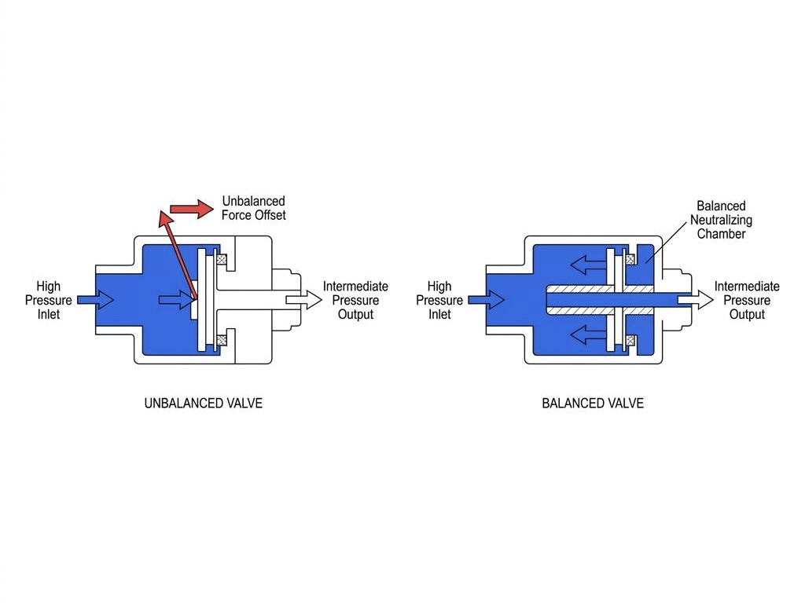

스쿠버 다이빙을 즐기다 보면 수심이 깊어지거나 출수를 앞두고 공기 잔압이 50 bar 아래로 떨어졌을 때, 왠지 모르게 호흡기를 빨아당기는 힘이 더 많이 들어간다고 느낀 적이 있을 것입니다. 많은 다이버가 이를 깊은 수심의 높은 기체 밀도 때문이거나 심리적인 불안감 탓으로 넘기곤 합니다.

하지만 이는 장비의 심장부라 불리는 호흡기 1단계의 내부 감압 메커니즘에서 발생하는 기계적 격차 때문일 확률이 매우 높습니다. 3000 psi에 달하는 파괴적인 고압 탱크의 공기를 인간의 폐가 편안하게 받아들일 수 있는 부드러운 숨결로 바꾸어주는 1단계 내부의 유체역학과, 잔압에 구애받지 않고 완벽한 호흡감을 선사하는 밸런스드 기술의 구조적 차이를 파헤쳐 봅니다.

### 200바의 폭풍을 10바로 잠재우는 감압의 물리학
스쿠버 실린더 내부에 갇힌 공기는 200 bar에서 300 bar라는 엄청난 압력으로 압축되어 있습니다. 이 고압 기체를 직접 2단계 마우스피스로 전달한다면 호흡기 밸브는 폭발적인 압력을 견디지 못하고 파손되며, 다이버의 폐는 치명적인 압력 손상을 입게 됩니다.

호흡기 1단계는 이 거대한 고압의 흐름을 다이버가 위치한 수심의 주변 압력보다 약 9 bar에서 10 bar 정도 높은 중간 압력으로 정밀하게 1차 감압하는 역할을 수행합니다. 수심 10미터에서는 주변압인 2 bar에 10 bar를 더한 12 bar의 중간 압력을 형성하고, 수심 30미터에서는 4 bar의 주변압에 맞추어 14 bar의 중간 압력을 실시간으로 조절해 호스로 밀어냅니다.

이 정밀한 압력 조절은 내부의 감지 장치가 주변 수압의 변화를 감지하고, 스프링의 탄성과 기체 압력이 완벽한 힘의 균형을 이루는 순간 밸브 오리피스를 닫아 공기의 흐름을 차단하는 기계적 평형 상태를 통해 완성됩니다.

### 언밸런스드의 한계: 탱크 잔압이 떨어질수록 뻑뻑해지는 이유
기본적인 형태의 언밸런스드 1단계는 구조가 단순하고 내구성이 뛰어나며 정비가 쉽다는 경제적 장점을 지니고 있습니다. 하지만 이 단순함 이면에는 유체역학적인 치명적 한계가 존재합니다.

언밸런스드 구조에서는 탱크 내부의 고압 공기가 밸브 시트를 닫거나 여는 방향으로 직접적인 물리력을 가합니다. 다이빙 초반 탱크 잔압이 200 bar일 때는 높은 고압이 밸브를 강하게 밀어주어 일정한 중간 압력을 형성하지만, 다이빙 후반부로 갈수록 탱크 내부의 압력이 급격히 떨어지게 됩니다.

탱크 잔압이 30 bar 수준으로 낮아지면 밸브를 밀어주던 고압의 힘이 약해지면서 1단계가 생성하는 중간 압력 수치 자체가 아래로 흔들립니다. 중간 압력이 낮아지면 2단계 호흡기의 밸브를 열기 위해 다이버가 폐의 힘으로 더 강한 흡입 부압을 만들어내야 하므로, 호흡이 점점 뻑뻑하고 답답해지는 물리적 현상이 발생합니다.

### 밸런스드 메커니즘: 잔압의 간섭을 지워버리는 대칭의 기하학
고급 호흡기에 적용되는 밸런스드 설계는 실린더 내부의 잔압이 밸브의 개폐 동작에 아무런 영향을 주지 못하도록 기하학적인 상쇄 구조를 적용합니다.

밸런스드 시스템은 고압 공기가 밸브 포핏이나 피스톤 샤프트 내부의 빈 공간을 통해 양방향으로 동시에 흐르도록 유로를 설계합니다. 고압이 작용하는 표면적을 양쪽에 동일하게 배치함으로써, 왼쪽으로 미는 고압의 힘과 오른쪽으로 미는 고압의 힘이 서로 완벽하게 상쇄되어 알짜 힘이 0이 되도록 만듭니다.

그 결과 탱크 잔압이 200 bar이든, 잔압 게이지의 바늘이 붉은 경고 영역인 20 bar를 가리키고 있든 상관없이 밸브는 오직 주변 수압과 메인 스프링의 힘에 의해서만 정밀하게 제어됩니다. 다이버는 다이빙의 시작부터 끝까지 공기 공급의 지연이나 저항감의 변화 없이 완벽하게 균일한 호흡 성능을 누릴 수 있습니다.

### 피스톤 대 다이아프램: 환경 씰링과 혹한기 다이빙의 선택
밸런스드 1단계는 주변 수압을 감지하는 방식에 따라 크게 밸런스드 피스톤 타입과 밸런스드 다이아프램 타입으로 나뉩니다. 두 방식 모두 탁월한 압력 균형 능력을 제공하지만, 물리적 구조에 따른 환경 적응력에서 차이를 보입니다.

밸런스드 피스톤 타입은 단 하나의 가동 부품인 피스톤을 통해 막대한 양의 공기를 가장 신속하게 2단계로 분출하는 고유량 특성을 자랑합니다. 깊은 수심에서 두 명의 다이버가 동시에 호흡을 거칠게 몰아쉬는 비상 상황에서도 유량 저하가 전혀 발생하지 않는 압도적인 반응성을 제공합니다.

반면 밸런스드 다이아프램 타입은 유연한 고무막이 외부 바닷물과 내부 구동 메커니즘을 완전히 차단하는 환경 씰(Environmental Dry Seal) 구조를 채택합니다. 차가운 바닷물이나 미세 모래, 오염 물질이 내부 메인 스프링 챔버로 유입되지 않으므로, 겨울철 빙판 아래를 탐험하는 아이스 다이빙이나 극한의 혹한기 환경에서 호흡기가 얼어붙어 발생하는 프리플로우 위험을 원천적으로 차단합니다.

### 극한의 수심에서 생명을 지키는 기술력의 가치
수심 30미터 아래로 내려가면 높은 주변 압력으로 인해 공기의 밀도가 지상보다 네 배 이상 짙어집니다. 끈적해진 고밀도 공기는 좁은 호흡기 유로를 통과할 때 심한 난류와 유체 마찰을 일으키며 다이버의 호흡 부담을 가중시킵니다.

이러한 가혹한 심해 환경에서 탱크 잔압마저 바닥을 드러낼 때, 언밸런스드 시스템의 호흡 저항 상승은 다이버에게 호흡 곤란과 이산화탄소 축적이라는 위험한 패닉 상황을 촉발할 수 있습니다. 밸런스드 1단계가 제공하는 흔들림 없는 감압 성능은 단순한 편안함의 영역을 넘어 다이버의 생명을 지키는 안전 마진입니다.

장비의 내부 구조와 작동 원리를 이해하는 것은 단순한 기계적 지식의 습득이 아닙니다. 자신의 주 다이빙 환경과 수심에 맞는 최적의 장비를 선별하고, 어떠한 수중 위기 속에서도 장비의 신뢰성을 바탕으로 침착함을 유지할 수 있는 전문적인 다이버로 성장하는 첫걸음입니다.
